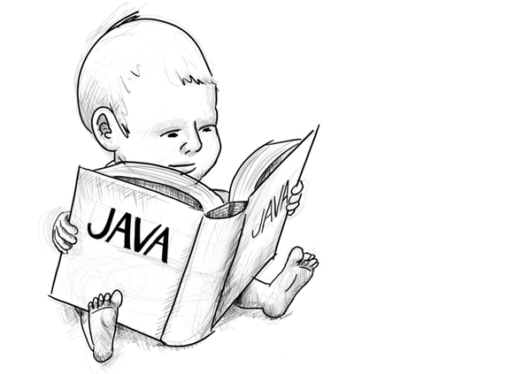
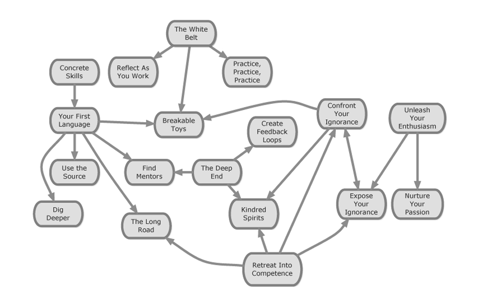

 <div align="center">
    
 
</div>

# فصل دوم

## خالی کردن فنجان

(*Emptying the Cup*)

> **فیلسوف جوان:**
> «آیا نمی‌بینی که فنجان پر و سرریز شده است؟»

---

روزی روزگاری، یک استاد زِن مشهور، از سوی یک فیلسوف جوان که از سرزمین‌های دور سفر کرده بود تا با او ملاقات کند، پذیرایی شد.
استاد به دلیل توصیه‌های بالای معلمان فیلسوف، تصمیم گرفت او را ببیند.
آن‌ها زیر درختی نشستند تا گفتگو کنند و بحث به سرعت به این سمت کشیده شد که استاد چه چیزی می‌تواند به فیلسوف جوان بیاموزد.
استاد، که شعلهٔ جوانی را در چشم‌های او می‌دید، با لبخندی گرم شروع به توضیح دادن تکنیک‌های مدیتیشن خود کرد.
اما فیلسوف جوان او را قطع کرد و گفت:

> «بله، من متوجه شدم! ما در معبد تکنیکی مشابه انجام می‌دادیم، فقط به جای تمرکز بر مدیتیشن، از تصاویر استفاده می‌کردیم!»

استاد لحظه‌ای سکوت کرد و سپس دوباره شروع به توضیح دادن کرد، این بار دربارهٔ چگونگی هم‌راستا بودن با طبیعت و جهان.
اما مجدداً فیلسوف جوان صحبت او را قطع کرد و شروع به توضیح دادن اینکه چگونه در گذشته به این مسائل پرداخته بودند کرد.

استاد با صبر به توضیحات او گوش می‌داد و وقتی که دوباره سکوت برقرار شد، استاد در مورد یافتن طنز در هر موقعیت صحبت کرد.
فیلسوف شروع به تعریف شوخی‌های مورد علاقه‌اش و اینکه چگونه فکر می‌کند این شوخی‌ها به موقعیت‌هایی که با آن‌ها مواجه شده ارتباط دارند.

پس از این گفت‌وگو، استاد زِن از فیلسوف خواست که به داخل بیاید و مراسم چای را با هم انجام دهند.
فیلسوف خوشحال از این دعوت، با اشتیاق پذیرفت، چرا که شنیده بود استاد در انجام این مراسم به گونه‌ای خاص و متفاوت عمل می‌کند.
وقتی وارد شدند، استاد مراسم را بی‌عیب و نقص پیش برد تا اینکه به مرحلهٔ ریختن چای در فنجان رسید.
فیلسوف متوجه شد که استاد بیش از حد معمول چای می‌ریزد و فنجان به سرعت پر شد.
استاد همچنان به ریختن چای ادامه داد تا فنجان کاملاً پر شد.
فیلسوف با تعجب و حیرت به استاد نگاه می‌کرد. استاد بدون هیچ نگرانی به ریختن چای ادامه داد و فنجان شروع به سرریز شدن کرد، چای داغ روی قالی و **هاکاما** (لباس سنتی استاد) ریخت.

فیلسوف که متوجه شده بود فنجان سرریز می‌شود، سرانجام فریاد زد:

> «توقف کن! نمی‌بینی که فنجان پر و سرریز شده است؟»

استاد، با لبخندی گرم، به آرامی **کتری چای را به آرامی روی آتش گذاشت** و به فیلسوف جوان نگاه کرد و گفت:

> «اگر با فنجانی که قبلاً پر شده پیش من بیایی، چگونه انتظار داری چیزی به تو بدهم؟»

---

این داستان از **میشل گراندمونت (Michel Grandmont)** در مقالهٔ *Tasting a New Cup of Tea* اقتباس شده است و در اینجا برای توضیح اینکه **چه نوع نگرشی برای یک شاگرد موفق ضروری است**، نقل شده است.
هرچه تجربهٔ بیشتری داشته باشی، باید **وقت بیشتری صرف خالی کردن فنجان خود کنی**؛
یعنی باید **ذهن خود را از عادات بد، غرور ناشی از مهارت‌هایت** و روش‌های قدیمی پاکسازی کرده و خود را برای **رویکردهای جدید و حتی گاهی متناقض با دیدگاه‌های قبلی** باز کنی.

---

### شروع شاگردی و ذهن تازه

الگوهای این فصل، **ابزارهایی** را برای شروع شاگردی‌ات با ذهنی باز و گام‌های صحیح فراهم می‌کنند.

* **کمربند سفید** (Wearing The White Belt) نماد حفظ ذهنیت آغازگری است، فارغ از اینکه چه‌قدر تخصص داری.
* **آزادسازی اشتیاق** (Unleashing Your Enthusiasm) تو را از موانع رایج در ابتدای مسیر همچون سرخوردگی، سردرگمی و ناامیدی عبور می‌دهد
  و به تو کمک می‌کند تا به عمق **زبان اولیۀ خود** (Your First Language) فرو بروی.
* **کسب مهارت‌های ملموس** (Acquiring Concrete Skills) در یک فناوری خاص، درهای جدیدی به روی تو باز می‌کند
  و فرصت‌های زیادی برای یادگیری در فصل‌های بعدی ایجاد می‌کند.
* اما **خود را راحتی نکرده** و از الگوهای نهایی برای **دستیابی به فناوری‌های جدید** استفاده کن.

---

### غلبه بر نادانی و چالش‌ها

* **خود را از نادانی‌ات در فناوری‌های خاص آگاه کن** (Expose Your Ignorance)،
  تا توجه خود را بر آنچه نیاز داری بیاموزی متمرکز کنی.
* **با نادانی‌ات روبه‌رو شو** (Confront Your Ignorance) و به تیم و مشتریان نشان بده که چطور می‌توانی **عضلهٔ کسب دانش** را تقویت کنی.
* در نهایت، به **وظیفه‌ای پرچالش دست خواهی یافت** (The Deep End)، فرصتی برای پریدن به عمق و آموختن یا **غرق شدن**.
  این ممکن است ترسناک باشد، اما هیچ‌زمانی بهتر از این برای این نوع ریسک کردن در حرفه‌ات نخواهد بود.
* زمانی که این حجم از اطلاعات و یادگیری ذهن تو را تحت فشار قرار می‌دهد،
  **به سمت مهارت‌های قبلی خود پناه ببر** (Retreat into Competence)،
  یادآوری کن که چقدر پیشرفت کرده‌ای و **برای جهش بعدی آماده شو.**

---

### زبان اول تو

(*Your First Language*)

 <div align="center">
    
 
</div>

با رها کردن مغز از تمام کارهای غیرضروری، یک نشانه‌گذاریِ خوب آن را آزاد می‌کند تا بر مسائل پیشرفته‌تر تمرکز کند و در عمل، توان ذهنی نوع بشر را افزایش می‌دهد.
واژگان فنی هر حرفه یا تجارت برای کسانی که هرگز آموزش ندیده‌اند تا از آن‌ها استفاده کنند، غیرقابل درک است.
اما این به این دلیل نیست که آن‌ها در ذات خود دشوار هستند.
برعکس، آن‌ها همیشه برای آسان‌تر کردن امور معرفی شده‌اند.
— آلفرد نورث وایتهد، *مقدمه‌ای بر ریاضیات*

**بافت (Context)**
تو تازه شروع کرده‌ای و فقط در یک یا دو زبان برنامه‌نویسی درکی سطحی داری.

**مسئله (Problem)**
احساس می‌کنی شغلت وابسته است به این‌که راه‌حلی ارائه دهی که در یک زبان برنامه‌نویسی خاص نوشته شده و از نظر کیفیت در سطح هم‌تیمی‌هایت باشد.
یا این‌که گرفتن شغل در وهلهٔ اول بستگی دارد به میزان مهارتت در یک زبان برنامه‌نویسی خاص.

---

**راه‌حل (Solution)**
یک زبان انتخاب کن. در آن مسلط شو. در چند سال آینده این زبان، ابزار اصلی تو برای حل مسائل و مهارت پیش‌فرضی خواهد بود که هنگام تمرین تقویت می‌کنی.
انتخاب این زبان یک چالش است. مهم است که با دقت گزینه‌ها را بسنجی، چون این پایه‌ای است که بخش ابتدایی مسیر حرفه‌ای تو بر آن ساخته می‌شود.

اگر از تو خواسته شده مسئله‌ای را حل کنی و زبان برنامه‌نویسی خاصی را دیکته کرده‌اند، بگذار همان مسئله مسیر یادگیری‌ات را مشخص کند.
اگر به دنبال شغلی هستی که نیاز به زبان خاصی دارد، با آن زبان یک **برنامه کوچک آزمایشی (toy application)** بساز — ترجیحاً یک پروژهٔ **متن‌باز (open source)** تا کارفرمای احتمالی‌ات بتواند به‌راحتی نمونهٔ کارت را ببیند.
در هر حالت، از باتجربه‌ترین برنامه‌نویسی که می‌شناسی بخواه به‌طور مداوم راهنمایی‌ات کند. داشتن فردی که بلافاصله بتوانی از او کمک بگیری، می‌تواند تفاوت بین چند دقیقه و چند روز اتلاف وقت باشد.
اما حواست باشد به‌طور کامل وابسته به آن فرد نشوی تا همهٔ مشکلاتت را او حل کند.

یکی از بنیادی‌ترین راه‌ها برای بهبود تجربهٔ یادگیری اولین زبان، داشتن یک **مسئلهٔ واقعی** برای حل‌کردن است.
این کار یادگیری‌ات را در واقعیت ریشه‌دار می‌کند و حلقهٔ بازخورد اولیه‌ات را بزرگ‌تر می‌سازد.
یادگیری با مثال‌های ساختگی در کتاب‌ها و مقالات محدود است، چون از کاربرد کشفیاتت در یک مسئلهٔ ذهنیِ واقعی محروم می‌مانی — چیزی که در کار واقعی دقیقاً از تو خواسته می‌شود.

راه کلیدی برای بهبود این تجربه، ایجاد **حلقه‌های بازخورد (feedback loops)** است. به‌ویژه، حلقه‌های بازخورد کوتاه به تو کمک می‌کنند پیشرفتت را بسنجی.
برخی زبان‌ها ابزارهای بهتری برای بازخورد دارند، اما در هر زبانی می‌توانی یک **sandbox** برای آزمایش و تجربه راه بیندازی.

در زبان **Ruby** ابزار خط فرمان تعاملی به نام `irb` وجود دارد. در **Rails** دستور `script/console` همین کار را می‌کند.
به‌طور مشابه، در **Erlang** ابزار `erb` هست.
**Firebug** نیز در مرورگر **Firefox** امکانات مفیدی برای بررسی محیط اجرایی **JavaScript** (از جمله یک شِل تعاملی) فراهم می‌کند.
بسیاری از زبان‌ها ابزارهای مشابهی دارند.

گاهی این ابزارها کافی نیستند و نیاز به sandbox بزرگ‌تری داری.
«دیو» دوست دارد وقتی می‌خواهد با API یا قابلیت ناآشنایی در جاوا بازی کند، یک کلاس خالی باز نگه دارد:

```java
public class Main {
    public static void main(String[] args) throws Exception {
        System.out.println(/*play with stuff here*/);
    }
}
```

وقتی به اندازهٔ کافی یاد گرفتی که واقعاً بتوانی کد بنویسی،
تکنیک‌های **توسعهٔ مبتنی بر تست (Test-Driven Development)** می‌توانند تو را متمرکز بر گام‌های کوچک نگه دارند و فرضیاتت را بیازمایند.
به‌لطف محبوبیت TDD، به‌سختی می‌توان زبانی پیدا کرد که چارچوب تست نداشته باشد.
در نوشتن تست‌های ساده برای درک زبان یا آشنایی با چارچوب تست تردید نکن.

با گام‌های بسیار کوچک شروع کن؛ هرچه یاد گرفتی بیشتر شد، اندازهٔ گام‌هایت نیز بزرگ‌تر می‌شود.
مثلاً در **Ruby** قابلیتی وجود دارد که اجازه می‌دهد یک بلوک کد را روی تمام عناصر لیستی اعمال کنی و نتایج را در لیست جدیدی جمع‌آوری نمایی:

```ruby
require "test/unit"
class LearningTest < Test::Unit::TestCase
  def test_my_understanding_of_blocks_and_procs
    original = [1, 2, 3]
    expected = [2, 3, 4]
    p = Proc.new { |n| n + 1 }
    assert_equal expected, original.map(&p)
  end
end
```

از تست‌های یادگیری فقط برای زبان استفاده نکن؛ همین روند را می‌توانی برای یادگیری کتابخانه‌های دیگر هم به‌کار ببری.
با گذشت زمان، این تست‌ها (که «اید» در یک کنفرانس آن‌ها را *vendor tests* نامید) به تو کمک می‌کنند مطمئن شوی ارتقای نسخهٔ یک کتابخانه، سیستم را خراب نکرده است.

در نهایت، از نوشتن تست‌های یادگیری به سمت تست‌های واقعی برای کدت حرکت می‌کنی — تست‌هایی که نه درک تو از زبان، بلکه صحت عملکرد کدت را بررسی می‌کنند.
با گذر زمان، تکنیک‌های بسیار بیشتری فراتر از تست‌های واحد ساده پیدا خواهی کرد که از کامپیوتر برای اعتبارسنجی و ارتباط با اعضای تیمت استفاده می‌کنند.

در مورد یادگیری زبان جدید، «رالف جانسون» (از نویسندگان *Design Patterns*) چنین می‌گوید:

> **سؤال:** اگر کسی بخواهد یاد بگیرد متفاوت فکر کند، چه زبانی را پیشنهاد می‌دهید؟
> **پاسخ:** من Smalltalk را ترجیح می‌دهم. اما مهم نیست من چه ترجیح می‌دهم. تو باید زبانی را بر اساس افرادی که در اطرافت هستند انتخاب کنی.
> آیا کسی را می‌شناسی که از یکی از این زبان‌ها طرفدار باشد؟
> آیا می‌توانی مرتب با او صحبت کنی؟ بهتر از آن، آیا می‌توانی با او روی پروژه‌ای کار کنی؟
> بهترین راه یادگیری زبان، کار کردن با یک متخصص در همان زبان است. فقط به یکی نیاز داری، ولی باید یکی را داشته باشی.
> بهترین حالت این است که به‌طور منظم با آن فرد روی پروژه‌ای با آن زبان کار کنی — حتی اگر فقط هر پنجشنبه‌شب باشد.
> تقریباً به همان اندازه خوب است اگر پروژه را خودت پیش ببری، اما هر هفته دو بار سر ناهار نمونه کدت را به او نشان دهی.
> یادگیری زبان به‌تنهایی ممکن است، اما بدون تعامل با متخصصان، یادگیری روح آن زبان سال‌ها طول می‌کشد.

— *رالف جانسون دربارهٔ یادگیری زبان*

نکتهٔ او مستقیماً با الگوی **یافتن مربی (Find Mentors)** مرتبط است.
وجود بازخورد از متخصصان نزدیک باید یکی از عوامل اصلی انتخاب زبان اولت باشد.
با انتخاب یک زبان، در واقع به یک **جامعهٔ مجازی از تمرین‌کنندگان** با الگوها، نشست‌ها و شیوه‌های ارتباطی مشخص می‌پیوندی.
از این شبکهٔ حمایتی استفاده کن تا فقط زبان یاد نگیری، بلکه وارد نخستین جامعهٔ «ارواح هم‌فکر» شوی.

هر زبان مجموعه‌ای از ظرافت‌ها دارد که تنها با تجربهٔ جمعی و درگیری با جامعه آموخته می‌شود.
امروزه این ظرافت‌ها معمولاً در کتاب‌هایی مانند *Effective Perl Programming*، *Effective Java* و *Effective C++* ثبت می‌شوند.
مطالعهٔ چنین کتاب‌هایی بلافاصله پس از یادگیری نحو پایه، می‌تواند روند رشد تو را تسریع کند و از اشتباهات رایج جلوگیری نماید.

زبان اولت برای چند سال چارچوب ذهنی تو خواهد بود؛
هرچه بهتر آن را بدانی، یادگیری زبان‌های بعدی آسان‌تر می‌شود.
اما مراقب باش در آن گیر نیفتی — هر زبان دنیای متفاوتی از تفکر و حل مسئله است.
برنامه‌نویسی شیءگرا؟ پس سراغ زبان‌های تابعی برو.
زبان پویا؟ برو سراغ زبان‌های ایستا.
سمت سرور؟ تجربهٔ طراحی رابط کاربری را امتحان کن.

در نهایت، همان‌طور که دیو توماس و اندی هانت در *The Pragmatic Programmer* می‌گویند:

> «نباید به هیچ فناوری خاصی وابسته شوی، بلکه باید زمینه و تجربه‌ای گسترده داشته باشی تا بتوانی در هر موقعیت، بهترین راه‌حل را انتخاب کنی.»

---

**اقدام (Action)**
مشخصات (specification) زبانت را پیدا کن. آن را بخوان.
برای بعضی زبان‌ها این کار به‌سادگی برداشتن یک کتاب چاپ‌شده است.
برای بعضی دیگر ممکن است فقط دستور زبان (grammar) در دسترس باشد.
و برای برخی زبان‌ها، تنها مرجع واقعی همان پیاده‌سازی (implementation) آن زبان است.
می‌توانی چالش نوشتن مشخصات زبان را خودت بپذیری.

اگر کتابخانهٔ استاندارد زبان منبع‌باز است، با استفاده از روش‌هایی که در الگوی **Use the Source** توضیح داده شده، کد آن را بخوان.
ممکن است از کیفیت کدی که می‌بینی شگفت‌زده نشوی، اما یادت باشد نویسندگان آن کد، جامعه‌ای برای یادگیری نداشتند و مجبور بودند همه‌چیز را از ابتدا خلق کنند.
در صورت دیدن باگ، می‌توانی برایشان **patch** بفرستی و آن را اصلاح کنی.

راه دیگر برای تقویت دانش زبانت این است که از همکارانت بپرسی **چطور اولین زبانشان را انتخاب کردند**.
سپس معیارهایی را که آن‌ها گفتند، به فهرست معیارهایی که هنگام انتخاب زبان اولت استفاده کردی اضافه کن.
این معیارها بعدها هنگام انتخاب زبان بعدی به کار خواهند آمد.

در نهایت، می‌توانی دربارهٔ **اصطلاحات و الگوهای خاص**ی که قبلاً اشاره شد (مثل **روش Muenchian**، **تبدیل Schwartzian** و **ترفند Duff**) بیشتر یاد بگیری.
همهٔ این‌ها به نام برنامه‌نویسانی نام‌گذاری شده‌اند که مسئله‌ای عملی برای حل داشتند.
سعی کن بفهمی هرکدام از این تکنیک‌ها در ابتدا برای حل چه مسئله‌ای ساخته شده‌اند،
و سپس از خودت بپرس: **چطور همان مسئله را با زبان اصلی خودم حل می‌کردم؟**

**همچنین ببین:**
“Breakable Toys” (صفحه ۷۹)، “Dig Deeper” (صفحه ۱۰۵)، “Find Mentors” (صفحه ۶۱)،
“The Long Road” (صفحه ۳۸)، و “Use the Source” (صفحه ۸۲).

---

### **کمربند سفید (The White Belt)**

به‌طور کلی، هر گام باید احساسی از «ورود» داشته باشد.
این همان ذهنِ تازه‌کار است — حالتی از «شدن».
— شونریو سوزوکی، *ذهن ذن، ذهن مبتدی*

**بافت (Context)**
تو درک عمیقی از زبان اولت پیدا کرده‌ای و با اطمینان بر سکوی مهارت قدم می‌زنی.
همکارانت توانایی تو را می‌شناسند و برای حل مشکلات در حوزهٔ تخصصی‌ات از تو کمک می‌خواهند.
به مهارت‌هایت افتخار می‌کنی.

---

**مسئله (Problem)**
در تلاش برای یادگیری چیزهای جدید هستی، اما به‌نظر می‌رسد یادگیری مهارت‌های تازه برایت سخت‌تر از قبل شده است.
سرعت یادگیری خودآموزت کند شده، با وجود تمام تلاشت.
می‌ترسی که رشد فردی‌ات متوقف شده باشد.

**راه‌حل (Solution)**
در حالی که اعتمادبه‌نفسی را که از یادگیری به‌دست آورده‌ای حفظ می‌کنی، هنگام روبه‌رو شدن با موقعیت‌های جدید، دانسته‌های پیشینت را کنار بگذار.
همان‌طور که یودا در *بازگشت امپراتوری* عاقلانه می‌گوید:
«باید آنچه آموخته‌ای را از نو بیاموزی.»

پوشیدن «کمربند سفید» بر پایه‌ی این درک است که در حالی که کمربند سیاه راه را می‌داند، کمربند سفید چاره‌ای ندارد جز اینکه راه را بیاموزد.

یکی از رویکردهایی که «دیو» در کارش به‌عنوان درمانگر خانواده داشت، حفظ «موضع ندانستن» بود.
خانواده‌هایی که در شرایط دشوار قرار داشتند، واقعیتی منحصربه‌فرد را تجربه می‌کردند که «دیو» می‌دانست با وجود تمام آموزش‌هایش، نمی‌تواند آن را به‌طور کامل درک کند.
در حالی که مهارت خود در مطرح‌کردن پرسش‌های سازنده و تسهیل گفتگوها را می‌پذیرفت، آموخته بود باور نداشته باشد که درک تخصصی از واقعیت زندگی آن خانواده‌ها دارد.
شاید این خلافِ منطق به‌نظر برسد، اما در عمل نگرشی از احترام و کنجکاوی ایجاد می‌کند که راه را برای راه‌حل‌ها و امکانات پیش‌بینی‌نشده باز می‌کند.
به‌جای تحمیل راه‌حل به خانواده، موضع «ندانستن» به او کمک کرد تا با خانواده همکاری کند و راه‌حل‌ها را به‌صورت تیمی بیابند.

اتخاذ چنین رویکردی در یادگیری فناوری‌های جدید، فرایند یادگیری را به‌شدت تسریع می‌کند.
آموزش دادن به خود برای متوقف کردن استفاده از عادات برنامه‌نویسی همیشگی، امکان کشف قابلیت‌های تازه را فراهم می‌کند.
با این حال، وقتی به‌عنوان یک برنامه‌نویس از رسیدن به سطح بالایی از مهارت احساس غرور می‌کنی، بازگشت به وضعیت «نادانی» و پذیرفتن احمقانه‌بودن، می‌تواند دردناک باشد.
اما به گفته‌ی جورج لئونارد در صفحات پایانی کتاب *استادی (Mastery)*:

«چند بار شده است چیزی تازه را امتحان نکرده‌ای، فقط از ترس اینکه دیگران تو را احمق بدانند؟
چند بار خودانگیختگی‌ات را سرکوب کرده‌ای، چون از بچگانه به‌نظر رسیدن ترسیده‌ای؟
... روان‌شناس آبراهام مزلو در کسانی که بخش زیادی از توان بالقوه‌ی خود را شکوفا کرده بودند، ویژگی‌ای کودکانه یافته بود.
اشلی مانتاگو واژه‌ی *Neoteny* (از واژه‌ی *Neonate* به‌معنی نوزاد) را برای توصیف نابغه‌هایی چون موتزارت و انیشتین به‌کار برد.
آنچه را در دوستانمان یا خودمان حماقت می‌پنداریم، اگر در نابغه‌ای جهانی ببینیم، به آن لبخند می‌زنیم و آن را «عجیب» می‌نامیم، بی‌آنکه فکر کنیم شاید همین آزادی برای احمق بودن یکی از کلیدهای موفقیت نابغه باشد.»

یا این نمونه را ببین از یک متخصص ده‌ساله‌ی صنعت نرم‌افزار که ذهنی باز نگه داشت و چیز جدیدی آموخت:

«من ده سال بود که به‌صورت حرفه‌ای و موفق نرم‌افزار می‌نوشتم و چند سالی هم TDD انجام می‌دادم تا اینکه با کتاب *کار مؤثر با کدهای میراثی (Working Effectively with Legacy Code)* از مایکل فدرز آشنا شدم.
این کتاب فوراً تأثیر عمیق و فوری بر نحوه‌ی کدنویسی من گذاشت، و من برای همه‌ی توسعه‌دهندگان شرکت خود نسخه‌ای خریدم و خواندنش را الزامی کردم.
از آن زمان، کدبیس من به‌تدریج به سیستمی با تست‌های بهتر، اتصال کمتر و قابلیت سازگاری بیشتر تبدیل شده که کار با آن بسیار لذت‌بخش‌تر است.»
— *استیو اسمیت، از طریق ایمیل*

همان‌طور که استیو آموخت، باید بتوانیم تجربیات و پیش‌داوری‌های گذشته‌مان را کنار بگذاریم تا دانش جدید وارد شود.
این کار به‌ویژه هنگام یادگیری زبان دوم برنامه‌نویسی دشوار است، چون معمولاً اولین باری است که باید **بازدهی فعلی خود را قربانی پیشرفت مهارتی آینده کنی**.
پیش‌تر، مسائل را مانند فنجان‌های خالی، بدون پیش‌فرض درباره‌ی «راه درست» حل می‌کردی.
اکنون باید بکوشی تا زمانی که دانش جدید جا نیفتاده، آن را با دانش قبلی نیامیزی و با ذهنی تازه‌کار به آن نزدیک شوی.
شاید این به معنای کاهش بازدهی کوتاه‌مدت باشد تا پس از تسلط، جهشی بزرگ به جلو انجام دهی.

«برای بالا رفتن باید از جای پای امن جدا شوی؛
باید آنچه را که خوب انجام می‌دهی رها کنی، حتی اگر به دره‌ای فرو بیفتی.
اگر هرگز آنچه را خوب انجام می‌دهی رها نکنی، شاید پیشرفتت ادامه یابد،
اما هرگز از سطح فعلی فراتر نخواهی رفت.»
— جری واینبرگ، *تبدیل شدن به یک رهبر فنی*، ص. ۴۲

یکی از مزایای اتخاذ این طرز فکر هنگام یادگیری یک زبان، ابزار یا حوزه‌ی جدید این است که یاد می‌گیری خود را **به‌صورت اصطلاحی و طبیعی (idiomatic)** بیان کنی و ارتباطت را با جامعه‌ی آن حوزه روان‌تر سازی.
با دوری از اشتباه قدیمیِ «نوشتن فورترن در هر زبان»، درک عمیق‌تری از دانش تازه پیدا می‌کنی.
در نتیجه، وقتی دانش جدید و قدیم را با هم ترکیب می‌کنی، در موقعیت بهتری برای کشف بینش‌های سازنده از هر دو حوزه قرار داری.

نمونه‌ی زیر را در جاوا ببین. این کد برای قرعه‌کشی ملی بریتانیا، شش عدد تصادفی غیرتکراری بین ۱ تا ۴۹ چاپ می‌کند:

```java
public class Lottery {
    private static final int NUMBER_OF_RANDOM_NUMBERS = 6;
    private static final int MAX_RANDOM_NUMBER = 49;
    public static void main(String[] args) {
        SortedSet randomNumbers = new TreeSet();
        Random random = new Random();
        while (randomNumbers.size() < NUMBER_OF_RANDOM_NUMBERS) {
            Integer randomNumber = new Integer(random.nextInt(MAX_RANDOM_NUMBER) + 1);
            randomNumbers.add(randomNumber);
        }
        System.out.println(randomNumbers);
    }
}
```

اگر از تو خواسته شود همین را در زبانی با نحو (syntax) ساده‌تر مثل **Io** بنویسی،
می‌توانی بخش زیادی از دانش جاوای خود را استفاده کنی و چیزی شبیه این بنویسی:

```
list := List clone
while (list size < 6,
    n := Random value(1 50) floor
    list appendIfAbsent(n)
)
list sort print
```

اما اگر خواسته شود همین را در زبانی کاملاً متفاوت مثل **J** پیاده‌سازی کنی،
دیگر این رویکرد کار نخواهد کرد.
تنها با «پوشیدن کمربند سفید» — یعنی پذیرفتن اینکه در زبانی که حتی حلقه ندارد،
باید روشی کاملاً متفاوت اما معتبر برای حل مسئله وجود داشته باشد —
می‌توانی پیشرفت کنی.
در **J** به‌صورت اصطلاحی (idiomatic) پاسخ چنین است:

```
sort 1 + (6 ? 49)
```

در ادامه خواهیم دید که چگونه با الگوهایی خاص می‌توانی تمرین کنی، برنامه‌های کوچک بسازی،
و آگاهانه به کار خود تأمل کنی.
این الگوها به تو کمک خواهند کرد تا شباهت‌های عمیق بین حوزه‌های دانشت را درک کنی
و در موقعیت‌هایی مهارتت را صیقل دهی بدون اینکه تحت فشار بهره‌وری روزمره باشی.

---

**اقدام (Action)**
فرصتی برای از نو یاد گرفتن چیزی پیدا کن. ایده‌آل این است که چیزی پیدا کنی که تو را مجبور کند تجربه‌های قبلی‌ات را کنار بگذاری.
برای مثال، یک برنامه که در یک پارادایم برنامه‌نویسی نوشته‌ای (مثلاً پارادایم دستوری، شیءگرا، تابعی، آرایه‌ای/وکتورمحور و غیره) را بردار و آن را در زبانی پیاده‌سازی کن که از پارادایم متفاوتی استفاده می‌کند.
مطمئن شو که پیاده‌سازی جدیدت از اصطلاحات و شیوه‌های رایج زبان جدید پیروی می‌کند.
اگر تمام زبان‌هایی که می‌دانی از یک پارادایم مشابه استفاده می‌کنند (مثلاً شیءگرایی)، این فرصت خوبی است تا یک پارادایم جدید یاد بگیری.

این الگو فراتر از زبان‌های برنامه‌نویسی می‌رود، اما به‌طور خاص در این حوزه است که سوءتفاهم‌ها به راحتی ممکن است بروز پیدا کنند.
پس فردی پیدا کن که از یک زبان برنامه‌نویسی یا مجموعه‌ای از فناوری‌هایی استفاده می‌کند که برای تو ناآشنا است.
از آن فرد بخواه که توضیح دهد چه سوءتفاهم‌هایی معمولاً افراد با پیشینهٔ تو در مورد جامعهٔ آن‌ها دارند.

**همچنین ببین:**
“Breakable Toys” (صفحه ۷۹)، “Practice, Practice, Practice” (صفحه ۷۷)، و “Reflect As You Work” (صفحه ۸۵).

---

### **آزاد کردن اشتیاق تو (Unleash Your Enthusiasm)**

**صنعت‌گران** تنها شاگردانی مشتاق را قبول می‌کنند که آماده یادگیری هنر توسعه نرم‌افزار باشند.
...
**شاگردان** بخش ضروری صنعتِ **هنر نرم‌افزار** هستند زیرا آن‌ها اشتیاق و انگیزه‌ای برای یادگیری دارند که بر همهٔ اطرافیانشان تأثیر می‌گذارد.
— *پیتر مک‌برین، هنر نرم‌افزار*

**بافت (Context)**
تو اشتیاق و کنجکاوی سیری‌ناپذیری نسبت به هنر نرم‌افزار داری.

**مسئله (Problem)**
احساس می‌کنی در خود نگه داشتن این اشتیاق، چون متوجه هستی که نسبت به همکارانت اشتیاق بیشتری برای کار داری.

---

**راه‌حل (Solution)**
با وجود (و به‌دلیل!) کم‌تجربگی‌ات، ویژگی‌های منحصر به فردی به تیم خود می‌آوری، از جمله اشتیاقی سرشار و مسری.
اجازه نده کسی اشتیاق تو برای هنر نرم‌افزار را کم کند — این یک دارایی باارزش است و یادگیری تو را تسریع می‌کند.

به‌عنوان یک توسعه‌دهنده نرم‌افزار، قطعاً باید بخشی از یک تیم باشی. در هر گروهی، به‌ویژه برای تازه‌واردها، تمایل به پیروی از هنجارها وجود دارد. بیشتر تیم‌ها هیجان‌زده و شاداب دربارهٔ فناوری نیستند. پیش‌بینی‌پذیر است که آن‌ها بیشتر روی تحویل پروژه بعدی یا بهبود جنبه‌هایی از چرخه زندگی توسعه که برایشان دردسر ایجاد کرده متمرکز می‌شوند. بنابراین، شاگردان مشتاق ممکن است اغلب به تمایل برای پنهان‌ماندن از چشم توجه کنند. آن‌ها یا اشتیاق خود را کاملاً سرکوب می‌کنند، یا اجازه می‌دهند که این اشتیاق فقط خارج از ساعات کاری‌شان نمایان شود.

البته، در معرض قرار دادن اشتیاق خود به تیمی که از قبل جا افتاده است، خطراتی دارد. اگر روحیه تیم پایین باشد یا اگر تیم از تازه‌واردها استقبال نکند، احتمالاً پشت سرت نگاه‌های تحقیرآمیز خواهی دید. قطعاً ممکن است تأثیر بدی روی افرادی بگذاری که مهارت را بیشتر از توانایی یادگیری ارزش می‌دهند، به‌ویژه وقتی که ناآگاهی‌ات را آشکار می‌کنی. مثل هر الگوی دیگری، این الگو نباید به‌طور کورکورانه اجرا شود. همیشه باید دینامیک تیم را در نظر بگیری. اگر خود را در تیمی یافتی که از اشتیاق تو استقبال نمی‌کند، باید روش‌هایی پیدا کنی که شور و اشتیاقت را پرورش دهی.

با این حال، در تیمی که از هیجان و مشارکت‌های یک شاگرد استقبال می‌کند، ویژگی‌های منحصربه‌فردی خواهی داشت که توسعه‌دهندگان با تجربه بیشتر به آن‌ها نیاز دارند، از جمله **تصور بدون محدودیت** و **اشتیاق**. این زمانی از حرفهٔ توست که بهترین فرصت برای به خطر انداختن و بیان ایده‌هایت وجود دارد. چیزی برای از دست دادن نداری. ایده‌ها و شور و اشتیاق تو به تیم هوش و تنوع اضافه می‌کند. در کتاب *حکمت جمعی*، جیمز سوئیرویکی به‌طور مکرر بر تنوع اندیشه‌ها به‌عنوان یکی از مواد کلیدی هوش جمعی تأکید می‌کند.

یک مطالعه جذاب در مورد ذهن جمعی خدمهٔ ناوهای هواپیمابر نشان داد که تازه‌واردها نقش مهمی در فعالیت‌های گروهی پیچیده و هماهنگ که برای عملیات ایمن یک کشتی عظیم با جنگنده‌هایی که مدام می‌آیند و می‌روند، ایفا می‌کنند.
محققان دریافتند که برای یک تیم بهتر است از افرادی با سطوح مختلف تجربه تشکیل شود.
فهم می‌تواند افزایش یابد اگر سطوح تجربه مختلف به هم مرتبط شوند، همان‌طور که وقتی تازه‌واردهایی که هیچ چیزی را پیش‌فرض نمی‌گیرند، بیشتر با افراد باتجربه که فکر می‌کنند همه‌چیز را دیده‌اند، ارتباط برقرار می‌کنند.
— کارل ویک و کارلین رابرتز، *ذهن جمعی در سازمان‌ها*، صفحه ۳۶۶

در نهایت، آزاد کردن اشتیاق یکی از معدود مسئولیت‌های یک شاگرد است.
ممکن است دانش عمیق یا تولید بالا نیاوری، اما وظیفهٔ تو این است که شور و اشتیاقی به تیم وارد کنی و همه چیز را زیر سؤال ببری.
تو در موقعیت منحصر به فرد (و موقت) داشتن یک دیدگاه تازه هستی که باید به تو این امکان را بدهد که پیشنهادات مفیدی برای بهبود ارائه کنی.

صنعت‌گران از شاگردان می‌آموزند، حتی در حالی که شاگردان از آن‌ها یاد می‌گیرند.
مبتدیان مشتاق نه تنها صنعت‌گران را تازه می‌کنند، بلکه با آوردن ایده‌های جدید از بیرون، صنعت‌گران را به چالش می‌کشند.
یک شاگرد خوب انتخاب‌شده می‌تواند حتی یک استاد صنعت‌گر را بیشتر بهره‌ور کند.
— *پیتر مک‌برین، هنر نرم‌افزار*

---

**اقدام (Action)**
به آخرین باری فکر کن که ایده‌ای داشتی اما آن را پیشنهاد نکردی.
شخصی را پیدا کن که به او می‌خواستی پیشنهاد بدهی و ایده‌ات را برای او توضیح بده.
اگر او ایرادهایی گرفت، سعی کن او را متقاعد کنی تا به بهبود آن کمک کند.

**همچنین ببین:**
“Expose Your Ignorance” (صفحه ۲۵) و “Nurture Your Passion” (صفحه ۴۵).

---

### **مهارت‌های ملموس (Concrete Skills)**

داشتن دانش با داشتن مهارت و توانایی عملی برای به‌کارگیری آن دانش به منظور ساخت برنامه‌های نرم‌افزاری یکی نیست.
اینجا است که هنر صنعت‌گری وارد می‌شود.
— *پیتر مک‌برین، هنر نرم‌افزار*

**بافت (Context)**
تو به دنبال نقشی در یک تیم با استعداد از صنعت‌گران هستی که فرصت‌های یادگیری بهتری از آنچه که در حال حاضر داری، به تو بدهد.

**مسئله (Problem)**
متأسفانه آن تیم هیچ انگیزه‌ای برای ریسک استخدام فردی که ممکن است نتواند به‌طور مستقیم به حجم کاری تیم کمک کند، ندارد.
این تیم همچنین با این احتمال مواجه است که شاید حتی نتوانی به‌طور غیرمستقیم به تیم کمک کنی، مانند اتوماسیون برخی از کارهای دستی ساده.

**راه‌حل (Solution)**
مهارت‌های ملموس را کسب و حفظ کن.
گرچه یکی از چیزهایی که یک شاگرد به تیم می‌آورد توانایی یادگیری سریع است، داشتن مهارت‌های قابل‌تفکیک و قابل‌نمایش در ابزارها و فناوری‌های خاص احتمال این را که به تو اعتماد کنند تا به‌طور غیرمستقیم کمک کنی افزایش می‌دهد، تا زمانی که شروع به کسب اعتبار کنی.

برخی از مهارت‌های ملموسی که باید کسب کنی، چیزی بیشتر از مکانیزم‌هایی برای عبور از فیلترهای دست و پاگیر منابع انسانی و مدیرانی که تیم‌ها را بر اساس بازی *بینگوی کلمات فنی* می‌سازند نخواهند بود.
برخی دیگر از مهارت‌ها به هم‌تیمی‌های احتمالی تو اطمینان می‌دهند که می‌توانند از تو استفاده کنند و نیازی به «نگهداری کودک» نخواهند داشت (منابع سازمانی توسعه نرم‌افزارهای چابک، صفحه ۸۸).
نمونه‌هایی از مهارت‌های ملموس شامل نوشتن فایل‌های ساخت (build files) در زبان‌های مختلف محبوب، آگاهی از فریم‌ورک‌های منبع‌باز محبوب مانند Hibernate و Struts، طراحی وب پایه، JavaScript و کتابخانه‌های استاندارد زبان انتخابی‌ات هستند.

نکته این است که تو معمولاً مجبور خواهی شد که به مدیران استخدامی اجازه دهی یک قدم شجاعانه در انتخاب تو بردارند.
مهارت‌های ملموس (که ایده‌آل است تا به‌اندازه‌ای دقیق باشند که بتوانی پیاده‌سازی‌های آزمایشی کوچک را به مصاحبه ببری) به تو این امکان را می‌دهند که نیم‌راه به آن‌ها بروی.
مهارت‌های ملموسی که داری، پاسخ تو به این سؤال است:
**«اگر امروز ما تو را استخدام کنیم، صبح دوشنبه چه کاری می‌توانی انجام دهی که به نفع ما باشد؟»**
درک عمیق از زبان اولت به اثبات اعتبار تو کمک خواهد کرد و باید برای تیم‌ات بسیار مفید باشد.

با شروع انتقال به نقش **شاگرد به حرفه‌ای**، دیگر به این مهارت‌ها وابسته نخواهی بود، چون شروع به استخدام بر اساس شهرت، مجموعه کارهای قبلی و ویژگی‌های عمیق‌تری که به تیم می‌آوری خواهی کرد.
تا آن زمان، باید ویژگی‌های خود را بیشتر به‌وضوح نشان دهی.

---

### **پر کردن شکاف‌ها توسط دیو (Dave fills in the gaps)**

مثل بیشتر افرادی که «دیر» به برنامه‌نویسی وارد شده‌اند، من مجموعه‌ای از تجربیات زندگی با خودم به این حرفه آوردم، بسیار بیشتر از یک برنامه‌نویس متوسط با شش ماه تجربه.
در شغل قبلی‌ام، مهارت‌های مختلف بین فردی و بینشی روان‌شناختی کسب کرده بودم.
در مسیر پیشرفت به‌عنوان برنامه‌نویس، افرادی را ملاقات می‌کردم که از گذشته‌ام هیجان‌زده می‌شدند و این باعث می‌شد که گاهی این مهارت‌های نرم را بیشتر از حد ارزش‌گذاری کنم یا سراغ مباحث غیرفنی بروم.
البته، مهارت‌های نرم من به من کمک کرده و در بسیاری از موقعیت‌ها مفید بوده‌اند، اما باید اجازه می‌دادم که این مهارت‌ها کمی تحلیل بروند تا بیشتر روی توسعه مهارت‌های فنی تمرکز کنم، که واضحاً همان جایی بود که بیشترین کمبود را داشتم.
من شغل خود را تغییر ندادم تا به برنامه‌نویسان مشاوره بدهم؛ شغل جدیدم را انتخاب کردم چون عاشق هنر نرم‌افزار نویسی هستم.
— *دیو هوور*

---

**اقدام (Action)**
رزومه‌های افرادی را که مهارت‌هایشان را تحسین می‌کنی جمع‌آوری کن. می‌توانی از آن‌ها درخواست کنی که یک نسخه از رزومه‌شان را برایت ارسال کنند یا آن‌ها را از وب‌سایت‌هایشان دانلود کنی.
برای هر فرد، پنج مهارت خاص که در رزومه‌اش ذکر شده را شناسایی کن و تعیین کن که کدام‌یک از این مهارت‌ها می‌تواند بلافاصله برای تیمی که می‌خواهی به آن بپیوندی مفید باشد.
یک برنامه و پروژه آزمایشی تنظیم کن که نشان دهد این مهارت‌ها را کسب کرده‌ای.
برنامه را اجرا کن.

عادت کن که به‌طور منظم رزومه خود را مرور کنی.
هنگام مرور، مهارت‌های ملموس را در یک لیست جداگانه استخراج کن.
آیا راحتی با این موضوع که بسیاری از مدیران استخدام فقط به این لیست نگاه می‌کنند، به جای مجموع تجربیاتت، احساس می‌کنی؟

**همچنین ببین:**
“Your First Language” (صفحه ۱۳).

---

### **افشای ناآگاهی خود (Expose Your Ignorance)**

فردا باید احمق‌تر به نظر برسم و از این بابت احساس بهتری داشته باشم.
اینکه سکوت کنم و سعی کنم حدس بزنم چه اتفاقی در حال وقوع است، به خوبی پیش نمی‌رود.
— *جیک اسکرگز در «کارآموزی من در Object Mentor»*
[لینک](http://www.jikity.com/Blah/apprentice.htm)

**بافت (Context)**
افرادی که برای انجام کارهای توسعه نرم‌افزاری به تو پول می‌دهند، از تو انتظار دارند که بدانی چه می‌کنی.

**مسئله (Problem)**
مدیران و همکاران تیمی‌ات نیاز دارند که از توانایی تو برای ارائه اطمینان پیدا کنند، اما تو با برخی از فناوری‌های مورد نیاز آشنایی نداری.
این فقط برای مشاوران اتفاق نمی‌افتد. این برای همه پیش می‌آید. شاید تو به تیم آورده شده‌ای چون درک عمیقی از حوزه کاری یا جنبه‌ای از تکنولوژی مورد استفاده در تیم داری. یا شاید صرفاً تو تنها فردی هستی که برای انجام کار در دسترس هستی.

**راه‌حل (Solution)**
به افرادی که به تو وابسته هستند نشان بده که فرایند یادگیری بخشی از ارائه نرم‌افزار است.
اجازه بده آن‌ها رشد تو را ببینند.

طبق تحقیقات روان‌شناسی اجتماعی کارول دوک، نیاز به نشان دادن صلاحیت در افراد بیشتر جوامع صنعتی نهادینه شده است.
این جوامع به طور فزاینده‌ای به توانایی تو به‌عنوان یک توسعه‌دهنده وابسته هستند، زیرا نرم‌افزار به طور فزاینده‌ای در زندگی روزمره ما نفوذ می‌کند.
اما به‌دلیل بی‌تجربگی‌ات، مناطق زیادی از ناآگاهی داری. در این موقعیت قرار گرفته‌ای.
افرادی که اطرافت هستند — مدیر، مشتری، همکاران، و حتی خودت — تحت فشار زیادی برای تحویل نرم‌افزار هستند.
تو نیاز به اعتماد در چشم‌های افراد هنگام پرسیدن این سوال که «چقدر طول می‌کشد تا ویژگی X را تمام کنی؟» را می‌بینی.
ممکن است فشار زیادی برای تسکین دادن آن‌ها وجود داشته باشد، برای اطمینان دادن به آن‌ها که دقیقاً می‌دانی چه می‌خواهند، چگونه آن را به آن‌ها می‌دهی و چه زمانی.

صنعت‌گران نرم‌افزار اعتبار خود را از طریق روابط قوی با مشتریان و همکاران خود می‌سازند.
تسلیم فشارهای ناخودآگاه و گفتن آنچه مردم می‌خواهند بشنوند، راه خوبی برای ساختن روابط قوی نیست.
حقیقت را به آن‌ها بگو.
به آن‌ها نشان بده که در حال شروع به درک آنچه می‌خواهند هستی و در فرایند یادگیری چگونگی ارائه آن به آن‌ها قرار داری.
اگر بخواهی به آن‌ها اطمینان بدهی، اطمینان بدهی که توانایی یادگیری داری، نه با وانمود کردن به اینکه چیزی را می‌دانی که نمی‌دانی.
به این ترتیب، شهرت تو بر اساس توانایی یادگیری‌ات ساخته خواهد شد، نه آنچه که قبلاً می‌دانی.

آشکارترین راه برای افشای ناآگاهی‌ات پرسیدن سوالات است.
این کار به آسانی گفته نمی‌شود، به‌ویژه وقتی فردی که از او سوال می‌پرسی فرض کرده که قبلاً پاسخ را می‌دانی.
ادامه بده!
مطمئناً می‌توانی غرور خود را حفظ کنی و از مسیرهای غیرمستقیم برای کسب دانش مورد نیاز استفاده کنی، اما به یاد داشته باش که مسیر رسیدن به حرفه‌ای بودن با استفاده از مسیر مستقیم کوتاه‌تر خواهد بود.
با تمرین و گذر زمان، متوجه خواهی شد که پرسیدن سوالات مستقیم از آگاه‌ترین افراد تیم به دومین طبیعتت تبدیل می‌شود.
در حالی که ناآگاهی‌ات را افشا می‌کنی، در واقع به تیم خود توانایی یادگیری‌ات را نشان می‌دهی.

و گاهی اوقات، آن‌ها ممکن است در فرایند پاسخ دادن به سوالات تو، وضوح جدیدی در دانش خود پیدا کنند.

**موضع «نادانی»**
به‌عنوان یک درمانگر خانواده به من آموختند که باید از این تصور که درباره زندگی دیگران دانش تخصصی دارم دست بردارم و با موضع «نادانی» به مردم نزدیک شوم.
این مسأله برای یک درمانگر تازه‌کار یا یک برنامه‌نویس تازه‌کار سخت است.
غریزه‌ات به تو می‌گوید که ناآگاهی‌ات را پنهان کنی، وانمود کنی که دانشی تخصصی داری، اما این فقط رشد تو را متوقف می‌کند و مانع از انجام کاری که می‌خواهی بکنی می‌شود.
این درس را از یک حرفه به حرفه دیگر انتقال دادم و برایم مفید بوده است.
در واقع، من به داشتن احساس ناآگاهی در روزهای کاری عادت کرده بودم؛ این احساس به من می‌گفت که در جای درستی هستم.
در حال رشد هستم.
— *دیو هوور*

به این فرایند یادگیری عادت کن.
این صنعت‌گری است.
افرادی هستند که با این فرایند راحت نیستند.
این افراد به‌جای تبدیل شدن به صنعت‌گران، به کارشناسان تبدیل می‌شوند؛ افرادی که در یک پلتفرم یا حوزه خاص تخصص پیدا می‌کنند و به آن پایبند می‌مانند.
به‌دلیل تمرکز محدود، کارشناسان می‌توانند عملکرد بهتری در یک زمینه خاص از دیگران داشته باشند.
این بسیار مهم و اجتناب‌ناپذیر است که صنعت ما کارشناسان داشته باشد، اما هدف یک شاگرد این نیست.

تخصص به‌عنوان یک محصول فرعی از مسیر طولانی که همگی در آن قرار داریم در می‌آید، اما مقصد نیست.
در طول سفر خود، صنعت‌گران با فناوری‌ها و حوزه‌های مختلفی کار می‌کنند.
اگر به‌دلیل ضرورت یا علاقه، به عمق بیشتری در یکی از این فناوری‌ها برسند و در آن تخصص پیدا کنند، این بهتر است.
این پیش‌بینی‌شده است، همان‌طور که دوندۀ تمرین‌کننده برای ماراتن عضلات پای قوی‌تری می‌سازد.
او برای داشتن پاهای قوی تمرین نمی‌کند؛ او برای دویدن تمرین می‌کند.
مثل توسعه‌دهنده‌ای که بعد از دو سال کار بر روی یک پروژه پایتون، دانش عمیقی از پایتون پیدا می‌کند.
عضلات قوی پای دونده برای رسیدن به هدف او وسیله هستند، نه پایان هدف.

برخی از کارشناسان تمام تلاش خود را می‌کنند تا به یک زمینه خاص بچسبند و دامنه یادگیری، تمرین و پروژه‌های خود را محدود کنند.
در مقابل، صنعت‌گران باید شجاعت و فروتنی داشته باشند تا تخصص خود را کنار بگذارند و «کمربند سفید» را بپوشند تا فناوری‌های ناآشنا را یاد بگیرند یا حوزه‌های جدیدی بیاموزند.

یکی از مهم‌ترین ویژگی‌هایی که یک صنعت‌گر می‌تواند داشته باشد، توانایی یادگیری است؛ شناسایی ناحیه‌ای از ناآگاهی و کار بر کاهش آن.
مثل لکه‌های خالی در یک باغ، ناآگاهی می‌تواند با پرورش دانه‌های دانش کاهش یابد.
دانه‌های خود را از طریق آزمایش، تمرین و مطالعه آبیاری کن.
می‌توانی انتخاب کنی که این لکه‌ها را از نور پنهان کنی، از اندازه آن‌ها خجالت بکشی، و آن‌ها را بپوشانی تا غرورت دست نخورده بماند.
یا می‌توانی انتخاب کنی که آن‌ها را افشا کنی، با خودت و افرادی که به تو وابسته‌اند، صادق باشی و درخواست کمک کنی.

تا پایان دوره کارآموزی‌ات، دانش عمیقی از چند رشته فناوری خواهی داشت.
با این رشته‌ها می‌توانی برنامه‌های نرم‌افزاری مقاوم روی تعدادی از پلتفرم‌ها و حوزه‌ها بسازی.
صنعت‌گر ماهر توانایی بافت یک تابلوی پیچیده از رشته‌های مختلف را دارد.
بدون شک او رشته‌های مورد علاقه خود و ترکیب‌های مورد علاقه‌اش را خواهد داشت،
اما تعداد رشته‌ها زیاد است، به طوری که صنعت‌گر ماهر می‌تواند خود را به‌راحتی با محیط‌های فناوری مختلف سازگار کند.
این جایی است که مسیر طولانی تو را خواهد برد.
با افشا کردن و سپس مواجه شدن با ناآگاهی‌ات، رشته‌های گمشده را خیلی سریع‌تر از زمانی که بخواهی وانمود کنی می‌توانی انجام دهی و شبیه به یک متخصص به نظر بیایی، به‌دست خواهی آورد.


---

**اقدام (Action)**
لیستی از پنج چیزی که واقعاً در کار خود نمی‌فهمی بنویس.
این لیست را جایی قرار بده که دیگران آن را ببینند. سپس این عادت را در خود ایجاد کن که این لیست را به‌طور منظم به‌روز کنی وقتی که کارت تغییر می‌کند.

**همچنین ببین:**
“Confront Your Ignorance” (صفحه ۲۸)، “Dig Deeper” (صفحه ۱۰۵)، و “The Long Road” (صفحه ۳۸).

---

### **مواجهه با ناآگاهی خود (Confront Your Ignorance)**

اگر ارزش استقلال را می‌دانیم، اگر از هم‌گونی فزاینده دانش، ارزش‌ها و نگرش‌هایی که سیستم فعلی ما ایجاد می‌کند، ناراحت هستیم، ممکن است بخواهیم شرایط یادگیری‌ای ایجاد کنیم که منجر به یگانگی، خودراهبری و یادگیری خودآغاز شود.
— *کارل راجرز، در مسیر تبدیل شدن به یک شخص*

**بافت (Context)**
شما شکاف‌هایی در مهارت‌های خود شناسایی کرده‌اید، شکاف‌هایی که مرتبط با کار روزمره شما هستند.

**مسئله (Problem)**
ابزارها و تکنیک‌هایی وجود دارند که باید آن‌ها را مسلط شوید، اما نمی‌دانید از کجا شروع کنید.
برخی از این‌ها چیزهایی هستند که همه افراد اطراف شما قبلاً به آن‌ها تسلط دارند، و این انتظاری است که از شما هم دارند که این دانش را داشته باشید.

**راه‌حل (Solution)**
یک مهارت، ابزار یا تکنیک را انتخاب کن و به‌طور فعال شکاف‌های دانش خود را در آن پر کن.
این کار را به روشی انجام بده که برای تو مؤثرترین است.
برای برخی افراد، بهترین رویکرد شامل خواندن تمام مقالات ابتدایی و پرسش‌های متداول (FAQs) است که به دستشان می‌آید.
افراد دیگر می‌بینند که شروع مستقیم به ساخت *Breakable Toys* مؤثرترین روش برای درک چیزی است.
هر رویکردی که برای شما مؤثر است، فراموش نکن که از روح‌های هم‌راستای خود و مربیان خود کمک بگیری تا ببینی آیا کسی هست که این مهارت را داشته باشد و حاضر باشد آنچه را که آموخته است با شما به اشتراک بگذارد.
گاهی اوقات دیگران هم در تلاش برای کسب این مهارت هستند و با همکاری با هم می‌توانید پیشرفت بهتری داشته باشید.
در نقطه‌ای از زمان، سطح مهارت رضایت‌بخشی در این زمینه جدید به‌دست می‌آوری، و سپس می‌توانی تصمیم بگیری که آیا مفیدتر است که بیشتر در این زمینه عمیق شوی یا توجه خود را به شکاف‌های دیگر در مهارت‌های خود معطوف کنی.
چون ساعات روز به‌اندازه کافی برای تمرین همه مهارت‌ها نیست، باید یاد بگیری که میان آن‌ها تعادل‌های لازم را برقرار کنی.

این الگو به‌شدت با *Expose Your Ignorance* مرتبط است، اما اجرای آن چالش کمتری برای غرور شما ایجاد می‌کند چون می‌توان آن را به‌طور خصوصی انجام داد، بدون اینکه کسی متوجه چیزهایی شود که شما نمی‌دانید.
با این حال، به‌عنوان یک کارآموز با آرزوهای رسیدن به استاد شدن، باید آماده باشی که ناآگاهی خود را نیز افشا کنی.
استفاده از این الگو به‌تنهایی (یعنی مواجهه با ناآگاهی خود بدون افشای آن) خطر ایجاد فرهنگی را به‌دنبال دارد که در آن شکست و یادگیری غیرقابل‌قبول است، زیرا همه یادگیری‌هایشان را به‌طور مخفیانه انجام می‌دهند.
به یاد داشته باش که یادگیری در دید عموم یکی از روش‌هایی است که یک کارآموز شروع به انتقال به مرحله *Journeyman* می‌کند.
این یک گام کوچک از یادگیری جایی که مردم می‌توانند تو را ببینند تا تدریس است.

حتی اجرای موفق این الگو می‌تواند عوارض منفی داشته باشد.
برنامه‌نویس‌هایی که کد تو را نگهداری می‌کنند احتمالاً از اینکه نیاز تو برای یادگیری ساخت سیستم‌های پیچیده همزمان باعث شده که سیستم پیام‌رسان خود را در Scala بنویسی، به‌جای استفاده از یک محصول آماده، خوشحال نخواهند شد.
آن‌ها حتی بیشتر ناراحت خواهند شد اگر نتوانند از تو سوالی بپرسند چون در حال حاضر در یک کنفرانس هستی.
در نهایت، کارفرمای شما نیز احتمالاً درک نخواهد کرد اگر نیازهای آموزشی شما مانع از تحویل موفقیت‌آمیز پروژه آن‌ها شود.
به‌طور خلاصه، باید به‌اندازه کافی حساس باشی تا نگذاری کارآموزی‌ات مشکل برای تیم ایجاد کند.
یکی از ویژگی‌های متمایز رویکرد صنعت‌گری، آمادگی برای گذاشتن منافع وسیع‌تر جامعه‌ات در اولویت منافع شخصی خود است، نه استفاده از تیم و مشتری برای پیشرفت شخصی‌ات.

از سوی دیگر، ممکن است ناآگاهی خود را افشا کنی بدون اینکه با آن مواجه شوی.
افرادی که این کار را می‌کنند، فقط وقتی ناآگاهی‌شان مطرح می‌شود با سر تعظیم فرو می‌آورند، گویی می‌خواهند بگویند «این‌طوری است.»
این به یک زندگی از خود بزرگ‌نشناسی و وابستگی بیش از حد به دیگر اعضای تیم تبدیل می‌شود.
در نهایت، به تیم‌هایی منجر می‌شود که هر عضو از قلمرو دانش خود دفاع می‌کند و وقتی مشکلی وارد قلمرو کسی دیگر می‌شود، شانه بالا می‌اندازد.

پس مهم است که تعادلی ظریف بین این الگو و *Expose Your Ignorance* برقرار کنی.
مواجهه با ناآگاهی به‌تنهایی به اطلاع‌رسانی‌های متکبرانه منجر می‌شود که هیچ کاری انجام نمی‌دهند، در حالی که افشای ناآگاهی بدون دیدن آن به‌عنوان مشکلی که باید حل شود، منجر به خود تواضعی و بی‌دفاعی می‌شود.


---

**اقدام**
لیست مواردی که از *Expose Your Ignorance* تهیه کرده‌ای را بردار و برای یادگیری هرکدام از آن‌ها تلاش کن، و هرکدام را که یاد می‌گیری از لیست خط بزن. این دانش جدیدی که به‌دست می‌آوری ممکن است شکاف‌هایی را که قبلاً متوجه آن‌ها نشده‌ای به‌نمایش بگذارد؛ فراموش نکن که این موارد را به لیستت اضافه کنی.

**همچنین ببین:**
“Breakable Toys” (صفحه 79)، “Expose Your Ignorance” (صفحه 25)، و “Kindred Spirits” (صفحه 64).

---

### **پریدن به عمق (The Deep End)**

**بافت (Context)**
اگر هرگز به زمین نیفتاده‌ای، احتمالاً هیچ چیزی ارزشمند را امتحان نکرده‌ای.
— *کریستوفر هاوکینز، "پس می‌خواهید مشاور نرم‌افزار شوید؟"*

گام‌های کوچک و ایمن باعث ناراحتی شما شده است.
شما شروع به ترسیدن کرده‌اید که این یک *فلات* نیست، بلکه یک *گودال* است. در فلات، شما مهارت‌های خود را از طریق تمرین مداوم تقویت می‌کنید تا به سطح بعدی برسید؛ در یک گودال، شایستگی بی‌طعم در نهایت به میان‌مایگی تبدیل می‌شود.

**مسئله (Problem)**
شما نیاز به رشد مهارت‌ها، اعتماد به نفس و مجموعه‌ای از کارهای موفقیت‌آمیز دارید.
احساس می‌کنید که باید خودتان را با پروژه‌های بزرگ‌تر به چالش بکشید. این می‌تواند شامل پروژه‌های بزرگ‌تر، تیم‌های بزرگ‌تر، وظایف پیچیده‌تر، حوزه‌های تجاری جدید و یا مکان‌های جدید باشد.

**راه‌حل (Solution)**
پریدن به عمق را انتخاب کن.
منتظر ماندن تا آماده شوی می‌تواند به یک دستورالعمل برای انجام ندادن هیچ چیزی تبدیل شود. پس وقتی یک نقش برجسته یا یک مشکل دشوار به شما پیشنهاد می‌شود، آن را با هر دو دست بگیرید. رشد تنها با پذیرفتن شغل‌های ترسناک و انجام کارهایی که شما را به چالش می‌کشد، اتفاق می‌افتد.
این کار خطراتی دارد. اگر اشتباه کنی و در عمق فرو روی، ممکن است غرق شوی. خوشبختانه در دنیای فناوری اطلاعات، مکان‌های زیادی وجود دارد که می‌توانی ریسک کنی بدون اینکه شغلت از بین برود اگر شکست بخوری. ریسک‌ها فرصت‌هایی هستند که از چشم‌های نیمه‌بسته ترس مشاهده می‌شوند. این به این معنا نیست که رزومه خود را دروغین بنویسی تا شغلی را بگیری که نمی‌توانی انجام بدهی، یا بدون آمادگی مناسب، چالش‌ها را بپذیری. بلکه به این معناست که وقتی یک ترفیع یا ماموریت خارجی به شما پیشنهاد می‌شود، آن را بپذیری، حتی اگر احتمال واقعی شکست در مقابل شما باشد. آماده بودن برای شکست و بازیابی از آن شکست درهای جدیدی را باز می‌کند که ترسوها هیچ‌گاه نمی‌بینند.

### **پریدن با هر دو پا (Jumping in with both feet)**

من به این شرکت اسپانیایی پیوستم که یک پلتفرم خدمات تحویل مخابراتی را انجام می‌داد. من در تیم اصلی بودم. کار معمولی بود اما هیچ‌چیز واقعاً چالش‌برانگیز نبود.
تغییرات زیادی در CTO رخ داده بود و من با تمام جهت‌گیری‌ها ناراضی بودم.
من به شدت حوصله‌ام سر رفته بود و تصمیم داشتم که از شرکت بیرون بروم وقتی که شنیدم به یک مشاور در نیجریه نیاز داریم.
در گفتگوی غیررسمی گفتم که می‌توانم این کار را انجام دهم.
با CTO و CEO ملاقات کردم و از من پرسیدند که آیا آماده‌ام برای تغییر؟
قرارداد من تغییر می‌کرد و دیگر یک کارمند عادی نبودم.
آن‌ها از من می‌خواستند که محصول شرکت را بفروشم اما من فروشنده نبودم. سپس گزارش‌های ترسناکی درباره خطرناک‌ترین شهرهای جهان خواندم که لاگوس سومین شهر خطرناک بود. من واقعاً از آن ترسیده بودم.
اما به خودم گفتم اگر اینقدر خطرناک است، همیشه می‌توانم در همان روز برگردم.
دو هفته بعد به آنجا پرواز کردم.
صحبت با یکی از همکاران که قبلاً آنجا زندگی کرده بود قبل از ترک کمک کرد. شاید من فقط جسور یا احمق بودم، اما آن ترس‌ها به طور کامل ناپدید شدند. شاید نه در دو روز اول، اما در عرض چند هفته احساس می‌کردم که مثل ماهی در آب هستم.
این قرار بود یک قرارداد کوچک برای سه ماه باشد اما نزدیک به دو سال در آنجا ماندم و به مشتری کمک کردم.
متوجه شدم که هیچ راهی برای فروش پلتفرم‌مان در آنجا وجود ندارد. آن‌ها به چیز دیگری نیاز داشتند.
پلتفرم به آن‌ها کمک نمی‌کرد، بنابراین من وارد شدم و خدمات آن‌ها را اصلاح کردم و پلتفرمی ساختم که واقعاً نیازهای آن‌ها را برآورده می‌کرد.
از آن زمان تا به امروز در اکثر کشورهای غرب آفریقا بوده‌ام. اکنون در لندن کار می‌کنم.
— *Enrique Comba Riepenhausen، ایمیل*

**پذیرش چالش‌های بزرگ‌تر و گام‌های جسورانه**
اگرچه ما از شما می‌خواهیم که چالش‌های دشواری که می‌توانید به آن‌ها پاسخ دهید را جستجو کنید، اما هنوز هم باید به خاطر داشته باشید که اگر آب از سطح سر شما بالاتر برود، یعنی در حال غرق شدن هستید.
حتی در مثال اینریکه، جایی که او زندگی خود را به‌طور قابل‌توجهی تغییر داد، او همچنان به کشوری رفت که حداقل یک نفر را می‌شناخت و می‌توانست زبان ملی را صحبت کند.
مسئولیت شما این است که ریسک‌های این روش را با یافتن مربیان و روح‌های هم‌راستای قابل‌دسترس که در صورت نیاز به شما کمک کنند، جبران کنید.
همچنین مسئولیت شما این است که بازخوردها را ایجاد کنید، به‌طوری که اگر پروژه چالش‌برانگیز شروع به از کنترل خارج شدن کرد، بتوانید بلافاصله آن را متوقف کرده و کمک بگیرید.
اعمال این الگو باید بیشتر حس شجاعت به شما بدهد تا بی‌احتیاطی.

---

**اقدام**
بزرگترین پروژه موفقی که تاکنون در آن کار کرده‌اید از نظر خطوط کد و تعداد توسعه‌دهندگان چیست؟ بزرگترین کدبیس که تاکنون به‌تنهایی روی آن کار کرده‌اید چه بوده است؟
جواب‌های این سوالات را بنویسید، سپس ببینید که آیا می‌توانید ابعاد دیگری از پیچیدگی پروژه‌ها و روش‌های دیگری برای اندازه‌گیری پروژه‌های خود پیدا کنید. از این معیارها برای اندازه‌گیری هر پروژه‌ای که تاکنون در آن شرکت کرده‌اید استفاده کنید.
حال، وقتی پروژه جدیدی به دست شما رسید، می‌توانید نموداری از تمام پروژه‌های خود ترسیم کنید و محل پروژه جدید را در مقایسه با پروژه‌های دیگر مشخص کنید. پس از مدتی، شما قادر خواهید بود از این نمودار برای دیدن جهت‌گیری حرفه‌ای خود استفاده کنید و حتی شروع به تصمیم‌گیری بر اساس آن کنید.

**همچنین ببین:**
“Create Feedback Loops” (صفحه 91)، “Find Mentors” (صفحه 61)، و “Kindred Spirits” (صفحه 64).

---

**عقب‌نشینی به سمت شایستگی**

 <div align="center">
    
 
</div>

**عقب‌نشینی به سمت شایستگی**

**بافت**
شما شروع به درک این کرده‌اید که چقدر از آنچه که باید بدانید، نمی‌دانید، یا شاید چالش جدیدی به عهده گرفته‌اید و چیزها خوب پیش نمی‌روند. یا هر دو.

**مسئله**
زمانی که با گستره عظیم نادانی‌تان مواجه می‌شوید، احساس overwhelm می‌کنید.

**راه‌حل**
مؤثرترین روش این است که کمی عقب بروید، سپس مانند سنگی که از منجنیق پرتاب می‌شود، به جلو پیش بروید. به طور موقت به شایستگی‌های خود بازگردید تا آرامش خود را بازیابی کنید. زمانی را به ساخت چیزی که می‌دانید چگونه بسازید اختصاص دهید. سپس از این تجربه برای درک فاصله‌ای که طی کرده‌اید و مقدار توانایی‌هایی که اکنون دارید، استفاده کنید.

یک apprenticeship مانند یک ترن هوایی است. شما هیجان یادگیری تکنولوژی‌های جدید، استفاده از دانش و خلاقیت خود برای ایجاد ارزش برای مشتریانتان را تجربه می‌کنید. اما در کنار آن، وحشت از دیدن این که چقدر کم می‌دانید نسبت به صنعتگران و کارشناسانی که در طول مسیر ملاقات می‌کنید، وجود دارد. این می‌تواند بسیار overwhelming باشد، به ویژه زمانی که با موعد تحویل نزدیک یا مسائل مربوط به تولید روبه‌رو هستید. دلگرم باشید. این یک پدیده طبیعی و اجتناب‌ناپذیر در طول راه طولانی است. غلبه بر ترس از ناتوانی خود، پلی است بین «نمایش نادانی خود» و «مواجهه با نادانی خود».

این الگو بیشتر برای افرادی که خود را فراتر از توانایی‌هایشان کشیده‌اند، مناسب است. اگر apprenticeship شما شما را در مسیر گام‌های منطقی و مسئولیت‌های فزاینده قرار داده است و پیچیدگی‌های فنی به تدریج بیشتر می‌شود، ممکن است نیازی به استفاده از این الگو نداشته باشید. اما اگر واقعاً در حال دست و پنجه نرم کردن با چالش‌ها هستید و در «عمق مشکل» در حال غرق شدن هستید، به دنبال فرصت‌هایی برای عقب‌نشینی موقت باشید. گاهی اوقات باید یک گام به عقب بردارید تا دو گام به جلو بروید. هنگامی که این کار را می‌کنید، مهم است که آن حرکت عقب را هرچه سریع‌تر به حرکت رو به جلو تبدیل کنید. این حرکت رو به جلو در دانش و مهارت بیشتر شما نسبت به دیروز ظاهر می‌شود.

با این حال، استفاده از این الگو ریسک‌هایی دارد. بدون تعیین یک حد مشخص برای مدت زمان و مسافتی که باید عقب‌نشینی کنید، ممکن است خودتان را فقط تسلیم ترس از شکست کرده باشید. غرق شدن در کارهایی که به خوبی بلد هستید می‌تواند بسیار راحت باشد. پاداش‌های تخصصی ملموس و فوری هستند، اما خطرات آن ممکن است تا زمانی که خیلی دیر شود، ظاهر نشوند. وقتی که تخصص شما در نهایت قدیمی شود، دوباره با گستره وسیع نادانی‌تان روبه‌رو خواهید شد، اما این بار ممکن است دیگر عادت به یادگیری چیزهای جدید نداشته باشید و شروع دوباره آن بسیار دردناک‌تر خواهد بود. در این سناریو، راه‌حل برای احساس overwhelm بدتر از مشکل خود می‌شود.

برای جلوگیری از این مشکل، باید بپذیرید که این الگو تنها یک راه‌حل کوتاه‌مدت است تا شما بتوانید نیروی خود را جمع کرده و دوباره به جلو پرتاب شوید. برای خود یک محدودیت زمانی (یا "زمان‌بندی") تعیین کنید، مانند: «من ده دقیقه آینده را صرف اصلاح اعتبارسنجی جاوا اسکریپت برای این صفحه می‌کنم قبل از اینکه به بهینه‌سازی کوئری‌های SQL که داده‌ها را فراهم می‌کنند بپردازم.» یا «چهار ساعت آینده را صرف پیاده‌سازی رابط خط فرمان برای این ابزار می‌کنم قبل از اینکه یاد بگیرم چگونه از این API SOAP شخص ثالث استفاده کنم.» یا «بقیه امروز را صرف بهبود پوشش تست‌های‌مان می‌کنم قبل از اینکه به بهینه‌سازی کد مربوط به قفل مفسر گلوبال پایتون بپردازم.»

یکی دیگر از جنبه‌های مهم این راه‌حل این است که از وقفه موقت برای جلب حمایت از مربیان و «Kindred Spirits» خود استفاده کنید. با حمایت آن‌ها و تقویت اعتماد به نفس از طریق نمایش توانمندی اخیرتان، باید برای برخورد با دست‌اندازهای احتمالی در مسیر جدید آماده‌تر باشید.

---

**اقدام**
چیزی را که کاملاً می‌شناسید و خودتان به خوبی به آن تسلط دارید انتخاب کنید و دوباره آن را پیاده‌سازی کنید. به عنوان مثال، Ade دوست دارد الگوریتم‌های کشینگ را پیاده‌سازی کند زیرا این الگوریتم‌ها می‌توانند از موارد ساده تا پیچیده باشند. همچنین این کار فرصت‌هایی برای تقویت شهود او درباره طراحی و پیچیدگی الگوریتمی فراهم می‌آورد.

**همچنین ببینید**
“مواجهه با نادانی خود” (صفحه 28)، “نمایش نادانی خود” (صفحه 25)، “Kindred Spirits” (صفحه 64)، و “راه طولانی” (صفحه 38).

**جمع‌بندی**
تمام این صحبت‌ها درباره نادانی، عمق مشکلات، نمایش و عقب‌نشینی ممکن است منفی به نظر برسند. اما نادانی چیز بدی نیست اگر آن را شناسایی و مواجهه کنید. بدترین حالت این است که شما حتی از نادانی خود آگاه نباشید، اما اگر متوجه شدید چه چیزی را کم دارید و آن را برطرف کنید، قدمی به جلو برداشته‌اید. یکی از اصول یک apprenticeship مستحکم، ارزیابی دقیق خود است که در آن سعی می‌کنید تعیین کنید که چقدر در مسیر پیشرفت قرار دارید و هرگونه شکاف در دانش خود را یادداشت کنید. شما باید به طور کامل با توانمندی‌های خود، مهارت‌هایی که برای رسیدن به شایستگی نیاز دارید و دانشی که بلندمدت شما را به خود جذب می‌کند، آشنا شوید. الگوهای بعدی مانند “تفکر در حین کار” و “ثبت آنچه می‌آموزید” باید به شما کمک کنند تا این آشنایی را حفظ کنید. بالاتر از همه، این فصل از “راه طولانی” را در آغوش بگیرید. در شغل شما زمان‌های کمی وجود دارد که بتوانید اینقدر بر خودتان و رشد شخصی‌تان متمرکز شوید.


 <div align="center">
    
 
</div>
