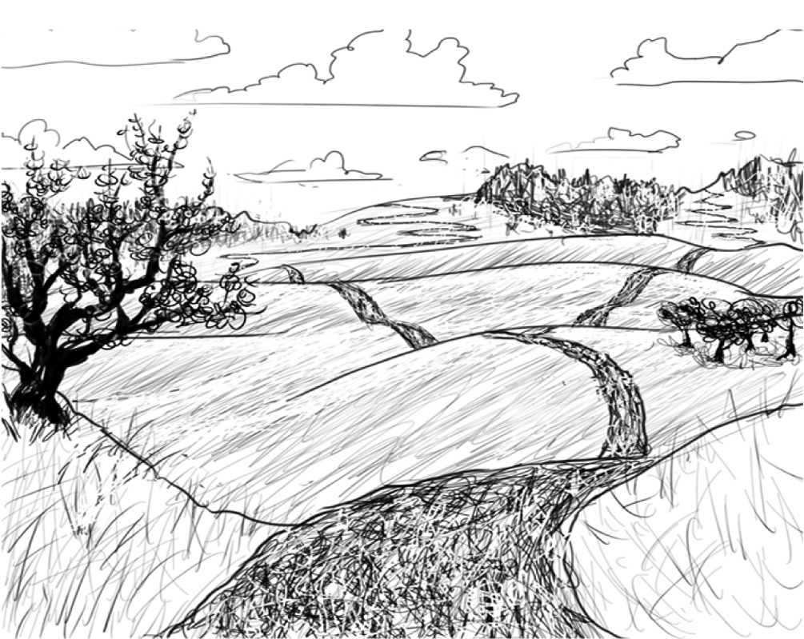
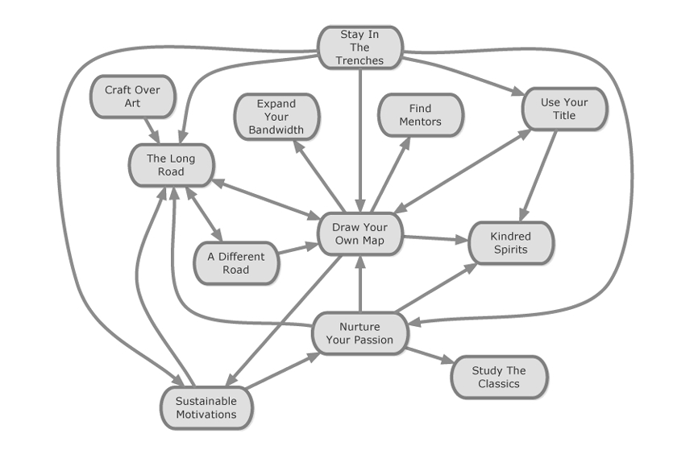

 

    
 

# فصل سوم
### پیمودن راه طولانی

«مسئله فقط فتح قله‌ای ناشناخته نیست، بلکه ترسیم گامی‌به‌گام مسیری تازه به سوی آن است.»
— گوستاو مالر، موسیقیدان و آهنگساز

---

آیا گواهی‌نامه‌های آموزشی و موفقیتت را به دیوار اتاقت زده‌ای؟
زمانی که «دیو» هنوز در اتاقک کار خودش می‌نشست و تجربه‌اش از امروز بسیار کمتر بود، یک دسته گواهی‌نامه به‌طور conspicuous (نمایان و آشکار) روی میزش جمع کرده بود. این مجموعه شامل مدرک Brainbench با عنوان «استاد پرل» بود و بعدها با گواهی‌هایی از دوره‌های چندروزه در زبان‌های C، J2EE، Vignette و ATG Dynamo گسترش یافت.
این توده کوچک از برگه‌های شبه‌پارچمنت به او (و شرکتش) اطمینان می‌داد که می‌داند چه می‌کند — او «آموزش دیده بود».

در همین حین، دیو شروع کرد به ارتباط برقرار کردن با جامعه‌ی بزرگ‌تر توسعه‌دهندگان از طریق وب‌سایت‌هایی مانند [perlmonks.org](http://perlmonks.org) و گروه‌های خبری `comp.lang.perl.*`. در همین فضا بود که با چند هکر استثنایی پرل آشنا شد. تخصص آن‌ها برایش ترسناک بود، مخصوصاً چون می‌دید که آن‌ها *هنوز در حال یادگیری هستند — و با سرعت بالا.*
به‌تدریج برایش روشن شد که او تنها سطحی از مفهوم «توسعه‌دهنده عالی بودن» را لمس کرده است.

در ماه‌های بعد، دسته‌ی گواهی‌نامه‌هایش آرام‌آرام زیر انبوهی از برگه‌های یادداشت و پیش‌نویس کتاب‌ها و آموزش‌ها ناپدید شد.

از طریق مشاهده و تعامل با این هکرهای برجسته، دیو مجذوب *فرایند یادگیری* شد.
گاه‌به‌گاه، با نگاهی گذرا به عمق و گستره‌ی دانش آن‌ها، یا دلسرد می‌شد — از اینکه چقدر کم می‌داند — یا الهام می‌گرفت، از قدرت درک و توانایی آن‌ها.
او خود را غرق پروژه‌های جانبی کرد و شروع به خواندن هر چیزی نمود که به دستش می‌رسید.

هرچه بیشتر می‌آموخت، بیشتر درمی‌یافت که مسیر پیش رو چقدر طولانی است. در سال‌های بعد، خوش‌شانس بود که بتواند چهره‌به‌چهره با چند توسعه‌دهنده‌ی استثنایی همکاری کند.
دیو دریافت که اگرچه این افراد بسیار از او جلوتر بودند، اما همگی در حال پیمودن **همان مسیر** بودند — «راه طولانی».

---

**راه طولانی**

«چقدر طول می‌کشد تا در آیکیدو استاد شوم؟»
دانشجویی تازه‌وارد می‌پرسد.
پاسخ شایسته فقط این است: «چقدر انتظار داری زندگی کنی؟»
— جرج لئونارد، *استادی*

«برای اینکه واقعاً در برنامه‌نویسی خوب شوی، باید عمری صرف آن کنی —
تلاشی پیوسته برای یادگیری و تمرین.»
— ران جفریز و همکاران، *نصب برنامه‌نویسی چابک (XP Installed)*

«به ازای هر گامی که به سوی استادی برمی‌داری، مقصدت دو گام دورتر می‌شود.
استادی را به‌عنوان سفری مادام‌العمر در آغوش بگیر.
یاد بگیر از خودِ مسیر لذت ببری.»
— جرج لئونارد، *استادی*

---

### زمینه (Context)

ما در فرهنگی زندگی می‌کنیم که شهرتِ یک‌شبه، ستاره‌های نوظهور، ثروت مادی و نتایج سریع را می‌ستاید.
برنامه‌نویسانی که بتوانند بگویند «توسعه نرم‌افزار در گذشته چگونه بود» بسیار اندک‌اند.
وقتی با این پیشکسوتان صحبت می‌کنی، سر تکان می‌دهند از دیدن موج تازه‌ای از مدهای صنعتی که همان اشتباهات دوران جوانی‌شان را تکرار می‌کند.
درس‌ها فراموش شده‌اند، چون انتقال دانش میان نسل‌های مختلف توسعه‌دهندگان تقریباً وجود ندارد.

---

### مسئله (Problem)

تو می‌خواهی استاد واقعی نرم‌افزار شوی، اما این خواسته با انتظارات اطرافیانت در تضاد است.
عقل متعارف می‌گوید باید هر شغل با حقوق بالاتر یا اولین ترفیع ممکن را بپذیری،
برنامه‌نویسی را کنار بگذاری و به کارهای «مهم‌تر» بپردازی،
به‌جای اینکه آهسته و با پشتکار مهارتت را بسازی.

---

### راه‌حل (Solution)

نخست بپذیر که ممکن است به‌خاطر هدفی که داری، کمی عجیب به نظر برسی.
دوم، تمرکزت را بر آینده‌ی بلندمدت حفظ کن.
در دوران شاگردی، *یادگیری* و *فرصت‌های رشد بلندمدت* را بر حقوق بالا و جایگاه سازمانی ترجیح بده.

کسی که به دنبال استادی در نرم‌افزار است، باید برای آینده برنامه‌ریزی کند.
این سفر طولانی (و درخشان) برایت مجموعه‌ای غنی از توانایی‌ها به همراه خواهد داشت:
توانایی یادگیری، حل مسئله، و ساختن روابط محکم با مشتریان.
خواهی آموخت که چگونه با دانش و فناوری مانند سامورایی با دو شمشیر خود رفتار کنی —
با مهارت، احترام و دقت.
به درک عمیق‌تری از حقیقت‌های زیرین توسعه نرم‌افزار خواهی رسید.
اما تمام این‌ها زمان می‌برد.

باید خود را برای طول این مسیر آماده کنی.
وقتی نقشه‌ی مسیر خودت را ترسیم می‌کنی (*Draw Your Own Map*)،
در نظر داشته باش که ممکن است حتی در میانسالی نیز هنوز در حال کدنویسی باشی.
این حقیقت باید بر انتخاب شغل‌ها و دامنه‌ی جاه‌طلبی‌هایت تأثیر بگذارد.
اگر هنوز بیست سال دیگر هم قرار است کار کنی، پس می‌توانی هر چیزی را بیاموزی.
هیچ‌کس آن‌قدر جلوتر نیست که نتوانی در طول دهه‌ها به سطح مهارتش برسی.
هیچ حوزه‌ی فنی یا تجاری‌ای بر تو بسته نیست.

وقتی زندگی‌ات را وقف این حرفه کنی،
دیگر بلندپروازی نیست اگر بگویی می‌خواهم از افرادی چون *دونالد کنوث* یا *لینوس توروالدز* فراتر بروم —
زیرا مسیر طولانی، فرصت‌های بی‌پایانی پیش رویت می‌گذارد.
(البته فراموش نکن آن‌ها هم درجا نمی‌زنند!)

این الگو برای کسانی نیست که می‌خواهند مدیر ارشد فناوری (CIO) یا مدیر پروژه شوند — یا صرفاً ثروتمند.
در طول مسیر ممکن است به موقعیت‌های قدرتمند یا ثروت هم برسی،
اما این‌ها هدف نیستند، بلکه *پیامد طبیعی* یک سفر مادام‌العمرند.
استادِ واقعی به‌جای شمردن روزهای بازنشستگی،
با شادی و اشتیاق تا آخرین سال‌های عمر به کارش ادامه می‌دهد.

---

نمی‌خواهیم این تصور ایجاد شود که همه باید یک مسیر واحد را دنبال کنند (رجوع شود به *Draw Your Own Map*)
یا اینکه این تنها مسیر درست برای همه‌ی برنامه‌نویسان است (رجوع شود به *A Different Road*).
برخی توسعه‌دهندگان به‌طور دائم از حوزه‌ی توسعه خارج می‌شوند و به مدیران اجرایی، تسترها، فروشندگان یا مدیران پروژه تبدیل می‌شوند.
برخی دیگر کاملاً از فناوری فاصله گرفته و وارد حوزه‌های دیگر می‌شوند.
همه‌ی این مسیرها معتبر و ارزشمندند —
اما این کتاب و این الگو برای آن افراد نیست.

اگر «خودارزیابی دقیق» (*Accurate Self-Assessment*) سنگ‌بنای شاگردی موفق است،
پس «راه طولانی» پایه‌ی اصلی آن است.
گذار از شاگرد به استادکار تنها اولین گام از بسیاری گام‌ها در مسیر استادی است.
همچون رزمی‌کاری که کمربند مشکی می‌گیرد،
کارآموز تازه درمی‌یابد که چقدر راهِ بیشتری پیش رو دارد.

برنامه‌نویسان خوش‌شانس‌اند،
زیرا مسیر ما عمیق، پویا و همیشه در حال دگرگونی است.
قانون مور بی‌وقفه پیش می‌رود و فرصت‌های تازه‌ای برای کشف پلتفرم‌های جدید فراهم می‌کند.
اما بسیاری از تغییرات سطحی‌اند —
فناوری‌های تازه، مشکلات قدیمی را با نامی نو تکرار می‌کنند.
در حالی که همواره نرم‌افزار جدید و سخت‌افزار بهتر در راه است،
«راه طولانی» به صنعتگر می‌آموزد تا حقیقت‌های عمیق‌تری را درک کند —
به‌طوری‌که استادان بتوانند فراتر از فناوری خاص،
به ذات واقعی مسئله برسند.

---

**عمل (Action)**
چشمانت را ببند و تصور کن در ۱۰ سال آینده عجیب‌ترین نقش ممکن را در زندگی حرفه‌ای‌ات داری.
از تخیل خود لذت ببر و دیوانه‌ترین آینده را برای خودت بساز.
سپس به ۲۰، ۳۰ و ۴۰ سال بعد فکر کن — چه تجربه‌هایی می‌خواهی تا آن زمان پشت سر گذاشته باشی؟
تصور کن که ۴۰ سال بعد از تو خواسته‌اند شرح کوتاهی از مسیر حرفه‌ای‌ات و بزرگ‌ترین تأثیرگذارانت بنویسی.
نتیجه‌ی این تمرین ذهنی را مبنایی برای برنامه‌ریزی تصمیمات شغلی آینده‌ات قرار بده.

**همچنین ببین:**
«راهی متفاوت» (صفحه ۵۳) و «نقشه‌ی خودت را بکش» (صفحه ۴۷).

---

### برتریِ صنعتگری بر هنر (Craft over Art)

> «من برنامه‌نویسی را نوعی صنعت (Craft) می‌دانم — که البته نوعی هنر است،
> اما نه هنر والا. صنعت یعنی ساختن چیزهای مفید با چاشنی زیبایی.
> هنر والا یعنی ساختن چیزهایی صرفاً برای زیبایی‌شان.»
> — ریچارد استالمن، *Art and Programming*

---

### زمینه (Context)

به تو پول می‌دهند تا چیزی بسازی که مشکل یک مشتری را حل کند.

---

### مسئله (Problem)

گرچه راه‌حل اثبات‌شده‌ای وجود دارد، اما مسئله‌ی مشتری برایت وسوسه‌انگیز است:
فرصتی برای خلق چیزی *فوق‌العاده* و زیبا — چیزی که همکارانت را شگفت‌زده کند.

---

### راه‌حل (Solution)

صنعتگری بر پایه‌ی روابط محکم بنا می‌شود.
تمرکزت را بر *ارزش‌آفرینی برای مشتری* بگذار، نه بر ارضای منافع شخصی‌ات.

به‌عنوان یک صنعتگر، تو در وهله‌ی اول برای *دیگران* می‌سازی، نه برای نمایش خلاقیت خودت.
در نهایت، «صنعتگر گرسنه» معنا ندارد. همان‌طور که *لوران بوساوو* گفته است:

> «گرسنگی برای یک صنعتگر شکست است؛ چون باید از صنعت خود نان بخورد.»

باید بهترین کار خود را طوری انجام دهی که منافع مشتری بر میل تو برای نمایش مهارت یا پر کردن رزومه‌ات مقدم باشد —
در حالی که همچنان به حداقل استانداردهای حرفه‌ای جامعه‌ی توسعه نرم‌افزار پایبند بمانی.

راه طولانی (*The Long Road*) از تو می‌خواهد این دو تقاضای متضاد را متعادل کنی.
اگر چنان درگیر «زیبایی» شوی که کارهایت دیگر در دنیای واقعی قابل تحویل نباشند،
دیگر صنعتگر نیستی. اگر میل به خلق آثار زیبا تو را از دنیای واقعی و حل مشکلات مردم دور کند،
از مسیر صنعتگری خارج شده‌ای.

چیزهایی که برای مشتریان می‌سازیم *می‌توانند زیبا باشند*، اما *باید مفید باشند*.
بخشی از بلوغ حرفه‌ای در این است که یاد بگیری — اگر لازم شد —
زیبایی را فدای کاربرد کنی.

خلق آثار زیبا اما بی‌فایده، صنعتگری نیست.
صنعتگر، بازیِ ۵۰ خطی‌ای را که لبخند به لب کسی می‌آورد،
بیش از بازیِ میلیون‌خطی‌ای می‌ستاید که مرزهای علم را می‌گشاید ولی غیرقابل‌بازی است.

وجه دیگر صنعت در برابر هنر این است که مشتریانت از تو کیفیت قابل قبول می‌خواهند — حتی وقتی «حال» نداری.
صنعتگر منتظر الهام نمی‌ماند تا کارش را تحویل دهد.
او موظف است در هر حال، محصولی ارائه کند که رضایت مشتری را جلب کند.

این هم نکته‌ی مثبت دارد و هم منفی:
از یک سو، صنعتگر نمی‌تواند مانند هنرمند در بهشت خیال‌پردازی زندگی کند،
اما از سوی دیگر، او و مشتریانش از ساخت و استفاده از نرم‌افزاری بهره‌مند می‌شوند که *ارزش واقعی* ایجاد می‌کند.

---

**کن درباره‌ی صنعتگری:**

> «کار کردن روی مشکلات واقعی برای آدم‌های واقعی است که صنعت را صیقل می‌دهد،
> نه کار برای ارضای شخصی.»
> — کن آور (از طریق ایمیل)

---

این الگو درباره‌ی «کار سرسری» نیست،
بلکه می‌گوید هر دست‌ساخته‌ی مفید باید حداقلی از کیفیت را داشته باشد.
وقتی از این الگو استفاده می‌کنی، باید میان خواسته‌ی مشتری برای *تحویل فوری*
و استانداردهای درونی خودت به‌عنوان صنعتگر *تعادل برقرار کنی*.

درک این حقیقت که «کاربرد» و «زیبایی» در تضاد نیستند بلکه مکمل‌اند،
از تو صنعتگری واقعی می‌سازد.
هرچه نرم‌افزار مفیدتر باشد، کیفیتش مهم‌تر است — اما کیفیت زمان می‌خواهد.
باید مدام میان زیبایی و کاربرد، تعادل جدیدی بیابی.

گاهی اشتباه می‌کنی و توازن را از دست می‌دهی.
بازنویسی کامل سیستم شاید به‌نفع مشتری نباشد،
در این مواقع باید *توان بازسازی و بازآرایی (Refactor & Repair)* را در خودت تقویت کنی.

همان‌طور که *ریچارد سِنِت* نوشت:

> «اغلب از راه تعمیر چیزهاست که می‌فهمیم چگونه کار می‌کنند.»

زمانی که صرف اصلاح اشتباهات ناشی از زیاده‌روی در زیبایی یا عجله کرده‌ای،
به تو درس‌هایی می‌دهد که در هیچ کلاس دیگری آموخته نمی‌شوند —
درس‌هایی درباره‌ی صنعت نرم‌افزار، که فقط از مسیر تجربه به دست می‌آیند.

---

**عمل (Action)**
در ۲۴ ساعت آینده، موقعیتی پیدا کن تا *کاری مفید* انجام دهی، نه *کاری زیبا*.
ممکن است این تصمیم واضح باشد، یا شاید لازم باشد میان این دو تعادل ظریفی برقرار کنی.
نکته‌ی مهم این است که هنگام انتخاب، آگاهانه به مسائلی فکر کنی که در اینجا مطرح شده است.

راه دیگر برای افزایش آگاهی‌ات این است که به موقعیت‌هایی در یک سال گذشته فکر کنی
که در آن‌ها *زیبایی را بر فایده* ترجیح داده‌ای.
نتیجه چه شد؟ بنویس اگر در آن زمان انتخابی متفاوت می‌کردی، چه اتفاقی ممکن بود بیفتد.

**همچنین ببین:**
«راه طولانی» (صفحه ۳۸).

---

### انگیزه‌های پایدار (Sustainable Motivations)

> «هرکسی که یک برنامه‌نویس را در حال کار دیده باشد...
> می‌داند که خودِ عملِ برنامه‌نویسی — اگر آزادی انجامش به شیوه‌ی خودش را داشته باشد —
> بزرگ‌ترین انگیزه برای برنامه‌نویس است.»
> — جری واینبرگ، *روان‌شناسی برنامه‌نویسی رایانه‌ای*

---

### زمینه (Context)

به‌عنوان یک شاگرد (Apprentice)، باید مهارت‌های فنی خود را رشد دهی.
به همین دلیل، اغلب درگیر پروژه‌های واقعی با شرایطی آشفته و مبهم خواهی شد —
پروژه‌هایی با نیازهای متغیر و گاه متناقض از سوی مشتریان.

---

### مسئله (Problem)

کار در میدان واقعی توسعه‌ی نرم‌افزار سخت است —
گاهی خسته‌کننده، گاهی فرساینده، اغلب ناامیدکننده،
و معمولاً آکنده از بی‌نظمی و محدودیت.

---

**راه‌حل (Solution)**
اطمینان حاصل کن که انگیزه‌هایت برای پیشه‌ی «استادی نرم‌افزار» بتوانند با سختی‌ها و پستی‌وبلندی‌های «راهِ طولانی» سازگار شوند و دوام بیاورند.

روزها، هفته‌ها و ماه‌هایی خواهد بود که عاشق کارت می‌شوی.
در دل می‌خندی که بابت کاری مثل برنامه‌نویسی — کاری که از آن لذت می‌بری — پول هم می‌گیری.
کدهایت بی‌هیچ زحمتی از ذهن تا نوک انگشتانت جاری می‌شوند،
زیبا در منطق و طراحی، و این روزها واقعاً *استثنایی‌اند*.
به عبارت دیگر، این روزها «روزمره‌ی معمولت» نخواهند بود.

> «...میان نوع نرم‌افزاری که پول‌ساز است و نوع نرم‌افزاری که نوشتنش لذت دارد،
> اشتراک چندانی وجود ندارد. اگر بخواهی پول دربیاوری، معمولاً مجبور می‌شوی روی مسائلی کار کنی
> که آن‌قدر سخت و کثیف‌اند که هیچ‌کس حاضر نیست رایگان حلشان کند.»
> — پاول گراهام، *Hackers & Painters*

همان‌طور که پاول گراهام اشاره می‌کند، شغل معمول برنامه‌نویسی تو را روبه‌روی مشکلاتی خسته‌کننده،
مبهم و بی‌جهت پیچیده قرار می‌دهد — مسائل زشتی که باید با آن‌ها بجنگی.
علاوه بر این، ممکن است با بوروکراسی، آدم‌های سخت‌گیر یا مدیریت ضعیف هم درگیر شوی.
روزها و هفته‌هایی خواهند بود که از خودت می‌پرسی: «آیا واقعاً به این مسیر متعهدم؟»

وقتی با چنین شرایطی روبه‌رو می‌شوی، باید انگیزه‌هایت با «راه طولانی» هماهنگ باشند.
نمونه‌هایی از این هماهنگی:

---

* تو از شغلت متنفری و تنها انگیزه‌ات پول است.
  تمرکزت روی ترفیع و ارتقای سازمانی است، نه بهبود مهارت‌هایت.
  اما شهرت فنی‌ات برایت اهمیت دارد، و همین باعث می‌شود بمانی تا اوضاع بهتر شود.

* انگیزه‌ات عشق به برنامه‌نویسی است،
  ولی چند ماهی است که این عشق را حس نمی‌کنی و به ترک حرفه فکر می‌کنی.
  خوشبختانه پول هم برایت انگیزه است و فکر می‌کنی فعلاً بهترین گزینه‌ی مالی‌ات همین است.
  برای پول ادامه می‌دهی و در نهایت عشق به برنامه‌نویسی دوباره برمی‌گردد.

* انگیزه‌ات از کار روی پروژه‌های متن‌باز ساختن شهرت است.
  پروژه‌هایت مفیدند، ولی اعتبارت رشد نکرده و قصد داری رهایشان کنی.
  با این حال، ایمان به اهمیت نرم‌افزار آزاد تو را نگه می‌دارد،
  پروژه‌هایت شکوفا می‌شوند و اعتبارت بالا می‌رود.

---

بعضی برنامه‌نویس‌ها به دام انگیزه‌های خود می‌افتند.
جری واینبرگ در کتاب *More Secrets of Consulting* از این وضعیت با عنوان **قفل طلایی** یاد می‌کند:

> «می‌خواهم چیز جدیدی یاد بگیرم، اما دانسته‌های فعلیم پول خیلی خوبی می‌دهند.»

خطر «قفل طلایی» همین است: وقتی انگیزه‌ات با مسیر رشد بلندمدتت ناسازگار باشد.
اگر انگیزه‌ات *استادی و رشد در مهارت* باشد، در برابر این قفل‌ها آگاه می‌مانی.

در مسیر حرفه‌ای‌ات، بارها مجبور می‌شوی بین امنیت و رشد یکی را انتخاب کنی —
این انتخاب‌ها تعیین می‌کنند که آزاد می‌مانی یا در قفل طلایی گیر می‌کنی.

**نمونه‌ها:**

* «اوبی فرناندز» — برنامه‌نویس برجسته‌ی جاوا — در سال ۲۰۰۵ میان دو راه بود:
  ادامه دادن به شهرتش در جاوا یا یاد گرفتن *Rails* با زبانی تازه به نام روبی.
  او مسیر یادگیری را انتخاب کرد و مبتدی روبی شد، و از قفل طلایی گریخت.
  همین تصمیم باعث رشد بیشترش شد و در نهایت شرکت *Hashrocket* را تأسیس کرد.

* «مارتن گوستافسون» چند بار خود را در «پروژه‌های مرگ‌بار» غرق کرد،
  چون اشتیاق بیش‌ازحدش باعث شد تمام وقتش را فدای پروژه کند.
  اگر در مسیر استادی قدم می‌زنی، باید شور و اشتیاقت را حفظ کنی،
  اما تعادلت را با سایر بخش‌های زندگی نگه داری.

طبیعی است گاهی کفه‌ی ترازو به یک سمت سنگین شود،
اما باید همیشه از این تعادل آگاه بمانی.

---

**تجربه‌ی دیو (Dave): آستانه‌ی پایین درد**

دیوود (یکی از همکاران فکری من در ThoughtWorks) جمله‌ای به‌یادماندنی گفت:

> «کاری را انجام بده که دوست داری، و پول خودش دنبالش می‌آید.»

من با این حرف ارتباط دارم، چون وقتی کاری را که دوست ندارم انجام می‌دهم، واقعاً ناتوان می‌شوم.
اما وقتی کاری را که عاشقش هستم انجام می‌دهم، انرژی و خلاقیتم چند برابر می‌شود —
و در نهایت، همین عشق به کار درآمد بیشتری هم برایم می‌آورد.

شاید بتوانی در کوتاه‌مدت پول بیشتری در شغل‌های دیگر بگیری،
اما در بلندمدت، *پولی که از انجام کاری که عاشقش هستی به‌دست می‌آوری، پایدارتر و لذت‌بخش‌تر است*.

برای مطالعه‌ی بیشتر درباره‌ی این دیدگاه،
به سخنرانی آغاز سال ۲۰۰۵ استیو جابز در دانشگاه استنفورد مراجعه کن.

— **دیو هوور (Dave Hoover)**

---

**راه‌حل (Solution)**
برای محافظت و رشد اشتیاقت نسبت به «صنعت نرم‌افزار»، باید *عمداً* قدم‌هایی برداری.

برای رسیدن به مرحله‌ی **پیشه‌ور (Journeyman)**، داشتن **شور و اشتیاق برای صنعت نرم‌افزار** ضروری است.
اما واقعیت این است که کار روزمره‌ی تو اغلب این اشتیاق را می‌کُشد.
شاید با سلسله‌مراتب خشک و تحقیرآمیز سازمانی، پروژه‌های فرسایشی، مدیران آزاردهنده یا همکاران منفی‌نگر روبه‌رو شوی.
در چنین محیط‌هایی حفظ انگیزه کار دشواری است — اما راه‌هایی برای نگهداری و تقویت آن وجود دارد.

---

### 🔹 روی چیزی کار کن که دوستش داری

در محل کار، بخشی از پروژه را پیدا کن که برایت *جذاب* است.
همان را انتخاب کن و با تمام انرژی‌ات روی آن تمرکز کن.
اگر در ساعات کاری وقت کافی برایش نداری، بخشی از وقت اضافه‌ات را صرفش کن.
و اگر این هم ممکن نیست، بیرون از کار برای خودت **Breakable Toys** بساز —
پروژه‌های کوچک و شخصی که صرفاً برای یادگیری و لذت انجامشان می‌دهی.

> پاول گراهام در ارائه‌ی معروفش در کنفرانس OSCON 2004 گفت:
> «کلیدِ یک هکرِ عالی شدن این است که روی چیزی کار کنی که *دوستش داری*.
> برای انجام درستِ هر کاری باید عاشقش باشی.
> تا وقتی بتوانی حسِ عشق به برنامه‌نویسی را در خودت زنده نگه داری، احتمال موفقیتت بالاست.»

---

### 🔹 با هم‌فکرهایت ارتباط بگیر

به **گروه‌های کاربری محلی** بپیوند — مخصوصاً گروه‌هایی که در زمینه‌ی مورد علاقه‌ات فعالیت دارند.
وبلاگ بنویس و بلاگ‌های دیگران را بخوان.
در فروم‌ها و لیست‌های پستی شرکت کن و **آموخته‌هایت را به اشتراک بگذار**.
می‌توانی یک گروه مطالعه با الگوی «Knowledge Hydrant» تشکیل دهی
(بر اساس مقاله‌ی جاشوا کریفسکی “A Pattern Language for Study Groups”).

---

### 🔹 آثار کلاسیک را بخوان

خودت را در کتاب‌های ماندگار حوزه‌ی نرم‌افزار غرق کن.
مطالعه‌ی این آثار چشمانت را به جهانی باز می‌کند که در آن کارها می‌توانند *بهتر* انجام شوند.
وقتی شور و انگیزه‌ات در خطر است، این کتاب‌ها مثل چراغ راه خواهند بود.

---

### 🔹 نقشه‌ی خودت را بکش

گاهی نیازها و اهداف تو با مسیر شغلی‌ای که سازمانت برایت ترسیم کرده، هم‌خوان نیست.
در این صورت، محیطی پیدا کن که با مسیر واقعی‌ات سازگار باشد تا بتوانی اشتیاقت را حفظ کنی.

---

### 🔹 در برابر «پروژه‌های مرگ‌بار» مقاومت کن

پروژه‌های فرسایشی یکی از بدترین دشمنان اشتیاق‌اند.
این پروژه‌ها زمان، انرژی و سلامتت را می‌بلعند و روابطت را تخریب می‌کنند.
در این شرایط حفظ علاقه تقریباً ناممکن می‌شود.
اما به یاد داشته باش:

> کسانی که «راه طولانی» را می‌پیمایند، قهرمانانی نیستند که چند سال بسوزند و تمام شوند —
> آن‌ها کسانی‌اند که با *سرعتی پایدار* دهه‌ها ادامه می‌دهند.

---

### 🔹 مرزهای روشن تعیین کن

مرزهایی بساز که مشخص کند چه نوع محیطی را می‌پذیری و چه نوعی را نه.
ممکن است این مرزها به قیمت محبوبیت یا ارتقا تمام شود —
اما برای حفظ درازمدت اشتیاقت حیاتی‌اند.

گاهی باید:

* وقتی تیم تا دیروقت می‌ماند، تو **زودتر** بروی.
* از جلسه‌ای که لحنش تحقیرآمیز است **خارج شوی**.
* گفت‌وگویی منفی را به سمت **راه‌حل‌سازی** ببری.
* از انتشار کدی که استانداردت را ندارد **خودداری کنی**.

---

> پاول گراهام همچنین گفت:
> «سعی کن حس شگفتی‌ات نسبت به برنامه‌نویسی را همان‌طور نگه داری که در ۱۴ سالگی داشتی.
> اگر فکر می‌کنی شغلت مغزت را پوسانده، احتمالاً درست فکر می‌کنی.»

---

> «آن مسافری که مسیر اصلی رشدش با شغل و معاشش یکی است، خوش‌اقبال است؛
> دیگران باید بیرون از ساعت کاری برای تمرین مورد علاقه‌شان وقت پیدا کنند،
> تمرینی که شاید درآمد نیاورد، اما رشد واقعی به همراه دارد.»
> — جورج لئونارد، *Mastery*, ص ۱۳۳

---

**اقدام (Action)**
در مسیر رفتن به محل کار، فهرستی از **سه موضوع مثبت** برای صحبت کردن آماده کن.
در طول روز، اگر گفتگوها شروع کردند انرژی‌ات را پایین بیاورند، سعی کن جهت گفتگو را به یکی از این سه موضوع بکشی.
هدف این است که کنترل گفتگو را در دست بگیری و اجازه ندهی حرف‌های منفی اطرافت تو را فرسوده کند.
در راه بازگشت به خانه، موفقیت خودت را ارزیابی کن و درباره‌ی راه‌های دیگری برای **بهبود محیط کاری‌ات** فکر کن.

**همچنین ببین:**
“Draw Your Own Map” (صفحه ۴۷)، “Kindred Spirits” (صفحه ۶۴)، “Study the Classics” (صفحه ۱۰۴)، و “The Long Road” (صفحه ۳۸).

---

**نقشه‌ی خودت را بکش (Draw Your Own Map)**

> «مراقب منفی‌نگرها باش. ممکن است با موقعیت‌ها یا افرادی روبه‌رو شوی که می‌خواهند ثابت کنند
> برنامه‌نویسی با گذر زمان دیگر شغل پایداری نیست.
> آن‌ها فکر می‌کنند توسعه‌ی نرم‌افزار فقط برای فارغ‌التحصیلان جوان است،
> و وقتی ازدواج کنیم و بچه‌دار شویم دیگر نمی‌توانیم آن را ادامه دهیم.»
> — موهان رادهاکریشنان

**زمینه (Context)**
هر کارفرما تنها می‌تواند مجموعه‌ی محدودی از مسیرهای شغلی ممکن را ارائه دهد.

**مسئله (Problem)**
هیچ‌کدام از مسیرهای شغلی که کارفرمای فعلی‌ات فراهم کرده، با مسیر واقعی تو هم‌خوانی ندارد.

---

**راه‌حل (Solution)**
گام بعدی منطقی اما جاه‌طلبانه‌ای برای مسیر شغلی خودت مشخص کن.
درک کن که پیشرفتت به عهده‌ی کارفرما، مشاور شغلی یا استاد دانشگاهت نیست — این مسئولیت خودِ توست. رسیدن به گام بعدی و ترسیم مسیر تا مقصد ایدئالت باید توسط خودت انجام شود.
وقتی گام بعدی را شناسایی کردی، گام‌های کوچک‌تر و میان‌مرحله‌ای را تصور کن که باید برای حرکت به جلو برداری.

بسیار مهم است که **اولین قدم را برداری، حتی اگر به‌ظاهر بی‌اهمیت به نظر برسد.**
همان گام نخست نیروی حرکتی ایجاد می‌کند که تو را به سوی اهدافت پیش می‌برد.
تمایل به برداشتن آن قدم ترسناک — حتی بدون داشتن برنامه‌ای کامل — همان چیزی است که نقشه‌ات را از «رویاپردازی» به «واقعیت» تبدیل می‌کند.

به جای نوشتن اهداف کلی و بلندمدت، سعی کن **گام‌های کوچک و قابل دستیابی** را تعریف کنی.
این گام‌های کوچک، بازخوردی به تو می‌دهند تا نقشه‌ات را اصلاح کنی و همچنین باعث می‌شوند «هم‌روح‌هایت» (Kindred Spirits) راحت‌تر بتوانند در مسیر کمکت کنند.
به‌هرحال کسی نمی‌تواند به‌طور مستقیم به تو کمک کند تا مثلاً “برنامه‌نویس بزرگ بعدی” شوی، اما می‌تواند منابعی به تو معرفی کند تا مثلاً زبان Lisp یا برنامه‌نویسی با Unix Socket را یاد بگیری.

اگر متوجه شدی دیدگاهت با دیدگاه کارفرما سازگار نیست و امکان هماهنگی هم وجود ندارد، گزینه‌های دیگر را بررسی کن تا ببینی آیا در جهت مورد نظر تو حرکت می‌کنند یا نه.
یادت باشد: هیچ مسیر واحدی وجود ندارد که همه شاگردان طی کنند.
شاگردان موفق مسیرهایی را دنبال می‌کنند که شباهت خانوادگی دارند — نه به این دلیل که استادان مجبورشان کرده‌اند، بلکه چون هرکدام آگاهانه یا ناخودآگاه مسیر خود را بر اساس مجموعه‌ای مشترک از ارزش‌ها انتخاب کرده‌اند.

نقشه‌ات را **پیوسته بازبینی** کن، چون شرایط و ارزش‌هایت تغییر می‌کنند.
گاهی نقشه‌ات با اطرافیانت هم‌راستا است، گاهی باید راه خودت را از میان بیابان باز کنی.
برخی از شاگردانی که با ما صحبت کرده‌اند، گفتند بازگو کردن نقشه‌شان به دیگران کمکشان کرده تا هم‌روح‌های خود را پیدا کنند و همزمان روابط خوبی با کارفرمایان گذشته و فعلی حفظ کنند.
تنها چیز ثابت این است که نقشه همیشه متعلق به توست و **هر زمان بخواهی می‌توانی آن را دوباره ترسیم کنی.**

از الگوهای **Sustainable Motivations** و **Use Your Title** استفاده کن تا عنوان شغلی و حقوق فعلیت دامنه‌ی مقصدهای ممکن را محدود نکند.
اگر لازم است برای ماندن «روی نقشه»، به نقشی با عنوان و جایگاه پایین‌تر بروی، به یاد بیاور **The Long Road** و اهمیت بلندمدت رشد واقعی را با درخشش کوتاه‌مدت مقایسه کن.

---

**داستان دِزی (Desi draws her own map):**
دزی در یک شرکت استارتاپی کار می‌کرد و مسئولیت‌هایی مثل مدیریت پایگاه داده، ادمین سیستم، تضمین کیفیت و کنترل سورس داشت.
بعد از مدتی احساس کرد دوباره می‌خواهد برنامه‌نویسی را امتحان کند. با اسکریپت‌های SQL و Perl و شل‌اسکریپت‌ها شروع کرد.
برنامه‌نویسی برایش لذت‌بخش بود، اما مدیرش می‌خواست او را به سمت کارهای سیستمی‌تر ببرد و این با علاقه‌اش به توسعه در تضاد بود.
دزی انگیزه‌اش را از دست داد، چون نمی‌توانست در جهتی که می‌خواست پیش برود.
وقتی نتوانست در همان شرکت تغییر مسیر بدهد، شغلش را عوض کرد، اما در شرکت جدید هم در نقش مشابهی قرار گرفت.
او سعی کرد Perl را در محیط جدید جا بیندازد، ولی با مقاومت شدید روبه‌رو شد.
در نهایت تصمیم گرفت دوباره جابه‌جا شود تا به خواسته‌اش — یعنی برنامه‌نویسی — برسد.
خوشبختانه، شرکت **ThoughtWorks** به او اعتماد کرد و به او فرصت داد.

**داستان کریس (Chris pushes the learning limit):**
کریس مک‌ماهون در شرکت Intrado کار می‌کرد و از همکارانش SQL، C و طراحی نرم‌افزار را یاد گرفت.
اما در نهایت شرکت به او گفت که دیگر اجازه ندارد بیشتر از این یاد بگیرد — چون از محدوده‌ی وظایفش فراتر رفته بود!
به او گفتند نمی‌تواند کدنویسی یاد بگیرد، حتی با وجود موفقیتش در نقش فعلی.
کریس که یادگیری برایش حیاتی بود، تصمیم گرفت شرکت را ترک کند.

---

هر دو داستان یک پیام دارند:
**دِزی و کریس حاضر نبودند اجازه دهند فرهنگ یا انتظار یک شرکت مانع رشدشان شود.**
این درس مخصوصاً برای ادمین‌ها و تسترهایی است که می‌خواهند توسعه‌دهنده شوند.
سازمان‌های زیادی افراد را در قالب‌های محدود نگه می‌دارند، اما **شاگرد واقعی نقشه‌ی خودش را می‌کشد.**
اگر در محیطی هستی که مانع رشدت می‌شود، وقتش رسیده **افق دیدت را گسترش دهی (Expanding Your Bandwidth)** و **راهنمایان واقعی (Mentors)** پیدا کنی تا کمکت کنند مسیرت را ادامه دهی.

---

**اقدام (Action)**

سه شغلی را فهرست کن که فکر می‌کنی می‌توانی بعد از موقعیت فعلی‌ات انجام دهی.
سپس برای هر یک از آن سه شغل، سه موقعیت دیگر بنویس که می‌توانند در آینده از آن‌ها منشعب شوند.

اکنون با دقت به این **۱۲ شغل** نگاه کن:
آیا واقعاً این‌ها تمام مسیرهای مطلوب برای چند سال آینده‌ی تو هستند؟
آیا چیزی کم است؟

اگر احساس می‌کنی فهرست هنوز کامل نیست، نمودارت را گسترش بده:
برای هر یک از ۹ شغل جدیدی که اضافه کرده‌ای، سه شغل دیگر بنویس.
به این ترتیب، حدود **۲۷ مسیر شغلی جدید** خواهی داشت.

حالا از خودت بپرس:
آیا این مجموعه، تصویر واقعی‌تری از دامنه‌ی فرصت‌ها و مسیرهایی است که در آینده می‌خواهی طی کنی؟
چه محدودیت‌هایی باعث شده‌اند گزینه‌هایت محدود به این فهرست شوند؟

اگر از نتیجه ناراضی هستی، تمرین را با مشاغل متفاوت — شاید در حوزه‌های دیگر فناوری یا حتی صنایع دیگر — دوباره انجام بده.
سپس بار دیگر تمرین را تکرار کن و یکی از محدودیت‌هایی را که همیشه پذیرفته‌ای، حذف کن:

* اگر بخواهی به کشور دیگری بروی چه؟
* اگر بخواهی مدرک جدیدی بگیری یا زبان انسانی/برنامه‌نویسی تازه‌ای یاد بگیری چطور؟
* اگر بخواهی کسب‌وکار خودت را راه بیندازی و نرم‌افزار فقط ابزار رسیدن به هدفت باشد چه؟

بیش از آنچه تصور می‌کنی **امکان و مسیر وجود دارد** — کافی است نقشه‌ات را گسترده‌تر بکشی.

---

**همچنین ببین:**

* “Expand Your Bandwidth” (صفحه 74)
* “Find Mentors” (صفحه 61)
* “Kindred Spirits” (صفحه 64)
* “Sustainable Motivations” (صفحه 43)
* “The Long Road” (صفحه 38)
* “Use Your Title” (صفحه 50)

---

**از عنوان شغلی‌ات استفاده کن (Use Your Title)**

> من تو را از «مهندس ارشد» به «مهندس سرپرست» ارتقا می‌دهم.
> حقوق همان است، اما مردم کمتر به تو بی‌احترامی خواهند کرد.
> — رئیس کله‌تیز دیلبرت

---

### **زمینه (Context)**

به‌دلیل پشتکار و اشتیاقت به یادگیری، به‌صورت رسمی یا غیررسمی، در موقعیتی با عنوانی چون «ارشد»، «معمار» یا «رهبر تیم» استخدام یا ترفیع گرفته‌ای.

---

### **مسئله (Problem)**

عنوان شغلی‌ات با آنچه در آینه می‌بینی هم‌خوانی ندارد.
وقتی خودت را در موقعیتی حرفه‌ای معرفی می‌کنی، احساس می‌کنی باید بابت فاصله‌ی میان مهارت واقعی‌ات و عنوان روی کارتت توضیح بدهی یا حتی عذرخواهی کنی.

---

### **راه‌حل (Solution)**

اجازه نده عنوان شغلی‌ات رویت تأثیر بگذارد.
عنوان فقط **حاشیه‌ای از آگاهی توست، نه مرکز آن.**
از عنوانت برای سنجش سازمانت استفاده کن — نه برای سنجش خودت.

فریب عنوان‌های پر زرق و برق را نخور.
ممکن است مادرت فکر کند واقعاً لیاقتش را داری،
اما عنوان‌های باشکوه و مسئولیت‌های سنگین به این معنا نیست که دوران شاگردی‌ات تمام شده است.
آن‌ها فقط یادآورند که هنوز **کمبود استادکار واقعی** در صنعت ما وجود دارد.

روی دیگر ماجرا نیز ممکن است عنوانی کم‌اهمیت داشته باشی،
در حالی که واقعاً از هم‌رده‌هایت جلوتر هستی.
درست همان‌طور که فریب عنوان پرطمطراق را نباید خورد،
ناامیدی از نبودِ عنوان درخور نیز باید برایت نشانه‌ای باشد از ایراد ساختاری در صنعت، نه ارزشیابی از خودت.
باز هم از این موقعیت برای سنجش تناسب سازمان با مسیر رشدت استفاده کن،
نه برای دلسرد شدن یا کند شدن حرکتت.

نمونه‌ی دیگر، تفاوت بین عنوان رسمی و غیررسمی است.
ممکن است بدون تغییر عنوان اداری، به‌مرور به فردی با نفوذ و مرجع در تیم تبدیل شوی.
این عنوان‌های غیررسمی معمولاً توسط همکارانت دائماً تأیید می‌شوند و همین باعث می‌شود نادیده گرفتن‌شان سخت شود،
حتی اگر با ارزیابی واقعی تو از خودت در تضاد باشند.
در چنین شرایطی، **ارتباطت با مربیان و هم‌مسیران هم‌فکر (Kindred Spirits)** اهمیت حیاتی پیدا می‌کند تا ذهنت روی واقعیت بماند.

---

### **تجربه‌ی دیو (Dave Sees the Sign)**

دو سال بعد از نوشتن اولین برنامه‌ام — یک اسکریپت Perl CGI — عنوانم شد «توسعه‌دهنده ارشد اپلیکیشن».
از آنجا که ارزیابی دقیقی از خودم داشتم، از دیدن این موقعیت خنده‌ام گرفت.
به‌جای اینکه فکر کنم به هدفم رسیده‌ام،
این عنوان را به‌عنوان نشانه‌ای دیدم که وقتش رسیده **نقشه‌ی خودم را رسم کنم (Draw My Own Map)**.
— *دیو هوور*

---

**اقدام (Action)**

نسخه‌ای بلند و توصیفی از عنوان شغلی‌ات بنویس؛
به‌گونه‌ای که **دقیقاً نشان دهد در محل کارت چه می‌کنی و سطح مهارت واقعیت چقدر است.**
این توضیح را به‌روز نگه‌دار،
و هر از گاهی تصور کن اگر شخص غریبه‌ای را می‌دیدی که همین عنوان و شرح شغل را دارد،
چه برداشتی از او پیدا می‌کردی.

---

**ارجاع‌ها (See Also):**
«نقشه‌ی خودت را بکش» *(Draw Your Own Map)* — صفحه ۴۷
و
«هم‌روح‌ها» *(Kindred Spirits)* — صفحه ۶۴

---

**در سنگر بمان (Stay in the Trenches)**

وسوسه‌شده از آواز فریبنده‌ی جامعه‌ای مصرف‌گرا و اهل میان‌بُر،
گاهی مسیری را انتخاب می‌کنیم که تنها **توهمِ دستاورد** و **سایه‌ای از رضایت** به همراه دارد.
— *جورج لئونارد، «استادی» (Mastery)*

---

### **زمینه (Context)**

به‌واسطه‌ی تعهدت به یادگیری، شهرتی یافته‌ای به‌عنوان کسی که می‌تواند نرم‌افزار را به‌طور مؤثر تحویل دهد.
در سازمانت، عملکرد استثنایی معمولاً با **ارتقا در سلسله‌مراتب اداری** پاداش داده می‌شود.

---

### **مسئله (Problem)**

به تو پیشنهاد ترفیع داده شده — نقشی که تو را از برنامه‌نویسی دور می‌کند.

---

### **راه‌حل (Solution)**

پیشنهاد ترفیع، آزمونی است برای اینکه بفهمی آیا **انگیزه‌های پایداری** داری و آیا واقعاً آماده‌ای **راه دراز (The Long Road)** را ادامه دهی یا نه.
بیشتر مردم تصور می‌کنند **رفتن به مدیریت یعنی موفقیت.**
اما شاگردان صنعت نرم‌افزار باید گول این توهم را نخورند — چرا که «مدیر فنی» بودن معمولاً دوام ندارد.

همان‌طور که *پیت مک‌بِرین* نوشت:

> «به‌محض اینکه کسی دست از تمرین بکشد، مهارتش رو به زوال می‌رود.»

هر روزی که کد نمی‌زنی، **یک گام از مسیرِ شاگردی دور می‌شوی.**

بنابراین، اگر می‌خواهی در این مسیر بمانی،
با کارفرمایت مذاکره کن تا روش‌های دیگری برای پاداش‌دهی پیدا کند — مثلاً افزایش حقوق یا **نقش‌های فنیِ غیراستاندارد** مثل مشاور داخلی.
اگر سازمانت انعطاف‌پذیر نیست، بهتر است دنبال فرصت‌های دیگری بگردی (نگاه کن به *نقشه‌ی خودت را بکش*)
تا اینکه اجازه دهی با یک ترفیع تو را از حرفه‌ی واقعی‌ات دور کنند.

در سنگر ماندن یعنی **پاسخ دادن به علاقه‌ات به برنامه‌نویسی.**
اگر ترفیعی گرفتی که هنوز اجازه می‌دهد تمام‌وقت کدنویسی کنی،
به یاد داشته باش **از عنوان شغلی‌ات هوشمندانه استفاده کن** (*Use Your Title*).

> ⚠️ البته مراقب باش این الگو را خودخواهانه به‌کار نبری.
> با افزایش تجربه، ممکن است تلاش کنی محیط کاری‌ات را طوری تغییر دهی
> که دیگران هم بتوانند به کاری که دوست دارند ادامه دهند.
> اما اگر مراقب نباشی، این تلاش‌ها می‌تواند تمام وقتت را ببلعد.

---

### **اقدام (Action)**

بررسی کن کارفرمایت **چطور از عملکرد برتر تقدیر می‌کند.**
اگر پاداش‌های فعلی برایت جذاب نیستند،
به **راه‌های جایگزین برای پاداش‌دهی** فکر کن.
شاید برخی محدودیت‌های قراردادی یا ساختاری وجود دارد که می‌توان شُل‌ترشان کرد.
یا شاید ایده‌ای نو داری که نیاز به حمایت مالی یا مدیریتی دارد.

فهرستی از این پاداش‌های جایگزین آماده کن تا وقتی پیشنهاد ترفیع را رد می‌کنی،
بتوانی با **درک روشن از انگیزه‌هایت وارد مذاکره شوی.**

---

### **ارجاع‌ها (See Also)**

* «نقشه‌ی خودت را بکش» — *Draw Your Own Map* (صفحه ۴۷)
* «پرورش علاقه‌ات» — *Nurture Your Passion* (صفحه ۴۵)
* «انگیزه‌های پایدار» — *Sustainable Motivations* (صفحه ۴۳)
* «راه دراز» — *The Long Road* (صفحه ۳۸)
* «از عنوانت استفاده کن» — *Use Your Title* (صفحه ۵۰)

---

**مسیر متفاوت (A Different Road)**

> فقط چون در مسیر تو نیستند،
> به این معنا نیست که گم شده‌اند.
> — *اچ. جکسون براون جونیور، از کتاب «دستورالعمل‌های کوچک زندگی» (Life’s Little Instruction Book)*

---

### **زمینه (Context)**

تو نقشه‌ی خودت را کشیده‌ای (*Draw Your Own Map*) و با پشتکار مسیرش را دنبال کرده‌ای.

---

### **مسئله (Problem)**

اما نقشه‌ای که طراحی کرده‌ای، تو را از **راه دراز (The Long Road)** دور کرده است.

---

### **راه‌حل (Solution)**

مسیر خودت را دنبال کن و آنچه در دوران شاگردی آموخته‌ای را به یاد بسپار.

مدتی است که در مسیر «راه دراز» گام برمی‌داری،
اما اکنون در نتیجه‌ی ترسیم نقشه‌ی خودت دریافته‌ای که این مسیر دیگر با تو هم‌خوانی ندارد.
تو راه دیگری یافته‌ای که پاداش‌هایش با ارزش‌های کنونی‌ات هماهنگ‌تر است —
شاید زمان بیشتر با خانواده، درآمد بیشتر، یا حتی **دعوت به یک حرفه‌ی تازه.**
به هر دلیل که باشد، به‌معنای خداحافظی با «حرفه‌ی ساخت نرم‌افزار» و «راه دراز» است —
چه موقتی، چه دائمی.

حتی اگر برای همیشه این مسیر را ترک کنی،
ارزش‌ها و اصولی که در طول راه در خود پرورش داده‌ای **همیشه همراهت خواهند ماند.**
همان‌طور که *دیو* وقتی حرفه‌ی درمان خانواده را کنار گذاشت،
نتوانست مثل *پروسپرو* (از نمایش‌نامه‌ی طوفان شکسپیر)
«کتاب‌هایش را بسوزاند و عصایش را بشکند» —
بلکه آموخته‌ها و تجربه‌های آن حرفه را با خود به دنیای جدیدش آورد.
برای تو هم همین‌طور است.

وقتی با *ایوان مور* (مربی *اید* از شرکت ThoughtWorks) مصاحبه کردیم،
او توضیح داد که پس از اولین شغلش در IT، شش ماه به یک جزیره‌ی یونانی رفت
تا مربی بادسواری شود.
او از آموزش لذت برد، اما گفت «احساس رضایت کامل نداشت چون ذهنش دیگر درگیر نمی‌شد.»
بعد از بازگشت، ورود مجددش به صنعت سخت بود، چون

> «اکثر مسئولان منابع انسانی در شرکت‌های بزرگ از این وقفه خوششان نیامد.»

ما همکارانی داشتیم که دنیای نرم‌افزار را ترک کردند تا معلم، مربی بادسواری یا والد تمام‌وقت شوند.
ما تصمیم‌شان را محترم می‌دانستیم.
و هر وقت برگشتند، با آغوش باز استقبال‌شان کردیم،
چون تجربه‌های تازه‌شان دیدگاه‌های جدیدی برای اشتراک‌گذاری داشت.

متأسفانه سازمان‌های سنتی نرم‌افزاری همیشه چنین ذهن‌بازی ندارند —
اغلب به این مسیرهای متفاوت به‌عنوان **«وقفه‌ی مشکوک» در رزومه** نگاه می‌کنند
که باید توجیه شود.
آنها انتظار دارند دلیلی بیاوری که در چارچوب ارزش‌های خودشان بگنجد:
چرا رفتی و چرا حالا برگشتی.

با وجود این ریسک، از امتحان مسیرهای دیگر نترس.
اگر از دنیای توسعه‌ی نرم‌افزار فاصله بگیری،
عادت به **تفکر نظام‌مند، تحلیل دقیق، و خودکارسازی کارها**
در هر مسیری که بروی به کارت خواهد آمد.
گذشته‌ی تو به‌عنوان یک صنعت‌گر نرم‌افزار،
می‌تواند هر آینده‌ای را که انتخاب کنی غنی‌تر کند.

---

### **انحراف لری از مسیر اصلی — درمان خانواده (Larry’s detour through family therapy)**

> در واقع، نمی‌توانم از موضوعات انسانی دور بمانم، همان‌طور که از کامپیوترها نمی‌توانم.
> فکر می‌کردم وقتی در جولای ۱۹۷۶ از حوزه‌ی کامپیوتر خداحافظی کردم،
> از آن رهایی یافته‌ام — درست هم‌زمان با جشن استقلال آمریکا.
> به‌عنوان درمانگر خانواده آموزش دیدم و بیش از ده سال در بخش خصوصی و سازمانی
> با زوج‌ها، خانواده‌ها و نوجوانان پرچالش کار کردم.
> اما نیروهای جهان دست به دست هم دادند تا دوباره مرا به دنیای فناوری بازگردانند.
> — *لری کانستانتین، از کتاب The Peopleware Papers*

---

### **اقدام (Action)**

اگر به هر دلیلی دیگر نتوانی توسعه‌دهنده‌ی نرم‌افزار باشی، چه می‌کنی؟
چند شغل دیگر را بنویس که فکر می‌کنی از انجامشان لذت می‌بری.
سپس افرادی را پیدا کن که **اکنون در آن شغل‌ها هستند و عاشق کارشان‌اند.**
از آنها بپرس چه چیزی را در کارشان دوست دارند،
و این پاسخ‌ها را با چیزهایی که خودت در برنامه‌نویسی دوست داری مقایسه کن.

---

### **ارجاع‌ها (See Also)**

* «نقشه‌ی خودت را بکش» — *Draw Your Own Map* (صفحه ۴۷)
* «راه دراز» — *The Long Road* (صفحه ۳۸)

---

### **جمع‌بندی (Wrapping Up)**

الگوهایی که مستقیماً از سفر شاگرد در مسیر **راه دراز (The Long Road)** پشتیبانی می‌کنند، می‌توانند به **ترکیب‌های بی‌شمار**ی کنار هم چیده شوند.
ترتیب ارائه‌شان در این فصل به هیچ‌وجه نشان‌دهنده‌ی **یک مسیر خطی یا مرحله‌ای** نیست.

---

#### **نمونه‌ی اول:**

شاید تو اکنون با **آرامش و ثبات** در مسیر راه دراز قدم می‌زنی.
محیط کاری‌ات انگیزه‌ات را خفه نمی‌کند و شور و اشتیاقت به این حرفه همچنان زنده است.
در کارت **درخشان عمل می‌کنی**. ترفیع می‌گیری و عنوانی چون «معمار (Architect)» به تو می‌دهند،
اما هنوز **تمام‌وقت برنامه‌نویسی می‌کنی**.

ارزیابی دقیق خودت (*Accurate Self-Assessment*) به تو نشان می‌دهد زمان آن رسیده که از الگوی
**Use Your Title (از عنوانت استفاده کن)** بهره ببری تا سطح بلوغ سازمانت را بسنجی.
شاید همین کار کافی باشد تا تو را در مسیر راه دراز نگه دارد —
و نیازی به هیچ الگوی دیگری نداشته باشی.

---

#### **نمونه‌ی دوم:**

در سازمان تو، **پاداش‌های مالی** بیشترین ارزش را دارند.
یک فشار پنهان و دائمی در فضا وجود دارد که مردم را تشویق می‌کند
تا فقط روی **درآمد بیشتر** تمرکز کنند —
چون در ذهن سازمان، درآمد بیشتر یعنی ارزش بیشتر.

تو این جریان زیرپوستی را تشخیص می‌دهی و می‌فهمی چه **خطری برای سفرت در راه دراز** دارد.
پس تصمیم می‌گیری **شور خود را پرورش دهی (Nurture Your Passion)**
و **انگیزه‌های پایدارت (Sustainable Motivations)** را حفظ کنی.

تمرکزت بر الگوی **Craft over Art** باعث رشد اعتبارت می‌شود،
و در نهایت به تو پیشنهاد ترفیع به مدیر پروژه داده می‌شود.
اما تو با استفاده از الگوهای **Stay in the Trenches** و **Draw Your Own Map**
با کارفرمایت مذاکره می‌کنی تا مسیر شغلی‌ای طراحی شود
که همچنان تو را در مسیر **راه دراز** نگه دارد.

---

#### **نمونه‌ی سوم:**

شاید از نوجوانی در حال برنامه‌نویسی بوده‌ای —
چون از خلق **راه‌حل‌های زیبا و ظریف** لذت می‌بری.
اما حالا در دنیای شرکتی قرار گرفته‌ای،
جایی که کارها اغلب **خسته‌کننده و بدون لذت** هستند،
و مشتریان فقط **عملکرد** می‌خواهند، نه زیبایی.

می‌فهمی که در شرایط فعلی،
انگیزه‌ات برای برنامه‌نویسی با **راه دراز** همسو نیست.
بنابراین تلاش می‌کنی **شور خود را حفظ کنی (Nurture Your Passion)**
و در عین حال **انگیزه‌های پایدارتر (Sustainable Motivations)** بسازی،
با تمرکز بر الگوی **Craft over Art**.
با گذشت زمان، انگیزه‌ات رشد می‌کند و
به‌تدریج هدف اصلی‌ات می‌شود **ایجاد رابطه‌ای قوی با مشتریان.**

---

همان‌طور که می‌بینی،
ترکیب‌های ممکن میان این الگوها **بی‌نهایت‌اند** —
به‌اندازه‌ی تنوع موقعیت‌هایی که هر شاگرد در زندگی واقعی تجربه می‌کند.

 

    
 

