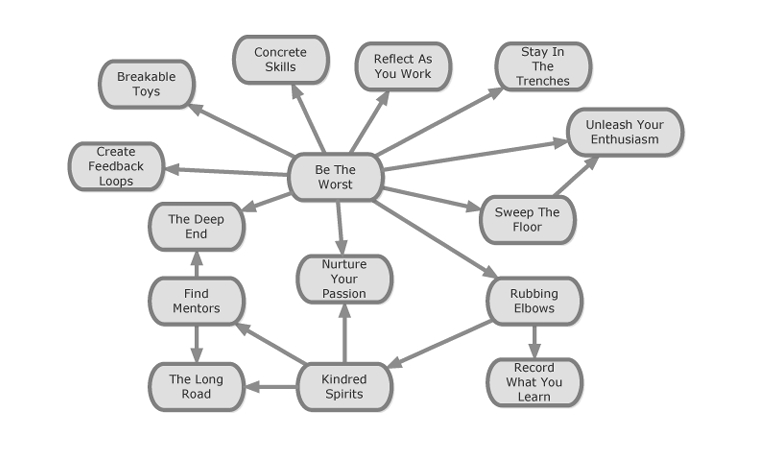

 

    
 

# **فصل چهارم — ارزیابی دقیق خود (Accurate Self-Assessment)**

یکی از **بزرگ‌ترین خطرها** برای کسی که **به‌سرعت یاد می‌گیرد**، این است که تبدیل شود به **ماهی بزرگی در برکه‌ای کوچک**.
البته در ذاتِ خود، نه برکه‌ی کوچک بد است و نه ماهی بزرگ،
اما نکته‌ی حیاتی این است که **ماهی بزرگ بداند برکه‌های دیگری هم وجود دارند**
در شبکه‌ی عظیم و به‌هم‌پیوسته‌ی برکه‌های جهان —
و از همه مهم‌تر، بداند **ماهی‌هایی بسیار بزرگ‌تر از خودش** نیز در آن برکه‌ها زندگی می‌کنند.

شاگرد بااستعداد و سخت‌کوش نباید از موفقیت‌هایش احساس رضایت و خودبسندگی پیدا کند.
در دنیای توسعه‌ی نرم‌افزار، **بالا رفتن از سطح متوسط** کار سختی نیست،
چون بسیاری از افراد به بودن در چند قدمیِ جلوی منحنی رشد قانع می‌شوند.
اما تو باید با این **گرایش به میان‌مایگی** مبارزه کنی —
با **جست‌وجو و یادگیری از تیم‌ها، سازمان‌ها، هم‌سفران (journeymen)**
و **استادکارانی** که در سطحی از مهارت کار می‌کنند
که یک شاگرد حتی ممکن است نتواند آن را تصور کند.

باید **جرأتِ رها کردن حسِ تواناییِ فعلی‌ات** را پیدا کنی
و بپذیری که هنوز تنها **فاصله‌ی کوتاهی در مسیر راه دراز** پیموده‌ای.
هدف تو نباید این باشد که از "برنامه‌نویس متوسط" بهتر باشی —
هدف این است که **توانایی‌هایت را بسنجی**
و راه‌هایی پیدا کنی تا **از دیروزِ خودت بهتر شوی**.

ما همه در یک سفر مشترک هستیم،
و مقایسه‌ی خود با دیگران تنها زمانی ارزش دارد
که به ما کمک کند **راه‌هایی برای رشد متقابل پیدا کنیم**.

---

### **بدترین باش (Be the Worst)**

 

    
 

> «دُمِ شیر باش، نه سرِ روباه!»
> — رساله‌ی آووت (Tractate Avot)

---

#### **زمینه (Context)**

تو با رها کردن شور و اشتیاقت و استفاده از هر فرصتی برای یادگیری مهارت‌های جدید، رشد چشم‌گیری کرده‌ای.
نتیجه؟ از تیم خود — و شاید از کل سازمان توسعه‌ای که در آن کار می‌کنی — جلو زده‌ای.

---

#### **مسئله (Problem)**

سرعت یادگیری‌ات ثابت مانده و دیگر رشد نمی‌کنی.

---

#### **راه‌حل (Solution)**

خودت را در میان توسعه‌دهندگانی قرار بده که از تو بهترند.
تیمی قوی‌تر پیدا کن که در آن **ضعیف‌ترین عضو** باشی — جایی که هنوز فضا برای رشد وجود دارد.

---

الگوی **«بدترین باش»** نخستین الگوی کلیدی در این زبان الگوها بود.
این ایده از توصیه‌ی **Pat Metheny**، نوازنده‌ی مشهور جاز، الهام گرفته است که گفت:

> «در هر گروهی که هستی، بدترین نفر باش.»

این جمله در ذهن **Dave Hoover** جرقه‌ای زد و یکی از دلایل نوشتن همین کتاب شد.

---

#### **تجربه‌ی دیو**

> اولین شغل برنامه‌نویسی من در یک استارت‌آپ دات‌کام بود. پنج ماه بعد، «دات‌بام» منفجر شد.
> بعد از فروکش‌کردن گرد و خاک، وارد بخش IT یک سازمان غیرانتفاعی بزرگ شدم.
> جای امنی برای گذر از دوران بحران بود، اما سرعت توسعه به شکل دردناکی پایین آمده بود.
> دو سال بعد، چیزهای زیادی یاد گرفته بودم، اما دیگر به چالش کشیده نمی‌شدم.
> در نقش «معمار فنی» تجربه‌ی خوبی پیدا کردم، اما به مرور فهمیدم که بودن در این نقش برای من مضحک است.
> تصمیم گرفتم تیمی پیدا کنم که بتوانم **دوباره رشد کنم** — جایی پر از توسعه‌دهندگان استثنایی.
> یک سال بعد، خوش‌شانس بودم که وارد تیمی با چند برنامه‌نویس در سطح جهانی شدم.
> چالشی سخت، اما فرصتی بی‌قیمت بود.
> — *دیو هوور*

---

بودن در یک تیم قوی باعث می‌شود **احساس کنی بهتر کار می‌کنی**،
چون اعضای دیگر اشتباه‌هایت را اصلاح می‌کنند و نمی‌گذارند آسیب بزنی —
اما همین موضوع ممکن است باعث شود متوجه نشوی چقدر واقعاً یاد گرفته‌ای.
به همین خاطر، باید **در حین کار تأمل کنی (Reflect as You Work)**
و **اسباب‌بازی‌های شکستنی (Breakable Toys)** بسازی تا مهارت‌هایی را که از هم‌تیمی‌هایت یاد می‌گیری در عمل محک بزنی.

---

وقتی ضعیف‌ترین عضو تیمی هستی، باید **بیش از همه تلاش کنی**.
هدفت این نیست که ضعیف بمانی، بلکه از پایین شروع کنی و پله‌پله رشد کنی.
برای این کار باید آگاهانه روش‌های اعضای قوی‌تر را **مشاهده و تقلید** کنی تا در سطح آنها قرار بگیری.

---

#### **ریسک‌ها**

* ممکن است باعث افت عملکرد تیم شوی.
* ممکن است تیم‌های قوی، کسی را که صرفاً «مسافر» است نپذیرند و بیرونش کنند.
* ممکن است دچار احساس بی‌ارزشی یا ناتوانی شوی، مگر اینکه دائماً در حال رشد باشی.

به همین دلیل باید **حلقه‌های بازخورد (Feedback Loops)** ایجاد کنی تا بفهمی چه زمانی در خطر غرق شدن هستی.

---

#### **نکته‌ی فرهنگی**

این الگو برخلاف جریان فرهنگی است که تو را تشویق می‌کند هرچه سریع‌تر رهبر شوی.
اما در مسیر شاگردی، باید **یادگیری را بر سلطه و قدرت ترجیح دهی.**

---

#### **نکته‌ی تعادلی**

برای جلوگیری از خودخواهی، الگوی «بدترین باش» را با دو الگو ترکیب کن:

* **جاروب‌کش باش (Sweep the Floor)** — کارهای کوچک اما مفید را خودت برعهده بگیر.
* **مهارت‌های ملموس (Concrete Skills)** — مهارت‌های واقعی‌ات را تقویت کن تا حضور تو برای تیم ارزشمند باشد.

---

#### **تجربه‌ی برایان**

> پیوستن به شرکت Obtiva من را دوباره به پایین زنجیره برگرداند.
> حالا من یک «کارآموز نرم‌افزار» هستم و مدت‌ها طول می‌کشد تا تیمی را رهبری کنم.
> اما بودن در تیمی از توسعه‌دهندگان برجسته با هیچ چیز قابل‌جبران نیست —
> نه محیط، نه تجهیزات، نه پول.
> کار کردن کنار کسانی که مسیر را رفته‌اند و چاله‌ها را می‌شناسند، بی‌قیمت است.
> — *برایان، ایمیل*

---

#### **اقدام (Action)**

تمام تیم‌هایی را که می‌شناسی فهرست کن — از پروژه‌های متن‌باز تا شرکت‌های دیگر.
آن‌ها را بر اساس سطح مهارت مرتب کن و تیمی را پیدا کن که:

1. از تو قوی‌تر است،
2. و آماده‌ی پذیرش اعضای مشتاق برای رشد است.

برای یافتن چنین تیمی ممکن است لازم باشد در چند **میلینگ‌لیست** عضو شوی، پرس‌وجو کنی و مهارت اعضا را بسنجی.
در پایان، حتی اگر هنوز به تیم جدیدی نپیوسته باشی،
درک عمیق‌تری از مقایسه‌ی سطح مهارت‌ها و مسیر رشد خود پیدا خواهی کرد.

---

#### **ارجاع به الگوهای مرتبط**

* **Breakable Toys** (صفحه ۷۹)
* **Concrete Skills** (صفحه ۲۴)
* **Create Feedback Loops** (صفحه ۹۱)
* **Find Mentors** (صفحه ۶۱)
* **Reflect As You Work** (صفحه ۸۵)
* **Rubbing Elbows** (صفحه ۶۶)
* **Stay in the Trenches** (صفحه ۵۲)
* **Sweep the Floor** (صفحه ۶۸)
* **The Deep End** (صفحه ۳۰)
* **Unleash Your Enthusiasm** (صفحه ۲۲)

---

### **پیدا کردن مربیان (Find Mentors)**

> «فرقی نمی‌کند تازه‌کار با دوره‌ی آموزشی شروع کند یا خودآموز باشد،
> نخستین گام در مسیر صنعت نرم‌افزار، یافتن استادی است که شاگرد او شوی.»
> — *پیت مک‌بریـن، کتاب Software Craftsmanship، صفحه ۹۶*

---

#### **زمینه (Context)**

تو فهمیده‌ای که اولین کسی نیستی که در این مسیر قدم گذاشته است،
اما هنوز زمان زیادی را در کوچه‌پس‌کوچه‌های بی‌نتیجه می‌گذرانی.

---

#### **مسئله (Problem)**

در مسیری قدم می‌زنی که نمی‌دانی پشت پیچ بعدی چه چیزی منتظرت است
و چگونه باید برای آن آماده شوی.
به کمک و راهنمایی نیاز داری.

---

#### **راه‌حل (Solution)**

به دنبال کسانی باش که پیش از تو در این مسیر قدم گذاشته‌اند و بکوش از آنان بیاموزی.

در حالت ایده‌آل، شاگردِ یک استاد واقعی می‌شوی؛
زیر نظر او آموزش می‌بینی و آینده‌ات را بر پایه‌ی اعتبار او می‌سازی.
اما این حالت ایده‌آل در دنیای امروز بسیار نادر است.

صنعت نرم‌افزار هنوز جوان است و استادان واقعی‌اش اندک‌اند.
از طرفی، تشخیص اینکه چه کسی واقعاً «استادکار» است برای شاگرد تازه‌کار آسان نیست.
بنابراین، در واقعیت، دوران شاگردی تو به‌احتمال زیاد زیر نظر **مجموعه‌ای از مربیان** با درجات مختلف مهارت خواهد بود.

شاگردان واقعی باید با سماجت راهی برای ورود به زندگی استادان بیابند
و قدردان هر توجهی باشند که از آنان می‌گیرند — به‌ویژه در ارتباط چهره‌به‌چهره یا در کنار هم کار کردن.
اما گاهی بهترین و تأثیرگذارترین مربیان تو در کنارت نیستند.
ممکن است در کشور دیگری زندگی کنند — یا حتی قرن‌ها پیش درگذشته باشند.
اما هنوز می‌توانند چون فانوسی مسیرت را روشن کنند.

> «اگر شاگردی داری که برایت مناسب نیست، ابتدا در درون خودت نگاه کن.
> شاید انتظارت از هر معلمی بیش از حد باشد.»
> — *جورج لئونارد، کتاب Mastery، صفحه ۷۱*

---

#### **نکته‌ی مهم**

هنگام یافتن مربی، به یاد داشته باش که **همه‌ی ما در جاده‌ی طولانی** (The Long Road) هستیم،
و هیچ‌کس همه‌چیز را نمی‌داند.
وسوسه می‌شوی فکر کنی مربی‌ات استاد واقعی است چون از تو خیلی بیشتر می‌داند،
اما باید در برابر این وسوسه مقاومت کنی —
زیرا وقتی ضعف‌های اجتناب‌ناپذیر او را ببینی، ممکن است ناامید شوی و نتوانی از کسی که هنوز چیزهای زیادی برای آموختن دارد، یاد بگیری.

---

#### **تجربه‌ی دیو (Dave Finds a Mentor)**

> تابستان ۲۰۰۲ بود. کمتر از دو سال از شروع برنامه‌نویسی‌ام می‌گذشت
> و تازه داشتم تفاوت عظیم میان یک تازه‌کار و یک حرفه‌ای را می‌دیدم.
> خواندن کتاب *Software Craftsmanship* از پیت مک‌بریـن در همان تابستان مرا واداشت تا به‌دنبال مربی بگردم.
> فهمیدم اگر بخواهم توسعه‌دهنده‌ی بزرگی شوم، باید به سراغ برنامه‌نویسان باتجربه بروم
> و شاگردی خود را به‌شکل آگاهانه تنظیم کنم.
>
> در آن زمان در اوج *گسترش پهنای باند ذهنی‌ام* بودم
> و تازه به گروه *Chicago Agile Developers (ChAD)* پیوسته بودم.
> در یکی از نشست‌ها خودم را به *وایت ساترلند*، برگزارکننده‌ی گروه، معرفی کردم.
> بلافاصله بعد از تمام‌کردن کتاب، ایمیلی برای او فرستادم و گفتم
> علاقه‌مندم تحت راهنمایی‌اش یاد بگیرم.
> فرستادن آن ایمیل کار راحتی نبود، اما نتیجه‌اش فوق‌العاده بود.
> او پیشنهاد کرد گه‌گاهی با هم صبحانه بخوریم و درباره‌ی پروژه‌هایمان صحبت کنیم.
> در طول یک سال، وایت مربی بسیار خوبی برای من شد.
> گرچه هرگز شانه‌به‌شانه کار نکردیم،
> اما رابطه با او — یک مشاور نرم‌افزار معتبر و نوازنده‌ی جهانی ویولنسل —
> اعتماد‌به‌نفس مرا به‌عنوان یک تازه‌کار بی‌مدرک به‌شدت بالا برد.
> راهنمایی‌های او نقش مهمی در پیشرفت من در توسعه‌ی چابک داشت
> و باورم را ساخت که می‌توانم وارد سازمانی مثل ThoughtWorks شوم.
> — *دیو هوور*

---

پیدا کردن مربی، ساده اما حیاتی است — و البته **سخت**.
پیدا کردن نویسندگان، سخنرانان کنفرانس، یا توسعه‌دهندگان پروژه‌های مشهور آسان است؛
اما دو مشکل وجود دارد:

1. ممکن است اصلاً علاقه‌ای به مربی‌گری نداشته باشند.
2. درخواست شاگردی ممکن است برایت بسیار دشوار و غیرمعمول باشد.

اما درست مانند جهیدن به **اعماق (The Deep End)**،
خطرِ «عجیب به نظر رسیدن» در برابر مربی بسیار کمتر از ارزش احتمالی آن است.
حتی اگر فرد مورد نظر نپذیرد، دعوت‌کردن او به ناهار به‌خودی‌خود تجربه‌ای ارزشمند است.

اگر واقعاً هدف تو رسیدن به استادی است،
باید در پیدا کردن مربیان **سماجت و پشتکار** داشته باشی.
تقریباً هیچ توسعه‌دهنده‌ی بزرگی را نمی‌یابی که نتواند از اثر عمیق مربیانش سخن بگوید.

---

شاگردی تو در انزوا شکل نمی‌گیرد.
همیشه افرادی جلوتر از تو هستند، و افرادی نیز عقب‌تر.
بنابراین در کنار یافتن مربی، باید آماده باشی که **خودت نیز مربی دیگران شوی.**
منتقل‌کردن دانسته‌هایت به تازه‌کارها یکی از نشانه‌های آغاز مرحله‌ی **میان‌دستی (Journeyman)** است.

---

#### **اقدام (Action)**

یک ابزار، کتابخانه یا جامعه‌ی نرم‌افزاری را انتخاب کن که **لیست ایمیل فعالی** دارد.
در آن عضو شو، اما هنوز چیزی ارسال نکن — فقط **مشاهده کن**.
با گذشت زمان، ارزش‌ها و فرهنگ آن جامعه را می‌فهمی
و تشخیص می‌دهی چه کسانی رفتار صبورانه و روحیه‌ی آموزشی دارند.
سپس در اولین کنفرانس مرتبط،
آن افراد را پیدا کن و از آنان بخواه برخی از درس‌هایی را که آموخته‌اند با تو در میان بگذارند.

---

#### **ارجاع به الگوهای مرتبط**

* **The Deep End** (صفحه ۳۰)
* **The Long Road** (صفحه ۳۸)

---

### **روح‌های هم‌فکر (Kindred Spirits)**

> «هیچ‌چیز قدرتمندتر از یک جامعه از افراد بااستعداد که روی مشکلات مشابه کار می‌کنند، نیست.»
> — *پال گراهام، کتاب Hackers & Painters*

---

#### **زمینه (Context)**

شما ماه‌ها یا سال‌هاست که در دوران شاگردی خود قرار دارید و احساس می‌کنید که فرهنگ سازمان توسعه شما شما را دلسرد کرده است.

---

#### **مسئله (Problem)**

فرهنگ‌های سازمانی که از صنعت نرم‌افزار و شاگردی حمایت می‌کنند، نادر هستند. شما خود را بدون مربی در فضایی می‌بینید که با آرزوها و اهداف شما در تضاد است.

---

#### **راه‌حل (Solution)**

برای حفظ حرکت خود، به‌ویژه در غیاب یک مربی تمام‌وقت، باید در ارتباط مداوم با افرادی باشید که مسیر مشابهی را طی می‌کنند.
**جاده‌ی طولانی (The Long Road)** جاده‌ای نیست که کسی به‌تنهایی در آن قدم بگذارد، و به‌ویژه در دوران شاگردی، به هم‌پیمانی نیاز دارید.
این الگو از نظر اصولی ساده است، و برای بعضی افراد (مانند گروه‌های برون‌گرا) در عمل نیز ساده است. اما برای برخی دیگر ممکن است دشوار باشد.
برخی روابط کوتاه‌مدت و تغییر‌دهنده‌ی زندگی هستند؛ برخی دیگر بلندمدت هستند و به شما کمک می‌کنند تا **اشتیاق خود را پرورش دهید**.
در ادامه داستان‌هایی از قدرت روح‌های هم‌فکر آورده شده است:

* **دیو (Dave) و رومن (Roman):**
  دیو در تابستان ۲۰۰۲ کتاب *Extreme Programming Explained* را خواند و وارد جامعه‌ی XP/Agile شد. او به‌طور خودجوش هزینه حضور در کنفرانس XP/Agile Universe 2002 را پرداخت و در آنجا با رومن آشنا شد که پیش از این از طریق یک گروه کاربری محلی با او ارتباط آنلاین داشت. آنها هر هفته برای صرف ناهار ملاقات می‌کردند و در کنار یادگیری کتاب‌های مختلف، هم‌فکری و حل مشکلات یکدیگر را در طول سال‌ها داشتند.

* **استیو (Steve) و شِین (Shane):**
  در سال ۲۰۰۴، استیو که یک برنامه‌نویس جوان پرانرژی بود، با شِین، یک توسعه‌دهنده با تجربه از نیوزیلند آشنا شد. علیرغم فاصله‌ی جغرافیایی بسیار زیاد، رابطه‌ی آن‌ها تاثیر عمیقی در مسیر حرفه‌ای استیو داشت. شِین به او کتاب‌هایی مانند *Design Patterns* را معرفی کرد و این دو با داشتن زبان مشترک، به بحث و گفتگو در مورد طراحی‌های شیءگرا پرداختند.

---

#### **نکته‌ی مهم**

مربیان افرادی هستند که شما می‌خواهید آن‌ها را الگوی خود قرار دهید و ممکن است گاهی از شما دور باشند یا حتی کمی ترسناک به نظر برسند.
از طرف دیگر، **جامعه شما** محیط امنی را برای کشف و یادگیری فراهم می‌آورد.
شاید شما به جاوا اسکریپت علاقه دارید، و یکی از روح‌های هم‌فکر شما در حال یادگیری هسکل است.
در این حالت می‌توانید آزادانه آنچه که می‌آموزید را با یکدیگر به اشتراک بگذارید، بدون اینکه مجبور شوید از یکدیگر پیروی کنید.
این برخلاف رابطه‌ی مربی-شاگرد است، که در آن ممکن است شاگرد احساس کند باید علاقه‌اش به جاوا اسکریپت را کنار بگذارد و فقط به هسکل بپردازد چون مربی آن را زبان برتر می‌داند.

---

#### **احتیاط در برابر تفکر گروهی (Groupthink)**

با اینکه جامعه‌ای از افراد هم‌فکر مزایای زیادی دارد،
باید از **تفکر گروهی** آگاه باشید.
خود را مجبور کنید تا سوالاتی بپرسید که ممکن است جامعه‌تان را شگفت‌زده کند.
سعی کنید آن فاصله‌ی فکری را حفظ کنید و اعتراضات محترمانه‌ای برای حفظ سلامت جامعه‌تان ایجاد کنید.
سلامت جامعه‌تان را می‌توانید با نحوه‌ی واکنش آن به ایده‌های جدید بسنجید.
آیا پس از بحث و آزمایش‌های جدی آن ایده را می‌پذیرند؟ یا سریع آن را رد می‌کنند؟

---

#### **اقدام (Action)**

تمام جوامعی را که می‌توانید به آن‌ها بپیوندید فهرست کنید،
شامل ابزارهایی که استفاده می‌کنید، زبان‌هایی که می‌شناسید، افرادی که با آن‌ها کار کرده‌اید، وبلاگ‌هایی که می‌خوانید و ایده‌هایی که شما را جذب کرده‌اند.
بررسی کنید کدام یک از این گروه‌ها در دنیای واقعی در شهر شما گردهم می‌آیند.
به تدریج در تمامی این گردهمایی‌ها شرکت کنید و تصمیم بگیرید کدام یک از این گروه‌ها برای شما جذاب‌تر است.
اگر هیچ‌کدام از این گروه‌ها به‌طور مرتب در نزدیکی شما تشکیل جلسه نمی‌دهند،
این یک **فرصت طلایی** برای ایجاد یک گردهمایی برای توسعه‌دهندگان نرم‌افزار در منطقه شماست.
این کار بسیار راحت‌تر از آن چیزی است که فکر می‌کنید.
فقط مراقب باشید که عضویت یا موضوعات را خیلی زود محدود نکنید.
به جای آن، این رویداد را در هر جایی که می‌توانید تبلیغ کنید تا توسعه‌دهندگان نرم‌افزار در منطقه شما آن را ببینند.

---

#### **ارجاع به الگوهای مرتبط**

* **Find Mentors** (صفحه ۶۱)
* **Nurture Your Passion** (صفحه ۴۵)
* **The Long Road** (صفحه ۳۸)

---

**رؤیای همکاری (Rubbing Elbows)**

من از این که آزادی کافی داشته باشم تا تفسیر کنم یا ایده‌هایی مطرح کنم لذت می‌برم، اما در عین حال از همکاری هم لذت می‌برم. من به دنبال پروژه‌هایی می‌روم که در آن‌ها از افرادی که با آن‌ها کار می‌کنم، یاد بگیرم و در این نوع پروژه‌ها رشد می‌کنم.

—ویلیام کمپ

**متن:**
در حالی که ممکن است شما دارای مربیان و هم‌راهان روحی باشید که به صورت دوره‌ای با آنها ملاقات می‌کنید، هنگام توسعه نرم‌افزار معمولاً به صورت انفرادی کار می‌کنید.

**مسئله:**
محصولیت شما به یک سطح ثابت رسیده است، یادگیری شما به رکود رسیده است و احساس می‌کنید که تکنیک‌ها و رویکردهای برتری در این هنر وجود دارند که شما هنوز به آن‌ها نرسیده‌اید.

**راه‌حل:**
راه‌هایی پیدا کنید که بتوانید کنار یک توسعه‌دهنده نرم‌افزار دیگر بنشینید و یک کار عملی را با هم انجام دهید، کنار هم. برخی از چیزها تنها زمانی قابل یادگیری هستند که شما در کنار یک توسعه‌دهنده نرم‌افزار دیگر نشسته و به‌طور مشترک به انجام یک هدف مشترک بپردازید.

این الگو می‌تواند ارتباط نزدیکی با الگوی "هم‌روحان" (Kindred Spirits) داشته باشد. این موضوع برای دیو اتفاق افتاد، که یک هم‌دست در رومن پیدا کرد و سپس به معنای واقعی کلمه در طول ناهار در کنار هم نشسته و در مورد تکنولوژی‌هایی مانند زبان برنامه‌نویسی روبی و توسعه پلاگین‌های اکلیپس یاد می‌گرفتند. اما حتی اگر رومن هم‌روح او نبود، دیو هنوز هم از همکاری با یک برنامه‌نویس با استعداد، حتی در پروژه‌های شخصی، بهره‌مند می‌شد. همواره تکنیک‌های میکرو خاصی وجود دارند که شما تنها زمانی آن‌ها را یاد خواهید گرفت که در کنار یک همکار به‌طور نزدیک همکاری کنید. این تکنیک‌ها معمولاً آن‌قدر جزئی هستند که در آموزش‌ها ذکر نمی‌شوند، اما تاثیر آن‌ها جمع می‌شود.

همکاری با رومن برای پیشرفت دیو به‌عنوان یک توسعه‌دهنده حیاتی بود، زیرا در آن زمان در حرفه‌اش به ندرت فرصت کار با برنامه‌نویسان با استعداد را داشت.

عملکرد برنامه‌نویسی جفت (Pair Programming) یک نمونه عینی از این الگو است، و کارآموزان باید به دنبال فرصت‌هایی برای کار در تیم‌هایی باشند که از این تکنیک استفاده می‌کنند. در حالی که برنامه‌نویسی جفت می‌تواند یک تکنیک عالی برای یادگیری باشد، این فعالیت پیچیده است و همیشه به‌طور ذاتی تجربه‌ای مثبت نخواهد بود. اما هنگامی که به‌طور مؤثر استفاده شود، یکی از قدرتمندترین راه‌ها برای یادگیری است، به‌ویژه از مربیان.

چگونه می‌توانید بفهمید که آیا برنامه‌نویسی جفت به‌طور مؤثر استفاده می‌شود؟ و کارآموز در این زمینه چه کاری می‌تواند انجام دهد؟

شما اغلب احساس خواهید کرد که در مقایسه با همکار خود گم شده‌اید یا خیلی عقب‌تر از او هستید. این به این معنی نیست که برنامه‌نویسی جفت شکست خورده است—این تنها به این معنی است که شما باید یا با پرسیدن سوالات سرعت کار را کاهش دهید یا احساس گم شدن را تحمل کرده و سعی کنید تکه‌هایی که درک می‌کنید را یاد بگیرید. اما اگر احساس می‌کنید که به طور مزمن عقب هستید، هفته به هفته، و در حال ناامیدی هستید، وقت آن رسیده که تغییری ایجاد کنید. ممکن است شما با یک همکار برنامه‌نویسی جفت ضعیف گیر کرده باشید، یا ممکن است همکار شما به پیشنهاداتی برای بهبود تجربه‌تان نیاز داشته باشد. به‌عنوان یک کارآموز، شما ممکن است قدرت زیادی برای تغییر وضعیت خود نداشته باشید، اما اگر در پروژه‌ای با بیش از چند نفر هستید، احتمالاً می‌توانید فرصت‌هایی برای چرخش روزها یا هفته‌ها بین همکاران برنامه‌نویسی جفت پیدا کنید. این چرخش ممکن است به شما کمک کند تا از وضعیت دشوار خود خارج شوید و دوباره به مسیر پیشرفت بازگردید.

علاوه بر این، اگر شما در حال انجام توسعه مبتنی بر تست (TDD) هستید، می‌توانید برنامه‌نویسی پینگ‌پنگ (Ping-Pong Programming) را به‌عنوان یک راه برای افزایش مشارکت خود پیشنهاد دهید.

بر اساس گفته‌های ریچارد سنه در کتاب "The Craftsman"، کارگاه ایده‌آل صنایع دستی جایی است برای "جذب دانش ضمنی، که در کلمات بیان نمی‌شود و به صورت غیررسمی است" از "هزار حرکت روزمره‌ای که در مجموع به یک عمل تبدیل می‌شود" (ص. 77). از آنجا که چنین محیط‌هایی اکنون بسیار نادر شده‌اند، ما باید از الگوی "رؤیای همکاری" به‌عنوان جایگزینی مدرن استفاده کنیم. کاربردهای این الگو محدود به برنامه‌نویسی جفت نیستند. هدف این است که راه‌هایی پیدا کنید تا خود را در معرض عادت‌های کاری روزانه دیگر افراد ماهر قرار دهید و روش‌هایی که آن‌ها به‌تدریج این عادت‌ها را به مهارت‌های بزرگتری تبدیل می‌کنند، مشاهده کنید.

برای مثال، ممکن است با کسی در مورد یک مقاله علمی یا ارائه یا در یک پرش پروژه متن‌باز همکاری کنید. یا همان‌طور که برای آدِ اتفاق افتاد، ممکن است خود را در حال داوطلب شدن برای کمک به کسی ببینید که می‌خواهد از نظریه گراف برای طراحی بخش مدیریت وابستگی در یک سیستم مدیریت محتوا نوشته شده با اسکریپت یونیکس استفاده کند! به اشتراک گذاشتن یک تخته سفید با کسی که می‌خواهد از یک ابزار سطح پایین برای حل مشکلی استفاده کند که شما به‌طور خودکار با زبان سطح بالا حل می‌کنید (یا بالعکس) شما را مجبور می‌کند که موقتاً مانند آن شخص فکر کنید تا بتوانید به‌طور مؤثر ارتباط برقرار کنید. حتی اگر در نهایت این دیدگاه را رد کنید، شما روشی جدید برای نگاه کردن به مشکلات کسب کرده‌اید. آن دیدگاه ممکن است دقیقاً راه‌حل مناسب برای مشکلی در آینده باشد، حتی اگر در کوتاه‌مدت برای شما آزاردهنده باشد.

خواه تجربه شما از همکاری مثبت باشد یا منفی، شما باید آنچه را که یاد گرفته‌اید ثبت کنید تا بعداً بتوانید به تجربیات خود بازگردید. روزی شما احتمالاً در همان موقعیت شریک برنامه‌نویسی جفت خود خواهید بود، و تجربیات گذشته‌تان بینشی ارزشمند به شما می‌دهد از نگرش فردی که در کنار شما نشسته است.

**عمل:**
کسی را پیدا کنید که قبلاً علاقه‌مند به شروع یا مشارکت در یک پروژه متن‌باز شده است. ترتیب دهید که یک شب در هفته را با هم روی پروژه کار کنید. ببینید چقدر می‌توانید یکدیگر را برای ادامه کار پروژه انگیزه بدهید. فشارهای زندگی پرمشغله به‌طور اجتناب‌ناپذیری انگیزه پشت همکاری شما را ضعیف خواهند کرد؛ زمانی که این اتفاق می‌افتد، شما باید سازگار شوید و راه‌هایی پیدا کنید تا پروژه را ادامه دهید تا آن انگیزه بازگردد. البته، اگر انگیزه هرگز بازنگردد، مسئولیت شماست که برای یک همکاری جدید به‌دنبال یادگیری چیزهای جدید باشید.

**مراجعه به دیگر الگوها:**

* **Kindred Spirits** (صفحه 64)
* **Record What You Learn** (صفحه 87)

---

**Sweep the Floor**
در سنت صنایع دستی، تازه‌کارها به عنوان شاگرد نزد یک استاد صنایع دستی شروع می‌کنند. آنها با انجام کارهای ساده شروع می‌کنند و به تدریج با یادگیری و کسب مهارت بیشتر، به کارهای پیچیده‌تر و بزرگتر ارتقا می‌یابند.
—پیته مک‌برین، هنر نرم‌افزار

**متن:**
**زمینه:**
شما به عنوان یک تازه‌کار در یک پروژه شروع کرده‌اید.

**مسئله:**
شما از جایگاه خود در تیم مطمئن نیستید و تیم هم از شما مطمئن نیست. شما می‌خواهید راهی پیدا کنید تا به کار تیم کمک کنید، اعتماد تیم را جلب کنید و به عنوان یک صنعتگر در جایگاه خود رشد کنید.

**راه‌حل:**
برای انجام کارهای ساده، کم‌اهمیت و در عین حال ضروری داوطلب شوید. این یک روش خوب برای کمک به موفقیت تیم در مراحل ابتدایی است، نشان دادن این که می‌توانید یک کار با کیفیت بالا را انجام دهید حتی زمانی که به نظر نمی‌رسد مهم باشد. البته، بی‌توجهی به کیفیت در بخش‌های کم‌اهمیت پروژه می‌تواند باعث مشکل در آینده شود، زمانی که مشخص می‌شود بخش‌های ساده پروژه به طور حیاتی اهمیت دارند.

**پل به‌طور واقعی کف می‌زند:**
من افتخار این را داشتم که در یک محیط آموزشی نرم‌افزاری رسمی آموزش ببینم. شرکت Object Mentor من را وقتی 17 ساله بودم استخدام کرد و هر تابستان و زمستان تعطیلات دانشگاهی من را دوباره استخدام کرد. وقتی آموزش نرم‌افزار خود را شروع کردم، نمی‌دانستم چگونه نرم‌افزار بنویسم. من بعضی کدها برای ایجاد برنامه‌ها و اسکریپت‌های ساده برای سرگرمی نوشته بودم. وقتی شروع به یادگیری کردم، در ابتدا جاهای کمی بود که می‌توانستم به کسب‌وکار شرکت ارزش بیافزایم. نمی‌توانستم نرم‌افزار بنویسم و به وضوح نمی‌توانستم به دیگران نحوه نوشتن نرم‌افزار را آموزش دهم.
در آن زمان، شرکت Object Mentor بسیاری از رهبران موفق eXtreme Programming را استخدام کرده بود تا دوره‌ای در مورد XP تدریس کنند. به عنوان یک تازه‌کار که بسیار تحت تأثیر قرار گرفته بود، به من مأموریت داده شد تا جداول برنامه‌نویسی جفتی را که آنها طراحی کرده بودند بسازم. همچنین باید کامپیوترها را آماده می‌کردم، نرم‌افزار مناسب برای تمرین‌ها را نصب می‌کردم و اتاق را تمیز می‌کردم. این کارها به من کمک کرد تا اعتماد به نفس پیدا کنم و بخشی از تیم و شرکت باشم.
به تدریج که آموزش من پیش می‌رفت، کارهای چالش‌برانگیزتر فنی را بر عهده می‌گرفتم. با این حال، آنها هنوز هم اغلب کارهایی بودند که باید به فرد پایین‌تر از هرم ارجاع داده می‌شد. کارهایی مانند جابه‌جایی سرورها، پیدا کردن سیستم‌های پشتیبان‌گیری، و به‌روزرسانی محتوای وب‌سایت. این کارها به من کمک کرد تا پیروزی‌های کوچکی به دست بیاورم، در زمانی که نوشتن کد برای من سخت بود.
ایفا کردن نقش یک شاگرد سنتی همچنین به من کمک کرد تا تواضع و احترام به صنعتگران ارشد را بسازم. به یاد دارم که "انکل باب" مارترین وارد اتاق شد، سطل زباله‌ها را پر دید و کیسه زباله را عوض کرد. مربی من مرا سرزنش کرد و به‌طور مناسب گفت که وظیفه استاد صنایع دستی این نیست که زباله‌ها را بیرون ببرد. این یک درس مهم برای من بود که آموختم.

**کارهای مشابه:**
مگر اینکه شما مثل پل باشید، بیشتر شاگردها واقعاً کف نخواهند زد. با این حال، کارهایی که شما داوطلبانه انجام می‌دهید به همان اندازه برای سلامت مداوم تیم اهمیت دارند.
مثال‌هایی از این کارها شامل نگهداری سیستم ساخت، پشتیبانی تولید، پاسخ به درخواست‌های نگهداری، رفع اشکال، بازبینی کد، از بین بردن بدهی فنی، راه‌اندازی ویکی پروژه، به‌روزرسانی مستندات، و عمل به‌عنوان تریبون برای ایده‌های دیگران هستند. به طور معمول، شما می‌خواهید روی لبه‌های سیستم که ریسک کمتری دارند تمرکز کنید، نه هسته که معمولاً پیچیدگی‌ها و وابستگی‌های زیادی دارد.

**عمل:**
کثیف‌ترین کارهایی که تیم شما ماه‌ها از انجام آن‌ها پرهیز کرده است، کدام‌ها هستند؟ کارهایی که همه از آن‌ها شکایت می‌کنند و هیچ‌کس نمی‌خواهد آن‌ها را انجام دهد. این کارها را انجام دهید. و فقط با فشار خود را مجبور به انجام آن‌ها نکنید؛ ببینید آیا می‌توانید این مشکل را به شکلی خلاقانه حل کنید که فراتر از انتظارات دیگران باشد و برای خودتان جالب باشد.

**مراجعه به دیگر الگوها:**

* **Nurture Your Passion** (صفحه 45)
* **Unleash Your Enthusiasm** (صفحه 22)

---

**جمع‌بندی**
تواضع یکی از ارکان اصلی یک دوره آموزشی موفق است. زمانی که با جاه‌طلبی ترکیب شود، تواضع به شما کمک می‌کند که متمرکز باقی بمانید و در جهت درستی پیشرفت کنید. بدون آن، شما مستعد این هستید که زودتر از موعد اعلام کنید که دوره‌ی آموزشی شما تمام شده و از برخی درس‌های مهم جا بمانید. شاید شما به خاطر یک پروژه یا زیرسیستم قابل توجهی که تحویل داده‌اید، احساس غرور کنید و باور داشته باشید که این نشان می‌دهد که شما به یک صنعتگر باتجربه تبدیل شده‌اید. شاید هم چنین باشد. اما آیا شما چیزی قابل توجه را روی بیش از یک پلتفرم تحویل داده‌اید؟ چقدر بیشتر یاد می‌گیرید اگر به زبان متفاوتی دست بزنید؟
غریزه طبیعی هر شاگرد جاه‌طلب این است که بخواهد سریع‌تر به خط پایان برسد و هرچه زودتر به یک صنعتگر باتجربه تبدیل شود. اما فراموش نکنید که شما در حال قدم زدن در **طولانی‌ترین راه** هستید، و این سفر یک دوی سرعت نیست. زمان بگذارید تا بیشترین استفاده را از دوره آموزشی‌تان ببرید و درک کنید که چه تفاوتی ندارد که شما سه ماه یا پنج سال برنامه‌نویسی کرده‌اید، هنوز هم در زمینه‌ی هنر نرم‌افزار، یک مبتدی واقعی هستید.

 

    
 

