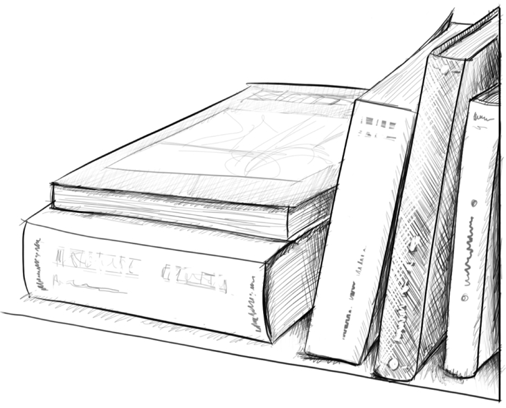
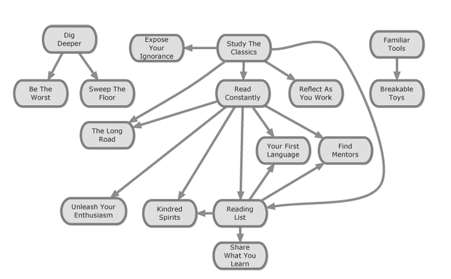

 

    
 

# فصل ششم -- ساخت برنامه درسی خود

او دیگر فردی نبود که تنها برای نمره تلاش می‌کرد. او فردی می‌شد که از دانش انگیزه می‌گرفت. دیگر نیازی به فشار بیرونی برای یادگیری نداشت. انگیزه او از درون می‌آمد... چنین انگیزه‌ای، زمانی که شکل بگیرد، نیرویی سهمگین است.
— رابرت پیرسیگ، *ذهن و هنر نگهداری موتور سیکلت*

---

###
محتوا
ما در عصری از اطلاعات فراوان زندگی می‌کنیم. اختراع دستگاه چاپ دوران جدیدی را آغاز کرد که حتی برخی از فقیرترین اعضای جامعه نیز می‌توانند دانش و بنابراین قدرت تغییر شرایط خود را به‌دست آورند. وب جهانی در حال گسترش و نوآوری‌های فنی بی‌پایان همچنان موانع را برای دستیابی به هرگونه اطلاعاتی که می‌خواهیم، کاهش می‌دهند. با افزایش پهنای باند اینترنت و ذخیره‌سازی مقدار نامحدودی از داده‌ها در دستگاه‌های دستی، اکنون می‌توانیم به رسانه‌های با وضوح بالا در قالب‌های متنی، صوتی و ویدیویی در هر زمان و هر مکان دسترسی پیدا کنیم.
مانند هر کارآموز خوب، احتمالاً از آخرین و بهترین دستگاه‌ها و پلتفرم‌های رسانه‌ای استفاده خواهید کرد، اما اطلاعات خاصی وجود دارد که عمدتاً در کتاب‌های قدیمی و کم‌فناوری یافت می‌شود. در حالی که بلاگ‌ها می‌توانند یک جریان عالی از مطالب خواندنی فراهم کنند، حجم زیادی از حکمت‌هایی که در کتاب‌های نویسندگان باتجربه‌ای مانند جری واینبرگ، فرد بروکس، استیو مک‌کانل و کنت بک جمع‌آوری شده است، نمی‌تواند جایگزین شود، حتی با اطلاعات با پهنای باند بالاتر. حتی اگر شما یک کتاب‌خوان حرفه‌ای نباشید، یک کارآموز موفق باید شامل کتاب‌هایی باشد که زمانی برای مطالعه به آن‌ها اختصاص داده می‌شود.
با این حال شما در مدرسه نیستید. هیچ خواندن تحویلی وجود ندارد—این به شما بستگی دارد که توصیه‌ها را پیدا کرده و برنامه درسی خود را بسازید.

---

**فهرست کتاب‌ها**

**محتوا**
هیچ‌کس نمی‌تواند همه‌چیز را یک‌جا یاد بگیرد، اما هیچ‌اصولی یا قاعده‌ای وجود ندارد که از کارآموز جلوگیری کند تا امروز کمی از این موضوع، فردا کمی از آن موضوع، چیزهایی به ترتیبی که هیچ‌کس قبلاً به آن فکر نکرده باشد، یاد بگیرد یا تا جایی که می‌خواهد یاد بگیرد و سپس به سراغ چیز دیگری برود. او نیازی ندارد که برای یادگیری یک روش خاص، منتظر زمان‌بندی از پیش تعیین‌شده باشد؛ همچنین نیازی ندارد که چیزی را که آماده یادگیری آن نیست، فکر می‌کند بی‌فایده، ترسناک یا غیرضروری است، یاد بگیرد. یادگیرنده خودش برنامه درسی‌اش را می‌سازد.
— هاوارد اس. بکر، *یک مدرسه جای مناسبی برای یادگیری هیچ چیزی نیست*

---

پس از اینکه مهارت و شایستگی کافی برای تسلط بر زبان برنامه‌نویسی اول خود پیدا کردید، اکنون شروع به نگاه کردن به اطراف می‌کنید و حجم شگفت‌انگیزی از اطلاعاتی که هنوز باید یاد بگیرید را می‌بینید.

---

**مسئله**
تعداد کتاب‌هایی که باید بخوانید سریع‌تر از سرعت شما در خواندن آن‌ها افزایش می‌یابد.

---

**راه‌حل**
یک فهرست کتاب‌ها نگه دارید تا کتاب‌هایی که قصد دارید بخوانید را پیگیری کنید و به یاد بیاورید که چه کتاب‌هایی را خوانده‌اید.
در روحیه الگوی *آنچه که می‌آموزید را به اشتراک بگذارید*، به فکر نگهداری فهرست خود در فضای عمومی باشید. این کار به دیگران اجازه می‌دهد از چیزهایی که شما یاد می‌گیرید بهره‌مند شوند. ما از ویکی در [http://bookshelved.org](http://bookshelved.org) (که توسط لوران بوسفیت در سال ۲۰۰۲ آغاز شده است) استفاده می‌کنیم، اما هر فهرست عمومی دیگری هم به‌خوبی کار خواهد کرد. ایده‌آل این است که فهرست شما به شما این امکان را بدهد که کتاب‌ها را به ترتیب خاصی قرار دهید و تشخیص دهید که کدام کتاب‌ها را خوانده‌اید و کی.

این الگو فقط در مورد مدیریت کتاب‌هایی که قصد دارید بخوانید نیست. بلکه همچنین یک مکانیزم برای بازتاب عادات خواندن گذشته شما است. با داده‌هایی که از چندین سال گسترش یافته است، می‌توانید الگوها، روندها و خلأهایی را در انتخاب‌های خود برای مطالعه مشاهده کنید. این می‌تواند به شما کمک کند تصمیمات بهتری درباره اینکه چه چیزی را باید بعدی بخوانید بگیرید. اگر این اطلاعات را به‌طور عمومی در دسترس قرار دهید، این امکان وجود دارد که دیگران پیشنهاداتی برای مطالعه آینده به شما بدهند. این می‌تواند به شما کمک کند تا ارتباطات پنهانی و جواهرات گمشده را کشف کنید.

یکی از ارزشمندترین چیزهایی که می‌توانید از هر کتاب به‌دست آورید، فهرستی از کتاب‌های دیگر است که ارزش خواندن دارند. به مرور زمان، متوجه خواهید شد که کتاب‌های خاصی بارها در منابع مختلف ظاهر می‌شوند و باید این کتاب‌ها را به بالای فهرست خود منتقل کنید. دیگر کتاب‌ها پایین‌تر خواهند رفت. چون فهرست شما در واقع یک صف اولویت است، در نهایت متوجه خواهید شد که برخی کتاب‌ها آن‌قدر در رتبه‌بندی پایین رفته‌اند که احتمالاً دیگر آن‌ها را نخواهید خواند. این اشکالی ندارد. هدف این الگو این است که راهی برای اولویت‌بندی و فیلتر کردن سیل دانش‌های بالقوه فراهم کند.

---

**مشکل اصلی در پیاده‌سازی این الگو این است که شما به درک عمیقی از یک موضوع نیاز دارید تا مشخص کنید کدام کتاب‌ها را بخوانید و به کدام ترتیب.**
یک راه حل برای این پارادوکس این است که ابتدا کتاب‌هایی را انتخاب کنید که درک وسیعی از موضوع مورد نظر به شما بدهند، و سپس کتاب‌هایی را انتخاب کنید که به جزئیات خاصی که به آن‌ها علاقه دارید بپردازند. راه دیگر برای حل این پارادوکس این است که به هم‌روح‌ها و مربیان خود تکیه کنید. مربیان شما قادر خواهند بود کتاب‌های ضروری را پیشنهاد دهند، در حالی که بحث با سایر کارآموزان می‌تواند به شما کمک کند تا ترتیب خواندن آن‌ها را مشخص کنید. همچنین می‌توانید از فهرست‌های عمومی کتاب‌های موجود از سوی افرادی که این الگو را پیاده‌سازی کرده‌اند، بهره‌مند شوید.

---

**دشواری دیگری در این است که نمی‌دانید از کجا شروع کنید.**
یک فهرست عالی از کتاب‌هایی که می‌توانید در فهرست خواندن خود قرار دهید، در فصل ۳۵ کتاب *Code Complete* از انتشارات Microsoft Press و در منابع کتاب *The Pragmatic Programmer* آمده است. همچنین می‌توانید به منابع این کتاب نگاه کنید تا برخی از کتاب‌هایی که ما را الهام بخشیده‌اند، ببینید.

این الگو بدهکاری زیادی به ایده *زنجیره کتاب‌ها* از راوی موهان و الگوی *مطالعه به‌صورت پیوسته* از زبان الگوهای جاشوا کریفسکی برای گروه‌های مطالعه دارد. در حالی که *زنجیره کتاب‌ها* درباره درخواست از افراد برای پیشنهاد مجموعه‌هایی از کتاب‌ها است که شما را با یک موضوع جدید آشنا می‌کند، این الگو بیشتر در مورد مدیریت جریان مستمر کتاب‌هایی است که برایتان جالب هستند. این الگو همچنین با الگوی *مطالعه به‌صورت پیوسته* متفاوت است زیرا بر خواندن کتاب‌ها به‌صورت زمانی تمرکز ندارد تا تأثیر آن‌ها بر یکدیگر را درک کند. در این الگو، کتابی که باید بعدی بخوانید، کتابی است که شما را یک قدم دیگر در سفر شما جلو می‌برد.

---

**مهم است که به یاد داشته باشید این فهرست کتاب‌ها متعلق به شما است.**
تأثیر گرفتن از پیشنهادات دیگران عالی است، اما تنها شما می‌دانید که وضعیت فعلی شما چیست. بنابراین، باید شما باشید که انتخاب می‌کنید که چه چیزی را باید بعدی مطالعه کنید. با این حال، مهم است که کتاب صحیح را در زمان صحیح بخوانید. این کار بسیار قوی‌تر از خواندن تعداد زیادی کتاب است که شما تجربه یا عمق دانش لازم برای درک آن‌ها را ندارید. بسیاری از افراد خیلی زود به سراغ کتاب *Design Patterns* می‌روند، در حالی که کتابی مانند *Refactoring* می‌تواند معرفی ملایم‌تری به الگوها باشد. مربیان خود را پیدا کنید و از آن‌ها بخواهید که به شما توصیه کنند که کدام کتاب را باید بعدی بخوانید. زمان‌بندی تأثیر زیادی بر تجربه شما از کتاب دارد.

---

**عملیاتی**
یک فایل متنی ایجاد کنید، شاید آن را تحت کنترل نسخه قرار دهید. تمام کتاب‌هایی که در حال حاضر می‌خوانید را در آن تایپ کنید. این فهرست کتاب‌ها است، ساده‌ترین پیاده‌سازی ممکن از این الگو. حالا تنها کاری که باید انجام دهید این است که این فایل متنی را به‌روز نگه دارید.

---

**برای اطلاعات بیشتر**
"مربیان را پیدا کنید" (صفحه ۶۱)، "هم‌روح‌ها" (صفحه ۶۴)، "آنچه که می‌آموزید را به اشتراک بگذارید" (صفحه ۸۹)، و "زبان اول شما" (صفحه ۱۳).

---

**دائماً مطالعه کنید**

اگر حتی هر دو ماه یک کتاب خوب برنامه‌نویسی بخوانید، تقریباً ۳۵ صفحه در هفته، به زودی تسلط خوبی بر صنعت پیدا خواهید کرد و خود را از تقریباً همه اطرافیان‌تان متمایز خواهید کرد.
— استیو مک‌کانل، *کامل‌ترین کد*

---

**محتوا**
شما شور و شوق خود را برای گشودن درهای بسیار زیاد آزاد کرده‌اید.

---

**مسئله**
به نظر می‌رسد که جریان بی‌پایانی از مفاهیم عمیق‌تر و بنیادی‌تر وجود دارد که از شما می‌گریزند، علی‌رغم تسلط شما بر زبان اول خود.

---

**راه‌حل**
تشنگی خود برای یادگیری را بر مصرف هر چه بیشتر کلمات نوشته شده متمرکز کنید.
کتاب‌ها را بر بلاگ‌ها ترجیح دهید وقتی که فهرست کتاب‌های خود را می‌سازید.
باید فصولی از *راه طولانی* وجود داشته باشد که در آن‌ها فرصت دارید تا تعداد زیادی کتاب بخوانید. برای دیو، این دوره در سال‌های ۲۰۰۲-۲۰۰۳ بود، چند سال بعد از شروع برنامه‌نویسی و درست زمانی که در زبان اول خود، Perl، به یک سطح ثابت رسیده بود. این فصل با استفاده از حمل‌ونقل عمومی امکان‌پذیر شد: دیو تقریباً ۹۰ دقیقه در روز در قطار زمان داشت که هر چیزی که می‌خواست را بخواند. او به‌قدری مصمم بود که ادامه می‌داد به خواندن حتی وقتی که از قطار پیاده می‌شد و یک مایل را تا میز کارش پیاده‌روی می‌کرد. غوطه‌ور شدن در کلاسیک‌ها و منابع اصلی این حوزه، هنگامی که با *یافتن مربیان* و تعاملات مکرر با *هم‌روح‌ها* ترکیب می‌شود، یک آموزش بی‌نظیر فراهم می‌کند.

بخشی از این غوطه‌وری باید شامل کاوش در انبار وسیع دانش جامعه آکادمیک باشد. خواندن گاه‌به‌گاه مقالات تحقیقاتی ذهن شما را کش می‌دهد و شما را در تماس با لبه برش علوم کامپیوتر نگه می‌دارد و همچنین منبعی از ایده‌های چالش‌برانگیز جدید فراهم می‌آورد. تلاش برای پیاده‌سازی این ایده‌ها، ابزار کار شما را با الگوریتم‌ها، ساختارهای داده و الگوهای طراحی جدید گسترش می‌دهد، سال‌ها قبل از اینکه این‌ها به جریان اصلی برسند.

---

**عملیاتی**
با خواندن این کتاب، شما قبلاً شروع به اعمال این الگو کرده‌اید. ترفند این است که پس از تمام کردن این کتاب، همچنان شتاب را حفظ کنید. همین حالا تصمیم بگیرید که کتاب بعدی شما چه خواهد بود. آن را بخرید یا قرض بگیرید تا وقتی این کتاب را تمام کردید، بتوانید بلافاصله به کتاب بعدی منتقل شوید.
همچنین سعی کنید همیشه یک کتاب کوچک با خود داشته باشید. این به شما این امکان را می‌دهد که از زمان‌های مرده کوچک در طول روز (مانند سفرهای قطار یا انتظار در صف‌ها) برای یادگیری استفاده کنید.

---

**برای اطلاعات بیشتر**
"یافتن مربیان" (صفحه ۶۱)، "هم‌روح‌ها" (صفحه ۶۴)، "فهرست کتاب‌ها" (صفحه ۱۰۰)، "راه طولانی" (صفحه ۳۸)، "آزاد کردن شور و شوق خود" (صفحه ۲۲)، و "زبان اول شما" (صفحه ۱۳).

---

**مطالعه کلاسیک‌ها**

به ادبیات بزرگ در حرفه یا زمینه علاقه‌مندی خود پی ببرید—بهترین کتاب‌ها، مقالات و سخنرانی‌هایی که تا به حال نوشته شده‌اند—و سپس شروع به مطالعه جدی این آثار کنید.
— جاشوا کریفسکی در *Knowledge Hydrant: A Pattern Language for Study Groups*

---

**محتوا**
شما خودآموز هستید یا آموزشی بسیار عملی داشته‌اید که بیشتر بر آموزش مهارت‌ها نسبت به نظریه تأکید دارد.

---

**مسئله**
افراد با تجربه‌ای که با آن‌ها همکاری می‌کنید، به‌طور مداوم به مفاهیمی مانند قانون بروکس از کتاب‌هایی اشاره می‌کنند که فرض می‌کنند شما—و هر توسعه‌دهنده نرم‌افزاری که خود را محترم می‌داند—آن‌ها را خوانده‌اید.

---

**راه‌حل**
نادانی خود را آشکار کنید و درباره مفهوم ناشناخته و کتابی که این مفهوم از آن آمده است، بپرسید. این کتاب را به فهرست کتاب‌های خود اضافه کنید.
جاشوا کریفسکی یک‌بار از جری واینبرگ پرسید که چگونه با تمام کتاب‌هایی که منتشر می‌شود هماهنگ می‌ماند. جری گفت: "آسان است—من فقط کتاب‌های بزرگ را می‌خوانم" (*Refactoring to Patterns*, صفحه ۳۳). با *مطالعه مداوم* و *تفکر در حین کار*، شما مانند جری در نهایت قادر خواهید بود "فقط کتاب‌های خوب را بخوانید." وقتی کتابی را برمی‌دارید و اولین چیزی که از خود می‌پرسید این است که چقدر از تاریخ گذشته است، شما کتاب‌های اشتباهی می‌خوانید. کارآموزان موفق تمایل دارند که بر روی "کتاب‌های بلندمدت" تمرکز کنند و از وب یا آزمایش برای یادگیری چگونگی تکامل اطلاعات استفاده کنند.
دیو به وضوح تجربه خواندن اولین کتاب کلاسیک خود در این حوزه، *روان‌شناسی برنامه‌نویسی کامپیوتری*، را به یاد می‌آورد و تعجب می‌کرد که چقدر این کتاب، با وجود داستان‌های مربوط به کارت‌های پانچ و کامپیوترهای اتاقی، هنوز مرتبط به نظر می‌رسید. حکمت‌های جمع‌آوری‌شده در چنین کتاب‌های کلاسیک اطلاعات حیاتی برای کمک به شما در ادامه مسیر صحیح در *راه طولانی* است.

---

**یک خطر در تمرکز بر کلاسیک‌ها این است که ممکن است این کار را بیش از حد انجام دهید و اطلاعات و دانش‌های عملی که به شما کمک می‌کند تا مهارت‌های روزمره خود را بهبود دهید، نادیده بگیرید.**
مطمئن شوید که کلاسیک‌ها را با کتاب‌ها و مقالات مدرن و عملی در فهرست خواندنی خود ترکیب می‌کنید.

---

**عملیاتی**
قدیمی‌ترین کتاب در فهرست شما کدام است؟ اول آن را بخوانید. دفعه بعد که در حال ورق زدن مجموعه کتاب‌های یک توسعه‌دهنده دیگر هستید، به قدیمی‌ترین کتاب‌ها توجه کنید و از توسعه‌دهنده بپرسید که چرا هنوز آن‌ها را دارد.

---

**برای اطلاعات بیشتر**
"نادانی خود را آشکار کنید" (صفحه ۲۵)، "دائماً مطالعه کنید" (صفحه ۱۰۲)، "فهرست کتاب‌ها" (صفحه ۱۰۰)، "تفکر در حین کار" (صفحه ۸۵)، و "راه طولانی" (صفحه ۳۸).

---

**عمیق‌تر کاوش کنید**

**محتوا**
در عمل، مشکلات الگوریتمی در ابتدای یک پروژه بزرگ ظاهر نمی‌شوند. بلکه معمولاً به‌عنوان مسائل فرعی به‌وجود می‌آیند زمانی که به طور ناگهانی مشخص می‌شود که برنامه‌نویس نمی‌داند چگونه ادامه دهد یا اینکه برنامه جاری ناکافی است.
— استیون اس. کینا، *راهنمای طراحی الگوریتم‌ها*

---

شما در دنیایی از مهلت‌های زمانی فشرده و پروژه‌های نرم‌افزاری پیچیده زندگی می‌کنید که از مجموعه‌ای از ابزارها استفاده می‌کنند. کارفرمایان شما نمی‌توانند این فرصت را داشته باشند که به اندازه کافی متخصص برای پر کردن هر نقش استخدام کنند. شما تنها به اندازه کافی در مورد هر ابزار می‌آموزید تا کار امروز را انجام دهید. شما چندین آموزش کوتاه در مورد زبان یا کتابخانه‌ای که امروز با آن کار می‌کنید، انتخاب می‌کنید. تصمیم‌گیری می‌کنید بدون اینکه وقت بگذارید تا مسائل را به‌طور کامل درک کنید و از مثال‌های ساده‌ای که همراه با ابزارها ارائه شده‌اند، استفاده می‌کنید. این روش تا جایی کار می‌کند که شما می‌توانید هر کاری را انجام دهید. شما توانایی یادگیری سریع یک تکنولوژی جدید و پیدا کردن راه‌حل‌ها را پیدا می‌کنید. تنها قسمت‌هایی از یک تکنولوژی را یاد می‌گیرید که نیاز دارید تا بخشی از سیستم خود را راه‌اندازی کنید و به دیگر اعضای تیم اتکا می‌کنید تا قسمت‌های دیگر را یاد بگیرند. برای مثال، شما ممکن است یک توسعه‌دهنده سمت سرور جاوا باشید و بنابراین دانشی در مورد نحوه ساخت رابط کاربری نداشته باشید یا خیلی کم داشته باشید.

---

**مسئله**
شما به‌دلیل اینکه متوجه می‌شوید آموزش‌هایی که دنبال کرده‌اید مسائل پیچیده را ساده کرده و گوشه‌هایی را بریده‌اند، در نگهداری کدهایی که نوشته‌اید با مشکل مواجه می‌شوید. شما متوجه می‌شوید که دانش سطحی شما از هزاران ابزار باعث می‌شود همیشه در مواقعی که یک اشکال ظریف پیش می‌آید یا باید کاری انجام دهید که به دانش عمیق نیاز دارد، در حال دست و پا زدن باشید. مردم اغلب شما را متهم به داشتن رزومه‌ای گمراه‌کننده می‌کنند چون شما تفاوتی بین چند هفته گسترش یک سرویس وب موجود و دانش عمیق از مسائل مربوط به نگهداری یک سیستم سازمانی قابل‌توسعه و سازگار قائل نمی‌شوید. بدتر از همه این است که به‌خاطر دانش سطحی‌تان، حتی متوجه نمی‌شوید که چقدر کم می‌دانید تا زمانی که چیزی یا کسی شما را در آزمایش قرار دهد.

---

**محتوا**
یاد بگیرید که به‌طور عمیق به ابزارها، تکنولوژی‌ها و تکنیک‌ها بپردازید. عمق دانش خود را تا جایی افزایش دهید که بدانید چرا چیزها به این صورت هستند. عمق به معنای درک نیروهایی است که منجر به یک طراحی خاص شده‌اند، نه صرفاً جزئیات طراحی. برای مثال، این به معنای درک نظریه نوع‌ها (یا حداقل ساده‌سازی‌هایی که توسط *چارچوب تایپ* ارائه شده است) است، نه اینکه فقط کلماتی که از دیگران شنیده‌اید را تکرار کنید.
یکی از همکاران پیشین ما (راوی موهان، ارتباط شخصی) اینطور گفت:
"دانش در مورد انواع مختلف همزمانی (و محدودیت‌های آن‌ها) دانش مفیدتری است نسبت به اینکه فقط بگویید 'Thread را زیرکلاس کن یا Runnable را پیاده‌سازی کن.'"

مناطق که شما در آن‌ها دانش عمیق دارید، اعتماد به نفس شما را تقویت کرده و زمانی که تصمیم می‌گیرید *سقف را جارو کنید* به شما کمک می‌کنند، چون نشان‌دهنده جاهایی هستند که می‌توانید ارزش را زودتر در زمان خود با یک تیم جدید فراهم کنید. مهم‌تر از همه، این عمق دانش چیزی است که می‌توانید به آن رجوع کنید تا قدرت مواجهه با نواحی جدید را به‌دست آورید. شما همیشه می‌توانید به خود بگویید: "اگر من EJBs را تسلط پیدا کردم، پس می‌توانم متاکلاس‌ها را هم مدیریت کنم."

---

**یکی از مزایای عمیق‌تر کاوش در یک تکنولوژی این است که می‌توانید واقعاً توضیح دهید که در زیر سطح سیستم‌هایی که با آن‌ها کار می‌کنید چه اتفاقی می‌افتد.**
در مصاحبه‌ها، این درک شما را از دیگر داوطلبانی که نمی‌توانند نرم‌افزاری را که کمک کرده‌اند بسازند به شکلی معنادار توصیف کنند، متمایز می‌کند چون آن‌ها فقط یک بخش کوچک از آن را می‌فهمند. زمانی که شما بخشی از یک تیم می‌شوید، این الگوست که شما را از افرادی که فقط توده‌هایی از کد را بدون تفکر می‌سازند (آنطور که برنامه‌نویسان پراگماتیک آن را "برنامه‌نویسی به‌طور تصادفی" می‌نامند و استیو مک‌کانل آن را "مهندسی نرم‌افزار مذهبی" می‌خواند) متمایز می‌کند و به کسانی که کاتدرال‌ها می‌سازند.

---

**چگونه می‌توانیم سازندگان کاتدرال‌ها را شناسایی کنیم؟**
آن‌ها کسانی هستند که در تیم شما به انجام اشکال‌زدایی، دیکامپایل و مهندسی معکوس می‌پردازند و مشخصات، RFC یا استانداردهای تکنولوژی‌هایی که استفاده می‌کنید را می‌خوانند. کسانی که این کارها را انجام می‌دهند، درک متفاوتی پیدا کرده‌اند و به طور عمیق در مورد ابزارهایی که از آن‌ها استفاده می‌کنند، دانش دارند.
این تغییر در چشم‌انداز شامل تمایل به دنبال کردن یک مشکل از لایه‌های مختلف سیستم است و آمادگی برای صرف زمان برای به‌دست آوردن دانش است که همه چیز را برایتان روشن کند. برای مثال، تغییر از یک لپ‌تاپ تک هسته‌ای به یک لپ‌تاپ چند هسته‌ای ممکن است رفتار تست‌های همزمانی جاوای شما را تغییر دهد. برخی افراد فقط شانه بالا می‌اندازند و می‌پذیرند که تست‌های آن‌ها حالا به‌طور غیرقابل پیش‌بینی رفتار می‌کنند. اما دیگران مشکل را از طریق کتابخانه‌های همزمانی، مدل حافظه جاوا و مشخصات سخت‌افزار فیزیکی پیگیری می‌کنند.

---

**ابزارهایی که باید با آن‌ها آشنا باشید شامل اشکال‌زدای‌ها (مانند GDB، PDB و RDB)، که به شما این امکان را می‌دهند که به برنامه در حال اجرای خود نگاه کنید؛ اشکال‌زدای‌های سطح شبکه (مانند Wireshark)، که به شما این امکان را می‌دهند که ترافیک شبکه را مشاهده کنید؛ و تمایل به خواندن مشخصات هستند.**
توانایی خواندن مشخصات به‌عنوان کد به این معناست که هیچ چیزی از شما پنهان نخواهد بود. این به شما این امکان را می‌دهد که سوالات دشواری در مورد کتابخانه‌هایی که استفاده می‌کنید بپرسید، و اگر از جواب‌هایی که دریافت می‌کنید راضی نبودید، قادر به پیاده‌سازی مجدد آن‌ها یا جابجایی به پیاده‌سازی‌های سازگارتر با استانداردها خواهید بود.

---

**یکی از راه‌های استفاده از این الگو این است که اطلاعات خود را از منابع اصلی به‌دست آورید.**
این بدین معناست که دفعه بعد که کسی در مورد *نمایش وضعیت انتقال*، معروف به REST، با شما صحبت کرد، باید از آن به‌عنوان بهانه‌ای برای خواندن پایان‌نامه دکترای روی فیلدینگ استفاده کنید که در آن این مفهوم را تعریف کرده است. در نظر بگیرید که یک پست وبلاگ بنویسید تا آنچه را که آموخته‌اید روشن کنید یا به اشتراک بگذارید، و دیگران را نیز ترغیب کنید که سند اصلی را بخوانند.
فقط به حرف کسی که کتابی را نقل می‌کند که مقاله‌ای را خلاصه کرده است که به صفحه ویکی‌پدیا که به سند درخواست نظر اولیه IETF پیوند می‌زند، توجه نکنید.
برای درک واقعی هر ایده، باید زمینه‌ای را که در آن برای اولین بار بیان شده است، بازسازی کنید. این به شما این امکان را می‌دهد که تأسیس ایده را تأیید کنید و مطمئن شوید که جوهر آن پس از عبور از تمام این واسطه‌ها باقی مانده است.

---

**عملیاتی**
چه کتابی در فهرست شما قدیمی‌ترین است؟ ابتدا آن را بخوانید. دفعه بعد که در حال ورق زدن مجموعه کتاب‌های یک توسعه‌دهنده دیگر هستید، به قدیمی‌ترین کتاب‌ها توجه کنید و از توسعه‌دهنده بپرسید چرا هنوز آن‌ها را دارد.

---

**برای اطلاعات بیشتر**
"نادانی خود را آشکار کنید" (صفحه ۲۵)، "دائماً مطالعه کنید" (صفحه ۱۰۲)، "فهرست کتاب‌ها" (صفحه ۱۰۰)، "تفکر در حین کار" (صفحه ۸۵)، و "راه طولانی" (صفحه ۳۸).

---

**عملیاتی**

1. **یافتن و خواندن RFC 2616**، که HTTP1.1 را توصیف می‌کند، و **RFC 707**، که وضعیت هنر در فناوری فراخوانی رویه از راه دور را تا ژانویه ۱۹۷۶ شرح می‌دهد. با داشتن دانش عمیق‌تری از HTTP، سعی کنید یک **کلاینت** و **سرور** برای RFC 707 پیاده‌سازی کنید.

2. هنگامی که احساس کردید درک خوبی از **مبادلاتی** که ویراستاران RFC 707 انجام داده‌اند، پیدا کرده‌اید، به بررسی پیاده‌سازی متن باز مدرن از همان ایده‌ها بپردازید، مانند **چارچوب Apache Thrift** که فیس‌بوک را توانمند می‌سازد. سپس، از دیدگاه آگاهانه خود، یک پست وبلاگ بنویسید که **تکامل دانش ما درباره فراخوانی رویه‌های از راه دور و سیستم‌های توزیع‌شده در سه دهه گذشته** را شرح دهد.

3. حالا بروید و مقالات **استیو وینوسکی** در مورد RPC را بخوانید. آیا حالا نسبت به عمق درک خود شک دارید؟ یک پست وبلاگ در مورد **شک‌های خود** و **سطح کنونی درک خود** بنویسید.

---

**برای اطلاعات بیشتر**
"بدترین بودن" (صفحه ۵۸) و "سقف را جارو کن" (صفحه ۶۸).

---

**ابزارهای آشنا**

**محتوا**
یک "گودال" زمانی است که شما در حال چرخیدن در جای خود هستید و در هیچ جایی پیشرفت نمی‌کنید؛ تنها پیشرفتی که می‌کنید این است که خودتان را در یک گودال عمیق‌تر می‌کنید. "یک شکاف" متفاوت است: چرخ‌ها می‌چرخند و شما بی‌دردسر به جلو حرکت می‌کنید... یک گودال نتیجه‌ای است از پافشاری بر روش‌های امتحان‌شده که تغییرات شما یا جهان را در نظر نمی‌گیرند.
— تویلا ثارپ، *عادت خلاقانه*

---

**محتوا**
هر پروژه پر از چیزهای جدید برای یادگیری است. اعضای جدید تیم، نقش‌های جدید در تیم، حوزه‌های کسب و کار جدید، تکنیک‌های جدید و تکنولوژی‌های جدید.

---

**مسئله**
در میان تمام این تغییرات، چیزی باید ثابت بماند، وگرنه بهتر است که در تحقیق مشغول باشید. چگونه می‌توانید تضمینی در مورد چیزی به مشتری خود بدهید؟ زمانی که می‌گویید برای تحویل یک ویژگی خاص زمان مشخصی نیاز است، مشتریان شما باید پایه‌ای برای اعتماد به توانایی شما در تحویل داشته باشند.

---

**راه‌حل**
یک مجموعه از ابزارهای آشنا را شناسایی کرده و بر روی آن‌ها تمرکز کنید. ایده‌آل این است که این ابزارها آن‌هایی باشند که دیگر نیازی به مستندات ندارید—یا تمام بهترین شیوه‌ها، نکات کلیدی و سوالات متداول را از حفظ می‌دانید، یا آن‌ها را در وبلاگ، ویکی یا هر جایی که تصمیم به *ثبت آنچه که یاد می‌گیرید* کرده‌اید، نوشته‌اید. با این دانش، می‌توانید پیش‌بینی‌های قابل اعتمادی درباره بخش‌هایی از کار خود انجام دهید و ریسک را به مناطق جدید و ناآشنا محدود کنید.

فقط به این دلیل که این ابزارها برای شما آشنا هستند، به این معنا نیست که باید همیشه آن‌ها را به دیگران توصیه کنید. گاهی اوقات بهترین ابزار برای کار ممکن است همان ابزاری نباشد که شما با آن آشنایید. در چنین مواقعی باید تصمیم بگیرید که آیا بهره‌وری شما مهم‌تر است یا بهره‌وری تیم. به این دلیل که شما استراتژی Struts را مانند کف دست خود می‌شناسید، به این معنا نیست که همیشه استفاده از آن ساده باشد.

با این حال، این ابزارها همان‌هایی هستند که از پروژه‌ای به پروژه دیگر همراه خود می‌برید. آن‌ها بخشی از چیزی هستند که شما را از کاندیدای بعدی که برای مصاحبه آمده است، متمایز می‌کند. اگر به مشکلات برخورد کنید، شما قبلاً می‌دانید که کجا بروید تا پاسخ‌ها را پیدا کنید. شما می‌دانید این ابزارها چه مشکلاتی را حل می‌کنند و چه مشکلاتی ایجاد می‌کنند. در نتیجه، شما می‌دانید که کجا نباید از آن‌ها استفاده کنید، که به اندازه دانستن بهترین جا برای استفاده از آن‌ها مهم است.

---

**عملیاتی**
یک فهرست از ابزارهای آشنای خود بنویسید. اگر فهرست شما کمتر از پنج آیتم دارد، شروع به جستجو برای ابزارهایی کنید که شکاف‌های موجود در جعبه ابزار شما را پر کنند. این ممکن است فقط به معنای شناسایی یک ابزار باشد که قبلاً از آن استفاده می‌کنید، اما به‌اندازه کافی با آن آشنا نیستید، یا ممکن است شامل پیدا کردن ابزارهای جدید باشد.
در هر صورت، یک برنامه برای یادگیری این ابزارها تهیه کنید و امروز آن را شروع کنید.

اگر پنج ابزار آشنا دارید، آن‌ها را به دقت بررسی کنید. آیا ابزارهای بهتری و قدرتمندتری در دسترس هستند؟ آیا به ابزارهایی که دیگر منسوخ شده‌اند، چسبیده‌اید؟ آیا ابزارهای در حال ظهور وجود دارند که تهدید کنند اجزای جعبه ابزار شما را منسوخ کنند؟ اگر پاسخ به هرکدام از این سوالات بله است، پس امروز فرآیند جایگزینی این ابزارها را شروع کنید. اگر نیاز به مکانی امن برای آزمایش ابزارهای جدید دارید، از *اسباب‌بازی‌های شکستاندنی* استفاده کنید.

---

**برای اطلاعات بیشتر**
"اسباب‌بازی‌های شکستاندنی" (صفحه ۷۹).

---

**جمع‌بندی**

در تحصیل رسمی خود ممکن است به عادت کرده باشید که یک برنامه درسی به شما ارائه شود و شما آن را بدون هیچ تفکر خاصی پیش ببرید، بدون اینکه بررسی کنید آیا این بهترین کتاب‌ها برای مطالعه هستند و آیا این ترتیب بهترین ترتیب برای مطالعه است. حالا شما باید یک شرکت‌کننده فعال در فرآیند آموزش خود باشید تا تبدیل به توسعه‌دهنده‌ای شوید که می‌تواند ابزارهای قدرتمندی را برای سازماندهی و جمع‌آوری اطلاعات به‌کار گیرد. ممکن است شما همه چیزهایی که برای ساختن برنامه درسی خود نیاز دارید را ندانید، اما قدرت ترکیب حکمت بسیاری از افرادی که پیشنهاداتی به شما می‌دهند را دارید. یادگیری لذت بردن از خود فرایند یادگیری به شما در چشم‌انداز همیشه در حال تغییر فناوری که ما را همواره در حالت آماده‌باش نگه می‌دارد، کمک خواهد کرد.

 

    
 

