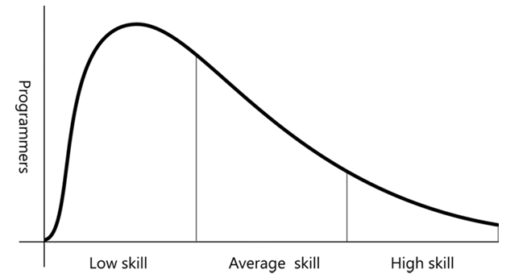

# فصل هفتم -- نتیجه‌گیری

هنرمندان و صنعتگران بیشترین افتخار را در مهارت‌هایی می‌کنند که رشد می‌یابند. به همین دلیل است که تقلید ساده، رضایت پایداری نمی‌آورد؛ مهارت باید تکامل یابد.
— ریچارد سِنِت، *صنعتگر*

---

### مقدمه
وقتی شروع به نوشتن این کتاب کردیم، فقط می‌خواستیم راهنمایی برای کارآموزان مشتاق ارائه کنیم—کسانی که آرزوی تبدیل شدن به استاد در حرفه خود را دارند. با این حال، همان‌قدر که رویکرد «حرفه‌ای» (Craft) فرصت‌هایی فراهم می‌کند، محدودیت‌هایی هم دارد.

---

**درس استرادیواری**
ویولن‌ها و ویولنسل‌هایی که در کارگاه آنتونیو استرادیواری در قرن‌های هفدهم و هجدهم ساخته شدند، هنوز هم بهترین‌های تاریخ محسوب می‌شوند. این سازها امروزه میلیون‌ها دلار ارزش دارند و در طول ۳۰۰ سال گذشته تلاش‌های بسیاری برای بازتولیدشان انجام شده است—اما همه شکست خورده‌اند.
در کتاب *صنعتگر* آمده است:
«رازهای استادانی مانند استرادیواری و گوارنری دل جزو، با آن‌ها از بین رفته است... چیزی در ساختار این کارگاه‌ها انتقال دانش را محدود کرده بود.»

وقتی استرادیواری پیر شد و دیگر نمی‌توانست در فعالیت‌های روزمره کارگاه حضور فعال داشته باشد، کیفیت سازهایی که در کارگاه ساخته می‌شد، کاهش یافت. چون کارگاه او حول نبوغ فردی خودش می‌چرخید و او نتوانست آن نبوغ را به شاگردانش منتقل کند، با مرگش کارگاه او نیز مرد.

نکته اینجاست که حتی با اینکه استرادیواری دو پسرش را شاگرد خود کرده بود و چیزی برای پنهان کردن نداشت، باز هم نتوانست تمام مهارتش را منتقل کند. او همه چیز را که *فکر می‌کرد* مهم است آموزش داد، اما آن‌چیزی که واقعاً مهارتش را متمایز می‌کرد—دانش ضمنی، ریزه‌کاری‌ها، و ارتباطات ظریفی که حتی خودش از وجودشان آگاه نبود—هرگز منتقل نشد.

---

**معنای این درس برای دنیای نرم‌افزار**
استرادیواری دانش خود را به اندازه کافی گسترده منتشر نکرد و حتی به مشتریانش یاد نداد چگونه شاگردانش را با همان معیارها بسنجند. در نتیجه تجربه‌ای که او در طول عمر به‌دست آورده بود، با مرگش از بین رفت.

اما اگرچه کارگاه او سقوط کرد، آثار شاگردانش هنوز هم "عالی، ولی نه خارق‌العاده" توصیف می‌شود.
پیامی که باید از او یاد بگیریم این است که **«استادان باید مجبور شوند تا خود را توضیح دهند، تا آن نشانه‌ها و حرکات خاموش درون‌شان را به سطح بیاورند»** و ما نیز باید اصرار کنیم تا دانش ضمنی آن‌ها به دانش آشکار تبدیل شود.
بدون کارآموزانی که آن‌قدر مشتاق باشند که استاد را به چالش بکشند، صنعت نرم‌افزار نیز مانند کارگاه استرادیواری فقط در «جیب‌های کوچک کیفیت» زنده خواهد ماند—گروه‌های محدودی از توسعه‌دهندگان بااستعداد که اتفاقاً کنار هم جمع شده‌اند.

---

**ماهیت صنعت نرم‌افزار به‌عنوان یک حرفه (Craft)**
توسعه نرم‌افزار یک حرفه است، دقیقاً چون هنوز آن‌قدر آن را نمی‌فهمیم که بتوانیم آن را مانند علم یا مهندسی، به یک رشته مدون تبدیل کنیم.
با وجود تلاش نهادهایی مانند *Software Engineering Institute* و *Agile Alliance*، این حوزه هنوز جایی است که مهارت فردی اغلب تعیین‌کننده اصلی موفقیت پروژه است.

وقتی از *مهارت* صحبت می‌کنیم، منظور فقط میزان دانش علوم کامپیوتر یا کارایی فرایند توسعه نیست؛ بلکه مجموعه تمام چیزهایی است که برای تحویل نرم‌افزار قابل‌کار لازم است—از دانش فنی گرفته تا درک انسانی، همکاری، و قضاوت.

---

**چرا مهارت اهمیت دارد**
مهارت اهمیت دارد چون ما هنوز درک دقیقی از کاری که انجام می‌دهیم نداریم تا بتوانیم آن را در قالب فرمولی بنویسیم که هرکس با اجرای آن به همان نتایج برسد.
مشتریان ما آرزو دارند که پروژه‌های نرم‌افزاری مانند آزمایش‌های علمی تکرارپذیر باشند—که بتوانند هر تیمی را استخدام کنند و مطمئن باشند همان نتیجه را می‌گیرند. اما واقعیت این است که آن‌ها فقط می‌توانند امیدوار باشند.
و چون توزیع مهارت در میان برنامه‌نویسان نامتقارن است، بهترین‌ها کارهایی انجام می‌دهند که برای بیشتر ما غیرممکن به نظر می‌رسد.

بدتر از آن، بیشتر برنامه‌نویسان فکر می‌کنند از میانگین بالاترند—در حالی که واقعیت آماری خلاف آن را نشان می‌دهد.
همان‌طور که اگر بیل گیتس به میزی با چند برنامه‌نویس بپیوندد، ناگهان حقوق «میانگین» بالا می‌رود و بقیه پایین‌تر از میانگین قرار می‌گیرند—در مهارت هم چنین است.
ترکیب این واقعیت با اثر **دنینگ–کروگر** (یا ناآگاهی از ناتوانی)، توضیح می‌دهد که چرا بسیاری از پروژه‌های نرم‌افزاری شکست می‌خورند: سطح مهارت ما با سطح مسئله‌ای که با آن روبه‌رو هستیم هم‌تراز نیست.

---

**نتیجه نهایی**
ما می‌توانیم متدولوژی‌های خود را بهبود دهیم، اما هیچ فرآیندی—حتی چابک‌ترین یا کم‌هزینه‌ترین آن‌ها—نمی‌تواند به شما بگوید که مسأله‌ای که حل می‌کنید NP-Complete است یا با حدس CAP در تضاد است.
این مفاهیم شاید برای برخی مبهم باشند، اما همان‌طور که بعضی توسعه‌دهندگان درباره Regex، HTTP یا یونیکس چنین احساسی دارند، واقعیت این است که **هیچ جایگزینی برای داشتن دانش و مهارت واقعی وجود ندارد**، اگر پروژه‌ای برای موفقیت به آن نیاز دارد.

 

    
 

وقتی می‌گوییم چیزی یک «حرفه» است، منظورمان این است که آن چیز، یک **انضباط و سنت** است که برای مهارت، ارزشی والا قائل است. این مفهوم شامل سه بخش است: **کسب مهارت، رشد دادن آن، و در نهایت انتقال آن به دیگران.**
ما باور داریم که **استادی واقعی** نه در دانش فردی، بلکه در تأثیری است که بر دیگران می‌گذاری — یعنی توانایی انتقال مهارت‌های برترت به دیگران.

---

### داستانی از پزشکی و شکست در انتقال مهارت

در کتاب *Better: A Surgeon’s Notes on Performance* نوشته‌ی دکتر آتول گاوانده، داستان پزشکی به نام **ایگناک سِمل‌وایس** نقل شده است.
در سال ۱۸۴۷، سِمل‌وایس متوجه شد که علت اصلی مرگ زنان زایمان‌کرده در بیمارستان‌ها، **دست‌های آلوده‌ی پزشکان** است. او دستور داد پزشکان دست‌های خود را با محلول کلر بشویند، و نتیجه حیرت‌آور بود: مرگ‌ومیر از ۲۰٪ به ۱٪ کاهش یافت.
اما مشکل این بود که در مسیر موفقیتش، تمام همکارانش را آزرده و دشمن خود کرده بود. پزشکان از او دلخور شدند و حتی برای مخالفت، **عمداً از شستن دست خودداری کردند.** ناتوانی سِمل‌وایس در توضیح روشن ایده‌هایش و قانع کردن دیگران، باعث شد شغلش را از دست بدهد — و جان هزاران نفر نیز در ۲۰ سال فاصله تا کشف مجدد این روش توسط جوزف لیستر از بین برود.
گاوانده می‌گوید: «سِمل‌وایس نابغه بود، اما دیوانه هم بود — و همین باعث شد یک نابغه‌ی شکست‌خورده باشد.»

---

### الگو برای ما، برنامه‌نویسان

در دنیای توسعه نرم‌افزار هم بسیاری از ایده‌ها و الگوهای این کتاب می‌توانند **مقاومت و تضاد** ایجاد کنند. همیشه افرادی هستند که از وضعیت فعلی سود می‌برند و از تغییر می‌ترسند.
اما ما باید از شکست سِمل‌وایس بیاموزیم:
به‌جای تحمیل ایده‌ها، باید **آن‌ها را شفاف بیان کنیم، توضیح دهیم، و دیگران را ترغیب کنیم که روش ما را امتحان کنند.** همچنین باید جامعه‌ای از سازمان‌ها و افراد بسازیم که پذیرای تغییرات مثبت و مشتاق رشد باشند.

---

### تعریف استاد واقعی در صنعت نرم‌افزار

ما دقیقاً نمی‌دانیم **استادی در توسعه نرم‌افزار** یعنی چه، اما می‌دانیم چه چیز **نیست**:
استاد بودن یعنی نه نابغه بودن، نه خوش‌شانس بودن، نه ثروت یا شهرت داشتن.
استادی یعنی **تسلط در مهارت‌های فنی، انسانی، و فکری در همه‌ی جنبه‌های توسعه نرم‌افزار** — و توانایی انتقال آن مهارت‌ها به شکلی که باعث پیشرفت کل حوزه شود.

یکی از نشانه‌های استاد واقعی این است که **شاگردانش از او فراتر می‌روند**. استادان واقعی از اینکه شاگردانشان از آن‌ها پیشی بگیرند خوشحال می‌شوند، چون این یعنی کارشان در انتقال مهارت موفق بوده است.

---

### ادعای استادی و واقعیت آن

هیچ‌کس نمی‌تواند صادقانه خودش را «استاد» بنامد.
اگر کسی چنین ادعایی کرد، از او بپرسید: **مدرکت چیست؟**
اگر به کارهایش اشاره کرد، باز هم قضاوت سخت است، چون فهمیدن دشواری کاری که ساده به‌نظر می‌رسد، برای کسی در سطح پایین‌تر تقریباً غیرممکن است.
اگر به مدارک رسمی اشاره کرد، باید گفت مدرکی به نام *Master Software Craftsman* وجود ندارد. تنها **دیگران** می‌توانند تو را استاد بنامند — آن هم کسانی که خودشان استادند.
بله، این تعریف بازگشتی و ناقص است، اما همه‌ی حرفه‌ها همین‌گونه آغاز می‌شوند: با معیارهای مبهم و تعاریف نارس.

---

### شاخص واقعی استادی

بهترین راه تشخیص استاد، بررسی **کیفیت کار او و شاگردانش** است.
استاد کسی است که دیگران را پرورش می‌دهد تا بتوانند حتی از خودش بهتر شوند.
نبوغ ذاتی به‌تنهایی استادی نیست، اما **اگر کسی بتواند نبوغش را آموزش دهد،** او در مسیر استادی قرار دارد.

---

### ما کجای این مسیر هستیم

نویسندگان این کتاب خود را استاد نمی‌دانند.
در بهترین حالت، ما **کارآموزان ارشد یا «journeymen»** هستیم — مسافرانی در این مسیر که فقط تجربه‌ی راه را با دیگران به اشتراک می‌گذاریم.
اگر مقیاس مهارت از ۱ تا ۱۰ باشد، خود را ۹ می‌دانیم، اما گاهی کسانی را می‌بینیم که به ما یادآوری می‌کنند این مقیاس تا ۱۰۰ هم ادامه دارد.

---

### هنوز استادان واقعی وجود ندارند — اما خواهند بود

شاید واقعاً استادان نرم‌افزار وجود داشته باشند، فقط هنوز آن‌ها را پیدا نکرده‌ایم.
اما اگر وجود داشتند، اثرشان در کل صنعت حس می‌شد: شاگردانشان، ابزارهایشان، و روش‌هایشان **سطح جدیدی از کیفیت و سرعت یادگیری** را به جهان معرفی می‌کردند.

ما هنوز به آن نقطه نرسیده‌ایم. اما این دلیلی برای ناامیدی نیست.
برعکس — این **دعوتی است به چالش.**

شاید نسل بعدی کارآموزان بگوید:

> «استادان نرم‌افزار وجود ندارند... هنوز.»

