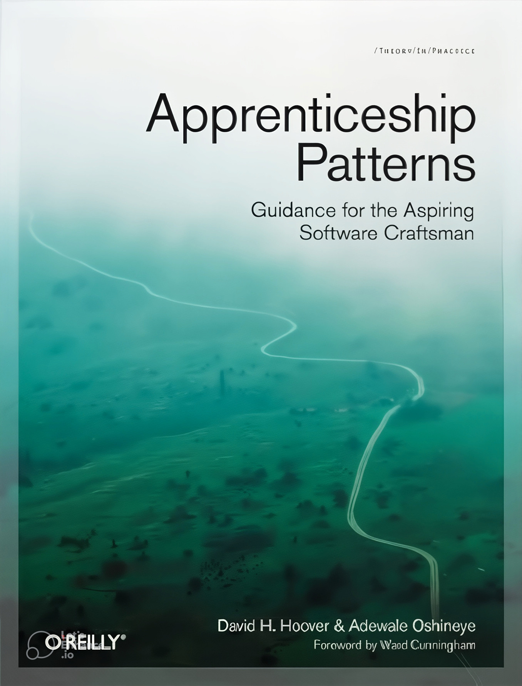

  

<h1 align="center"> ترجمه فارسی کتاب Apprenticeship Patterns </h1>

 الگوهای رشد و بلوغ در مسیر حرفه‌ای شدن برنامه‌نویس

  
  
  
  
  

<h1>

   <a href="https://hheydarian.github.io/Gitab/" target="_blank"><strong>  گیتاب — نسخه آنلاین کتاب </strong></a>

</h1>

---

## ✨ معرفی پروژه

کتاب **Apprenticeship Patterns: Guidance for the Aspiring Software Craftsman** نوشته‌ی *Dave Hoover* و *Adele Ferreira* یکی از مهم‌ترین آثار در حوزه‌ی **رشد حرفه‌ای و تربیت برنامه‌نویسان نرم‌افزار** است.  

این کتاب با رویکردی عمل‌گرایانه، مجموعه‌ای از «الگوهای رشد» (Patterns) را معرفی می‌کند که به توسعه‌دهندگان کمک می‌کند تا از مرحله‌ی کارآموزی تا رسیدن به سطح استادکاری (Craftsmanship) مسیر خود را آگاهانه، منظم و مبتنی بر یادگیری مداوم طی کنند.  

هدف این ریپازیتوری، ارائه‌ی **ترجمه‌ای دقیق، بومی‌سازی‌شده و قابل استفاده برای جامعه‌ی فارسی‌زبان برنامه‌نویسان** است تا مفاهیم ارزشمند «فرهنگ شاگردی در مهندسی نرم‌افزار» در دسترس‌تر و کاربردی‌تر شوند. 🚀

---

## ⚙️ پیش‌نیاز مطالعه

🔹 این کتاب برای تمام برنامه‌نویسانی مناسب است که:
- در آغاز مسیر حرفه‌ای خود هستند؛  
- به دنبال یادگیری از طریق تمرین و ساخت پروژه‌های واقعی‌اند؛  
- و می‌خواهند نگرش «استادکاری نرم‌افزار» را در مسیر شغلی خود درونی کنند.
-  برای تجربه خوانایی بهتر در مرورگر، توصیه می‌کنیم افزونه [فونت ایران](https://chromewebstore.google.com/detail/fontiran/edbchgkbejkdkdkpgenlaciegoidmjoh) رو نصب کنید.

---

## 🙌 راه‌های مشارکت

ما به حضور و تجربه‌ی شما در این پروژه افتخار می‌کنیم! مشارکت شما می‌تواند شامل موارد زیر باشد:

- 📝 **بازبینی و اصلاح ترجمه‌ها**
- 💬 **افزودن توضیحات فرهنگی و تجربی برای خوانندگان فارسی‌زبان**
- 🎯 **پیشنهاد ساختار بهتر برای فصل‌ها یا اصطلاحات کلیدی**

---

## 🔗 فصل‌های کتاب (با لینک)

| شماره | نام فصل (انگلیسی)                   | نام فصل (فارسی)                        | وضعیت | لینک                                                                          |
| ----- | ----------------------------------- | -------------------------------------- | ----- | ----------------------------------------------------------------------------- |
| 00    | Preface             | پیشگفتار                        | ✅     | [Preface](Book/00/Preface.md)                                       |
| 01    | Introduction                    | مقدمه                      | ✅     | [Introduction](Book/01/Introduction.md)                               |
| 02    | Emptying the Cup               | خالی کردن فنجان                   | ✅     | [Emptying-the-Cup](Book/02/Emptying-the-Cup.md)                     |
| 03    | Walking the Long Road               | پیمودن مسیر طولانی                     | ✅     | [Walking-the-Long-Road](Book/03/Walking-the-Long-Road.md)                     |
| 04    | Accurate Self-Assessment            | ارزیابی دقیق خود                       | ✅     | [Accurate-Self-Assessment](Book/04/Accurate-Self-Assessment.md)               |
| 05    | Perpetual Learning                        |  یادگیری مداوم                           | ✅     | [Perpetual-Learning](Book/05/Perpetual-Learning.md)                                       |
| 06    | Construct Your Curriculum                      | برنامه درسی خود را بسازید              | ✅     | [Construct-Your-Curriculum](Book/06/Construct-Your-Curriculum.md)                                   |
| 07    | Conclusion                        | نتیجه‌گیری                         | ✅     | [Conclusion](Book/07/Conclusion.md)                                       |
| 08    | Pattern-List           | فهرست الگو                | ✅     | [Pattern-List](Book/APPENDIX-A/Pattern-List.md)               |
| 09    | A Call for Apprenticeship          | درخواست برای کارآموزی              | ✅     | [A-Call-for-Apprenticeship](Book/APPENDIX-B/A-Call-for-Apprenticeship.md)               |
| 10    | A Retrospective on the First Year          | نگاهی به سال اول              | ✅     | [A-Retrospective-on-the-First-Year](Book/APPENDIX-C/A-Retrospective-on-the-First-Year.md)               |
| 11    | Online Resources         | منابع آنلاین              | ✅     | [Online-Resources](Book/APPENDIX-D/Online-Resources.md)               |

---

## 🧩 اصول ساختاری پروژه

- تمامی فصل‌ها در قالب فایل‌های `.md` نوشته شده‌اند.  
- نقل‌قول‌ها، توضیحات و مثال‌های کتاب با Markdown ساختاردهی شده‌اند.  
- تصاویر و دیاگرام‌ها در مسیر `assets/image/` قرار دارند.  
- از فونت فارسی خوانا و استاندارد برای نمایش آنلاین استفاده شده است.

---

## 🛡️ مجوز و حقوق نشر

<ul dir="rtl">
<li><b>حقوق نشر و کپی‌رایت کتاب اصلی:</b> متعلق به <a href="https://www.amazon.com/Apprenticeship-Patterns-Guidance-Aspiring-Craftsman/dp/0596518382">O’Reilly Media</a> است. این پروژه یک ترجمه آزاد و آموزشی است و هیچ‌گونه منفعت تجاری ندارد.</li>
<li><b>متن ترجمه:</b> تحت مجوز <a href="https://creativecommons.org/licenses/by-nc-sa/4.0/">CC BY-NC-SA 4.0</a> منتشر می‌شود.</li>
<li><b>نمونه‌کدها:</b> در صورت وجود، با مجوز <a href="https://opensource.org/licenses/MIT">MIT License</a> منتشر خواهند شد.</li>
</ul>

---

## 🌟 قدردانی

از تمام کسانی که با پیشنهاد، بازخورد و ویرایش‌های خود در مسیر ترجمه و نشر آزاد دانش مشارکت می‌کنند سپاسگزاریم 🌱  

ساخته‌شده با ❤️ برای جامعه‌ی برنامه‌نویسان فارسی‌زبان

